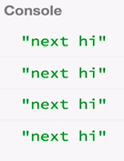

So far when writing the subscribe functions which are past and observable constructor, we haven't returned anything. But it's possible to return an `unsubscribe` function from this. Here's how it's useful.

Let's say inside this `function` I want to `setInterval` to run this every one second, `1000`. Every one second, I'm going to deliver a value to the observer. I'm going to say `hi`, for instance. Now when we run his, we see the string 'hi' being delivered every one second.

#### ES6/Babel
```javascript
function subscribe(observer) {
    setInterval(function () {
        observer.next('hi');
    }, 1000);
}
```

Now, suppose that after four and half seconds, I don't want to receive these 'hi' values anymore. Let's say the observer is done receiving values. It doesn't want to get values. Since we're subscribing, we should also have a way of unsubscribing. That's where this `return function unsubscribe()`, comes in.

```javascript
function subscribe(observer) {
    setInterval(function () {
        observer.next('hi');
    }, 1000);
    return function unsubscribe(){

    }
}
```

If we just comment out our `foo` variable and `.foo` in order to have pure JavaScript and no Rx -- just to make things simpler to understand, `subscribe` expects the `Observer` object. Let's make this an object with three members, `next`, `error`, and `complete`. 

```javascript
subscribe({
  next: function (x) { console.log('next ' + x); },
  error: function (err) { console.log('error ' + err); },
  complete: function () { console.log('done'); },
});
```

`subscribe` will return this `return function`. That's what we can capture as the return value.

```javascript
var unsubscribe = subscribe({
  next: function (x) { console.log('next ' + x); },
  error: function (err) { console.log('error ' + err); },
  complete: function () { console.log('done'); },
});
```

Now we have this `unsubscribe` function that we can call anywhere here. Let's say, for instance, at the very bottom. The `setInterval` will return to us this `id` number for the `setInterval` that was registered. Then you can stop that by calling this API `clearInterval` with the `id`. We call that precisely here inside our 'unsubscribe'.

```javascript
function subscribe(observer) {
    var id = setInterval(function () {
        observer.next('hi');
    }, 1000);
    return function unsubscribe(){
        clearInterval(id);
    };
}
```

Basically, when I call `unsubscribe()`, it will `clearInterval`. I can do that after four and a half seconds by using `setTimeout` at the bottom of our code and `unsubscribe();`. 

```javascript
setTimeout(function () {
    unsubscribe();
}, 4500);
```

When we run this, we should see just four values. Then it should `unsubscribe()`. It did. 



That's what returning this function, `unsubscribe`, is. It's a way of being able to stop receiving values because `.subscribe()` is saying, "Give me values."

If we now go back from pure JavaScript to RxJS, we need to uncomment. We can put this `subscribe` function directly inside our `foo` variable, for instance. Even though we are returning an `unsubscribe` function, the `Observable.subscribe()` will always return a `subscription`.

```javascript
var foo = new Rx.Observable(function subscribe(observer) {
  var id = setInterval(function () {
    observer.next('hi');
  }, 1000);
  return function unsubscribe() {
    clearInterval(id);
  };
});

var subscription = foo.subscribe({
    next: function (x) { console.log('next ' + x); },
    error: function (err) { console.log('error ' + err); },
    complete: function () { console.log('done'); },
});
 
setTimeout(function () {
  subscription.unsubscribe();  
}, 4500);
```

The `subscription` is just an object which has the `unsubscribe` function. It's almost the same thing, but just a slightly different API. This also works.

The idea is that you are able to dispose from resources that you are using in our `foo` variable so that it wouldn't leak, because if the `observer` is not interested in those values anymore, then we can stop everything that was running.