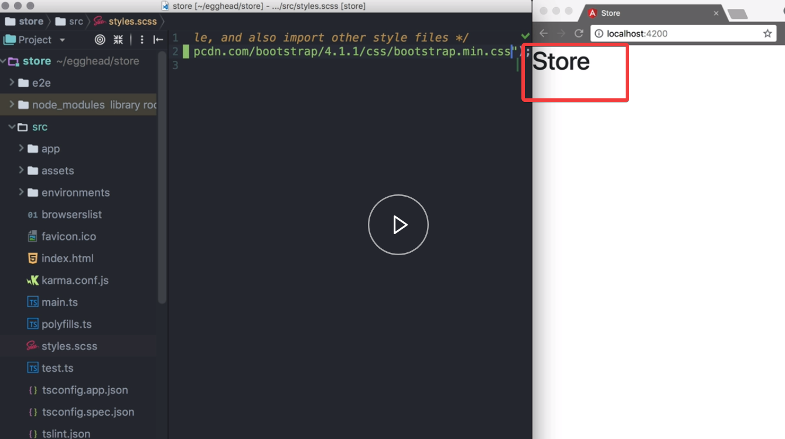

Let's go to [bootstrapcdn.com](https://www.bootstrapcdn.com/) and copy the link to the latest version of bootstrap. 

We open `src`, `styles.scss`, and add the import rule. 

We'll pass in the url methods and paste in the URL we just copied. 

#### src/styles.scss
```css
@import url("https://stackpath.bootstrapcdn.com/bootstrap/4.1.1/css/bootstrap.min.css")
```

We see that the font changed from Serif to San Serif.

