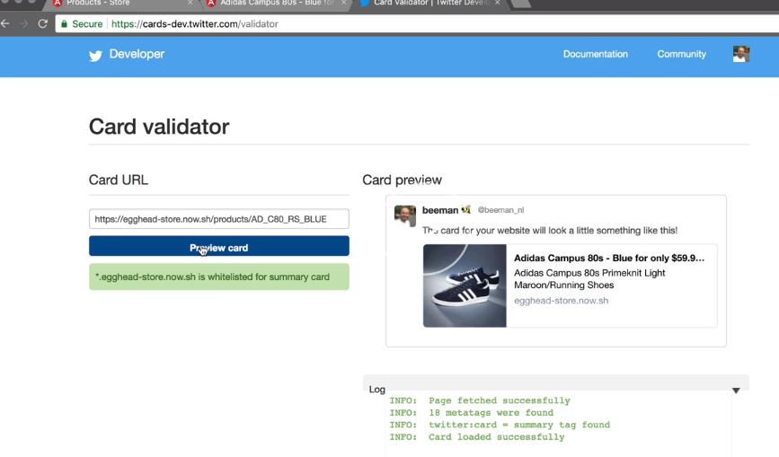

We run `ng g s ui/services/ui` to generate the `ui.service.ts`. 

Let's define some default properties in this file. We set `appColor` to `#343a40`. We set `appImage` to link to our logo. We set `appTitle` to `Store`, and in our `appDescription`, we add a description for a store.

#### ui.service.ts
```javascript
private appColor = '#343a40';
private appImage ='/assets/logo.svg';
private appTitle = 'Store';
private appDescription = 'Online';
```

Inside the constructor, we inject private `title` `Title` and private `meta` `Meta`, which are both imported from `@angular/platform-browser`. 

We define a method called `setMetaData()`, which takes a `config` parameter. We take the `description` from the config object, or else use the defaults. We use the same thing for `image`.

For the `title`, we want to append the `app.title` if we get one from the object, or otherwise, just show the `appTitle`. We invoke `this.title.setTitle()`, and pass in the new `title`. 

```javascript
constructor(private meta: Meta, private: title: Title) { }

public setMetaData(config){
    const description = config.description || this.appDescription;
    const image = config.image || this.appImage;
    const title = config.title
    ? `${config.title} - ${this.appTitle}`
    : this.appTitle;
    
    this.title.setTitle(title)
}
```

Next, we create an array called `tags`, in which we define all the meta text that we want to set.

We set `description` to `description`. We set `theme-color` to `this.appColor`. 

Then we add a `twitter:card` of type `summary`, `twitter:image`, which takes the `image`, `twitter:title`, which takes the `title`, `twitter:description`, which takes the `description`.

Then `apple-mobile-web-app-capable`, set to `yes`, `app-mobile-web-app-status-bar-style` set to `black translucent`, `apple-mobile-web-app-title` set to title, `apple-touch-startup-image` set to `image`, and lastly, a few properties. `og:title` to `title`, `og:description` to `description`, and `og:image`, set to `image`.


```javascript
cons tags = [
    { name: 'description', content: description },
    { name: 'theme-color', content: this.appColor },
    { name: 'twitter:card', content: 'summary' },
    { name: 'twitter:image', content: image },
    { name: 'twitter:title', content: title },
    { name: 'twitter:description', content: description },
    { name: 'apple-mobile-web-app-capable', content: 'yes' },
    { name: 'apple-mobile-web-app-status-bar-style', content: 'black translucent' },
    { name: 'apple-mobile-web-app-title', content: title },
    { name: 'apple-touch-startup-image', content: image },
    { name: 'og:title', content: title},
    { name: 'og:description', content: description},
    { name: 'og:image', content: image},
]
```

The last step is to loop over these tags in the array using `forEach`. Inside that, we take the `tag`, and we pass it into `this.meta.updateTag`. 

```javascript
tags.forEach(tag => this.meta.updateTag(tag));
```

In order to use this new method, we open `product-list.component.ts` and inject private `UiService` into the constructor.

We define the method `metaData()`, which takes a `products` property of type `product` array. In this method, we invoke `this.UI.setMetaData`, and we pass an object with the `title` property set to `Products`, and the `description` with a nice promotional text.

#### product-list.component.ts
```javascript
metaData(products: Product[]){
    this.ui.setMetaData({
        title: 'Products',
        description: `Check our our collection of ${products.length} products`
    })
}
```

Then inside the `pipe`, below our `map` operator, we add a `tap` operator, which gets imported from `rxjs/operators`. 

We take `products`, and pass it in `this.metadata`. 

```javascript
.pipe(
    map(data => data['products'],
    tap(products => this.metaData(products)))
)
```

When we refresh the page, we can see that the metadata updates.


Let's quickly do the same for `product-detail.component.ts` We inject private UI `UiService`. We create metadata, which takes `product` like `Product`. We call into `this.UI.setMetadata`. We add a `title`, a `description`, and set the product `image`.

We then go to the `pipe`, append the `tap` operator and pass `product` into `this.metadata`. 

When we build and deploy the app, we see that the metadata is now updated. 

When we pass a product URL in the Twitter cart validator, we see that this also enabled social previews.

