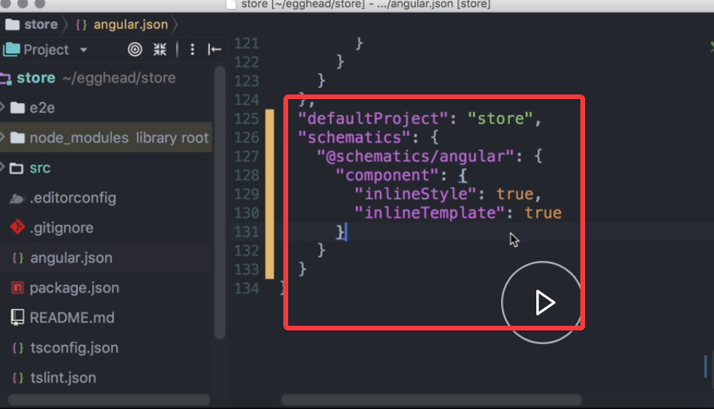

By default, the Angular CLI creates components with an external template and style sheet. 

In our `app.component.ts`, we rename the template URL property to a template, and add the content inside a string literal.

#### app.component.ts
```javascript
template: `
<h1>Store Inline Template</h1>
<router-outlet></router-outlet>
`

```

We rename `styleUrls` to `styles`, and set the value to an array with string literal. 

```javascript
style: [`
h1{
    color: hotpink;
}
`]
```

After this is done, we can remove the external files that are no longer used. 

We can use the `ng config` command to set the defaults for a specific schematic, schematic Angular in this case.

We set `inlineStyle` and `inlineTemplate` to true. 

#### Terminal
```javascript
ng config schematics.@schematics/angular.component.inlineStyle true

ng config schematics.@schematics/angular.component.inlineTemplate true
```

If we check `angular-cli.json` in our project root, we see that the defaults are stored there.

