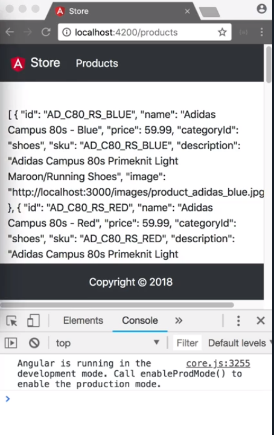

We run `ng g s product/services/product` to create our service. 

#### Terminal
```bash
ng g s product/services/product
```

We open up `product.service.ts` and inject dependency called `private http` of type `HttpClient`. 

Below our imports we add a const `baseUrl` and set the value to a template literal. We'll take the value `apiUrl` from the environment we just created and append `/products`.

#### product.service.ts
```javascript
const baseUrl = `${environment.apiUrl}/products`;
```

We now create a public method `getProducts()` that does not take any parameters and returns an `Observable` of type `Product[]`. In this method, we return `this.http.get` and pass in the `baseUrl`. We tell the get method, using a generic that we expect to retrieve an array of `Product`.

```javascript
public getProducts(): Observable<Product[]>{
    return this.http.get<Product[]>(baseUrl);
}
```

Then, we add a public method `getProducts()` that takes `id` as a string and returns an `Observable` of type `<Product>`. We make it return `this.http.get` and pass in the `baseUrl` with the `/` and the `id` appended to it.

```javascript
public getProduct(id: string): Observable<Product>{
    return this.http.get<Product>(`${baseUrl}/${id}`);
}
```

In order to use those methods, we open `product-list.component.ts`, and in our constructor, we inject `private service: ProductService`. 

In our `ngOnInit` method, we call into `this.service.getProducts()`, so subscribe to that method and assign the results to `this.products`.

#### product-list.component.ts
```javascript
ngOnInit(){
    this.service.getProducts()
    .subscribe(res => this.products = res);

}
```

When we reload our app, we see that we have an error message, `No provider for HTTPClient` 

In order to fix this, we open our `app.module.ts` and add HTTPClientModule to our `imports` array, and make sure we import it from `@angular/common/http`.

#### app.module.ts
```javascript
import { HttpClientModule } from '@angular/common/http';

imports: [
    BrowserModule,
    HttpClientModule,
    AppRoutingModule,
    UiModule
]

```

When we reload, we finally see the list of products being displayed and our error is gone. 



Let's update `product-detail.component.ts`, inject `private service ProductService`, and `ngOnInit` `this.service.getProduct()`. We pass in the parameter we get from the router `this.route.snapshot.paramMap.get('id')`

We `subscribe` to it and assign the result to `this.product`. 

#### product-detail.component.ts
```javascript
this.service.getProduct(this.route.snapshot.paramMap.get('id')).subscribe(res => this.product = res);
```

We can now navigate through our app and see that products get loaded.