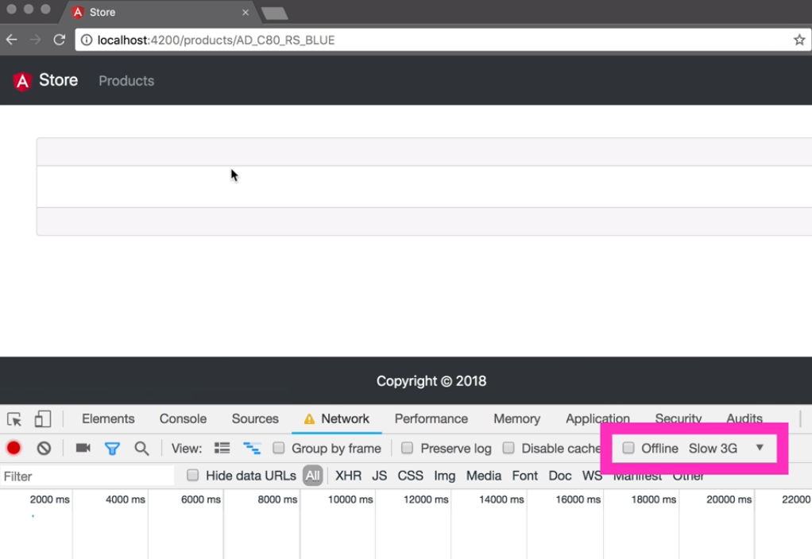
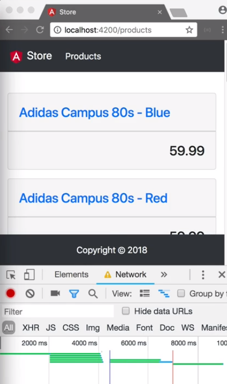

The container components fetch the data by subscribing to the service in the ngOnInit method. While this works it has some drawbacks. This can be shown by opening the network tab in Chrome DevTools and setting the connection to slow 3G.



We can prevent this by creating a `products.resolver.ts` that the router can use to retrieve the data. We open the file and add export class `ProductsResolver`. We add the @Injectable decorater and that function takes an object with `providedIn` set to `root`.

We add `implements` `Resolve` of type `Product[]` array. 

#### products.rexolver.ts
```javascript
@Injectable({
    providedIn: 'root',
})
export class ProductsResolver implements Resolve<Product[]>{

}
```

Next, we add a `constructor` and inject `private service ProductService`. We implement the `resolve()` method and make it return `this.service.getProducts()`. 

To use this resolver, we open `products-routing.module.ts`, and in the routes to `ProductListComponent`, we add the `resolve` property.

We add a key `products` and set the value to `ProductsResolver`. 

#### product-routing.module.ts
```javascript
{
    path: '',
    component: ProductListComponent,
    resolve: { products: {ProductsResolver}}
}
```

The next step is to update the `product-list.component.ts`. We change the constructor, so it only injects private route `ActivatedRoute`. 

In the `ngOnInit` method, we call in `this.route.data`.

We invoke the `pipe` function and use the `map` operator to take the `products` property from the `data` object. Let's remove the call to the service and just reuse the same subscription we used before.

#### product-list.component.ts
```javascript
ngOnInit() {
    this.route.data.pipe(
        map(data => data['products'])
    ).subscribe(res => this.products = res);
}

```

When we now check in the browser, we see that the product list still works and that the route does not change until the data is loaded.



Let's quickly do the same for the product details. We copied the `products.resolver.ts` to `product.resolver.ts` singular.

We renamed the class ProductResolvers to ProductResolver singular. We changed the result type from `Product` array to `Product`. We add the parameter route of type `ActivatedRouteSnapshots` to the resolve method.

We change the method `getProducts()` to `getProduct()`, and lastly we pass in `route.paraMap.get('id')`. 

In the `products-routing.module.ts`, we add the `resolve` key to the product detail routes. We set the key to `product` and ProductResolver` as the value.

#### product-routing.module.ts
```javascript
{
    path: 'id',
    component: ProductDetailComponent,
    resolve: { product: ProductResolver }
}
```

The `product-detail.component.ts` will remove the product service from constructor and imports, in the `ngOnInit` method we call `this.route.data`. Invoke the `pipe` function and use the `map` operator to get the `product` key from the `data` objects, and reuse the `subscribe` method.

#### product-detail.component.ts
```javascript
ngOnInit(){
    this.route.data
        .pipe(
            map(data => data['product'])
        )
        .subscribe(res => this.product = res);
}
```

When we navigate through the app, we see that it works as expected without any empty components. Let's quickly set the speed back to online before we forget.