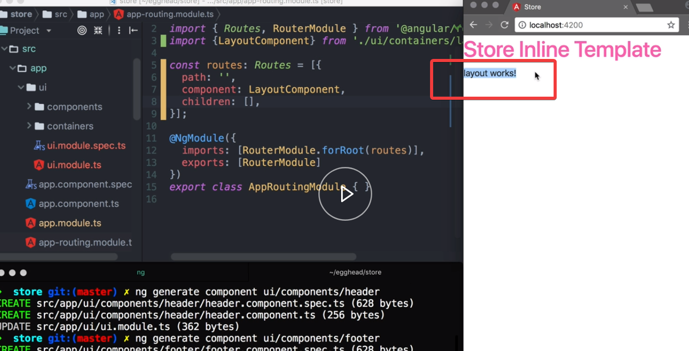
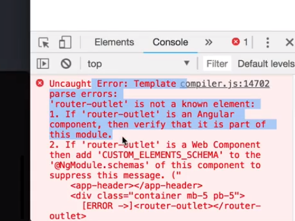
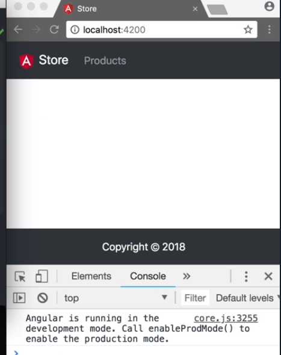

We run 

#### Terminal
```bash
ng generate module ui --module app
```

We see that the module gets generated and imported by our `app.module.ts`. Now inside this module, we're going to create three components to build out our UI -- the `layout`, `header`, and `footer` components.

```javascript
ng generate component ui/containers/layout
ng generate component ui/containers/header
ng generate component ui/containers/footer
```

Let's open our `app-routing.module.ts` to add our first route. 

This is an object literal with the `path` property set to an empty string and the `component` property references `LayoutComponent`. 

We now see that our app renders the layout components.



We open `app.component.ts` and remove everything from the `styles` array and the `template` property, except the `<router-outlet></router-outlet>` element. 

We open our `layout.component.ts` and add our `<app-header></app-header>` to the `template`.

Next, we add a `div` with the class `container`, `mb-5` and `pb-5` to add some spacing. Inside the div, we add the `<router-outlet></router-outlet>` component. Lastly, we add an `<app-footer></app-footer>`.

#### layout.component.ts
```html
template: `
<app-header></app-header>
<div class="container mb-5 pb-5">
<router-outlet></router-outlet>
</div>
<app-footer></app-footer>
`
```

When we save the page, we see that TypeScript got mad at us. It tells us that `<router-outlet></router-outlet>` is not a known element. 



In order to fix this, we open `ui.module.ts` and add `RouterModule` to the import array. 

#### ui.module.ts
```javascript
imports:[
    CommonModule,
    RouterModule
]
```

Let's quickly head over to [Angular IO/press kit](https://angular.io/presskit) to download the Angular logo in SVG, and store it in our folder `src/assets`, with the name `logo.svg`.

Now that we have the logo, we open `header.component.ts`, and add three properties in the `HeaderComponent` class. `logo`, set to `assets/logo.svg`, `title`, set to `Store`, and our `links`, set to an array with one entry, the property `label` set to `Products`, and the `url` set to `/products`.

#### header.component.ts
```javascript
public logo = 'assets/logo.svg';
public title = 'Store';
public links = [{
    label: 'Products',
    url: '/products',
}]
```

We clear out the `template`, and start by adding a `nav` tag with the class as `navbar`, `navbar-expand`, `navbar-dark`, `bg-dark`, and `fixed-top`. 

Inside our `nav` element, we add an `a` tag with the class `navbar-brand`. We change the `href` property to a `routerLink` and set its value to a `/`.

The content of the `a` tag will be an `img`, with the property `[attr.src]` set to `logo`, `[attr.alt]` set to `title`, and `width` and `height` set to `30`. After the image, we add a `title` property in double curly braces `{{title}}`.

```html
template: `
<nav class="navbar navbar-expand navbar-dark bg-dark fixed-top">
    <a routerLink="/" class="navbar-brand">
        
        {{title}}
    </a>
`
```

Below our `a` tag, we'll create a `div` with the class as `collapse` and `navbar-collapse`. Inside this div, we add another div with the `navbar-nav` class.

Lastly, we add an `a` tag with the `nav-item` and `nav-link` classes. 

We use the `*ngFor` directive on the `a` tag to loop over the items in our `links` array. Content of the `a` tag is set to `{{link.label}}`, and we add a router link directive in square brackets `[routerLink]`, and set its value to `link.url`.

We set `routerLinkActive` to `active`, then we add the `[routerLinkActiveOptions]` in square brackets, and assign the value to an object with the key `exact` set to `true`. 

```html
<div class="collapse navbar-collpase">
    <div class="navbar-nav">
        <a class="nav-item nav-link" *ngFor="let link of links"
        [routerLink]="link.urk" routerLinkActive="active"
        [routerLinkActiveOptions]="{ exact: true }">
        {{ link.label }}
        </a>
    </div>
</div>
```

We open the `footer.component.ts`, and clear the content of the `template`.

We add a `nav` tag with the class as `navbar`, `navbar-expands`, `navbar-dark`, `bg-dark`, and `fixed-bottom`. 

Inside our `nav` element, we add a `div` tag with the class as set to `navbar-text`, `m-auto` to center the content, and `text-white` for some better contrast. Inside our `div`, we place our footer tag -- just a simple copyright message.

#### footer.component.ts
```html
<nav class"navbar navbar-expand navbar-dark bg-dark fixed-bottom">
    <div class="navbar-text m-auto text-white">
        Copyright &copy; 2018
    </div>
</nav>
```



