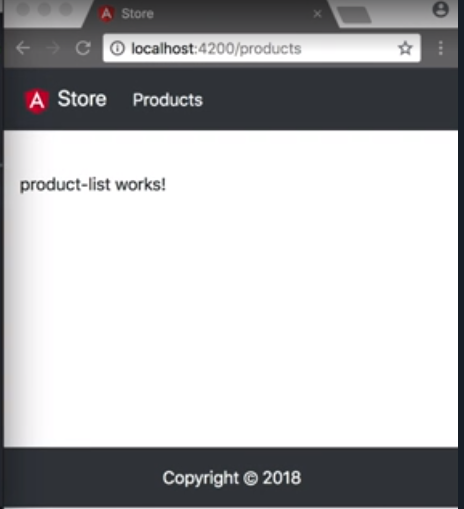
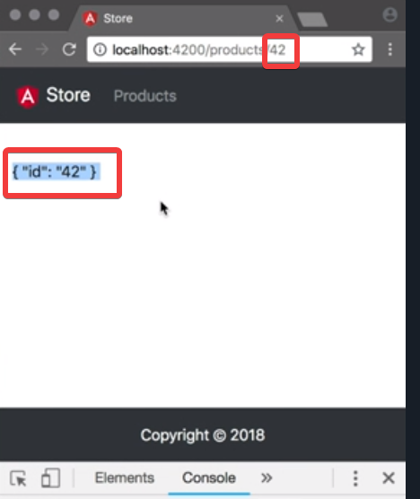

We run `ng g m product --routing` to generate a routing file. 

#### Terminal
```bash
ng g m product --routing
```

We open `app-routing.module.ts` and add a `children` property to the existing `routes`, and initialize it as an array.

Inside this array, we create two new routes. The first route redirects any unknown routes to the `/product` routes. The second one is the actual `products` routes and it lazy `loadChildren` from our new product module.

#### app-routing.module.ts
```javascript
children:[{
    path: '',
    pathMatch: 'full',
    redirectTo: '/products'
}, {
    path: 'products',
    loadChildren: './product/product.module#Product'
}]
```

When we refresh our app, we see it navigates to the `/product` route. 


To get the maximum out of typescript, we'll create a module for `product` using `ng g cl product/models/product`.

#### Terminal
```bash
ng g cl product/models/product
```

We open this new file and add the following properties -- an `id` of type `string`, `name` of type `string`, `description` of type `string`, `image` of type `string`, and `price` of type `number`. 

We'll add two container with smart components and add a route to them. These components will be responsible for retrieving the data and passing it into our presentational or dumb components.

We use `ng g c product/containers/product-list` to create a `product-list` and `ng g c product/containers/product-detail` to create `product-detail` components. 

We open `product-routing.module.ts` and add a `routes` to `ProductListComponent` with the `path` set to an empty string. The route to `ProductDetailComponent` has the path set to `:id`

#### product-routing.module.ts
```javascript
const routes: Routes = [{
    path: '',
    component: ProductListComponent,
}, {
    path: ':id',
    component: ProductDetailComponent,
}]
```

Now to see the product list appear, we need to fix a small mistake I made in the `layout.component.ts` -- the `margin` and `padding` should be on the y-axis, not just on the bottom. 

Now, we see product list. 



We open the `product-list.component.ts` and set the `template` to `products` and square brackets and pipe through the JSON.

#### product-list.component.ts
```javascript
template: `
    {{ products | json }}
`
```

Inside the component class, we add a `products` property of type `Product[]`, and initialize it with an empty array. 

We open `product-detail.component.ts` and set the template to `products` and square brackets and pipe it through the JSON.

#### product-detail.component.ts
```javascript
template: `
    {{ product | json }}
`
```

In our component class, we add a `product` property and set a type to `Product`, and initialize it with `new Product()`. 

To fetch the ID property from a URL, we inject a private route `ActivatedRoute`.

```javascript
constructor(private route: ActivatedRoute) {}
```

In our `ngOnInit` block we assign `this.product.id` to `this.route.snapshot.paraMap.get('id')`.

```javascript
ngOnInit() {
    his.product.id = this.route.snapshot.paramMap.get('id');
}
```

If we pass in a random ID to a URL, we see that the route renders the product detail components, and that will receive the ID from the router.

