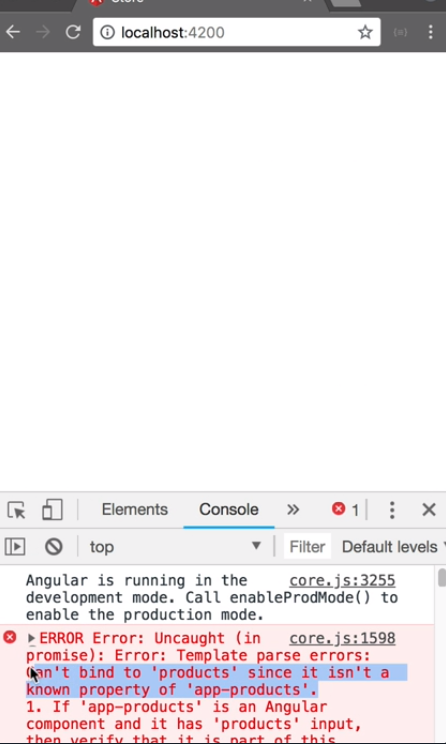

We use `ng g c product/components/products` to generate `products.component.ts` and `ng g c product/components/product` to generate `product.component.ts`. 

In our `product-list.component.ts`, we update our `template` and reference our new `<app-products></app-products>` component. We pass in an input named `[products]` and set it to the local variable `products`.

#### product-list.component.ts
```javascript
template: `
    <app-products [products]="products"></app-products>
`
```

When we save and reload, we see that we have an error in our console. 



Let's fix it by opening the `products.component.ts`, add a public `products` property, and decorate it with the `@Input()` decorator, which is a function. On save, we see that the error is gone.

We add a `div` with class `row`. Inside that `div` with class `col-md-6`, `col-lg-4` and `mb-3` to make the columns responsive with some margin on the bottom.

We add the `*ngFor` directive and assign the expression `let product of products` to loop over each of our `products` that we get from our inputs.

Inside our `*ngFor` loop, we call into our `<app-product>` component, pass in the `product` we are looping over, and set `details` to `false` because we don't want to show the `details` in the list view.

products.component.ts
```html
<div class="row">
    <div class="col-md-6 cl-lg-4 mb-3" *ngFor="let product of products">
        <app-product [product]="product" [details]="false"></app-product>
    </div>
</div>
```

Let's build `product.component.ts`. We first add two inputs -- a public `product` of type `Product`, public `details` of type `boolean`. 

#### product.component.ts
```javascript
@Input() public product: Product;
@Input() public details: boolean;
```

In the template, we add a `div` with class `card`. Inside the card, we add a `div` with class `card-header`.

We now create an `<ng-container>` with an `*ngIf` statement that checks if `details` is true. If not, it renders `link`. Inside this `<ng-container>`, we show `product.name` in curly braces. 

Below that we create an `<ng-template>` and add the identifier `#link` with a hash sign. 

Inside our template, we create `a` tag, set the content to `product.name` in curly braces, set `routerLink` directive in square brackets, and assign it to `product.id`. If our details is true, it will show the text only. If it's false, it will render the `<ng-template>` with a link inside it.

```html
<div class="card">
    <div class="card-header my-2">
        <ng-container *ngIf="details; else link">
            {{product.name}}
        </ng-container>
        <ng-template #link>
            <a [routerLink]="product.id">{{product.name}}</a>
        </ng-template>
    </div>
</div>
```

Underneath our card-header, we create an `img` tag with class `card-image`. We set `[attr.src]` to `product.image` and `[att.alt]` to `product.name`. We create a `div` with class `card-body` and an `*ngIf` statement with the `details` expression, so it will only display when we want to see the details.

Inside the card-body, we add a `p` tag with class `my-2`. Inside that, we render `product.description` in curly braces. We create a div with class `card-footer` and inside that a `<h4>`
with class `text-right` and `my-2`. The content of this `h4`
tag is `product.price` in curly braces.

```html

<div class="card-body" *ngIf="!details">
    <p class="my-2">{{product.description}}</p>
</div>
<div class="card-footer">
    <h4 class="text-right my-2">{{product.price}}</h4>
</div>
```

A quick update to the header -- we're going to add a `h4`
with class `my-2` and place the `ng-container` and the `ng-template` inside the `h4`.

We can then remove `my-2` from card-header.

Now let's go to the `product-detail.component.ts`, set the template to our `<app-product>` component, pass in the `[product]` input, and assign it to our local product. We set the `[details]` input to `true`.

#### product-detail.component.ts
```html
template: `
<app-product [product]="product" [details]="true"></app-product>
`
```

We see that the product description does not get displayed, so let's open the `product.component.ts` and fix the `*ngIf` statement. We can now navigate from our products list to the individual products.