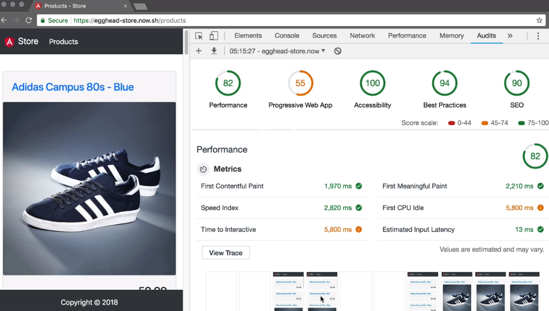
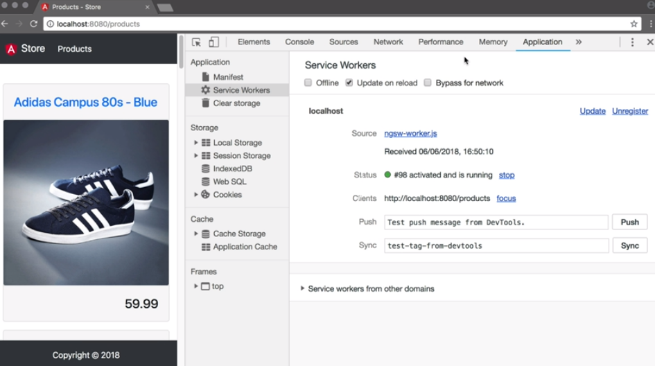
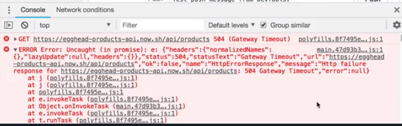
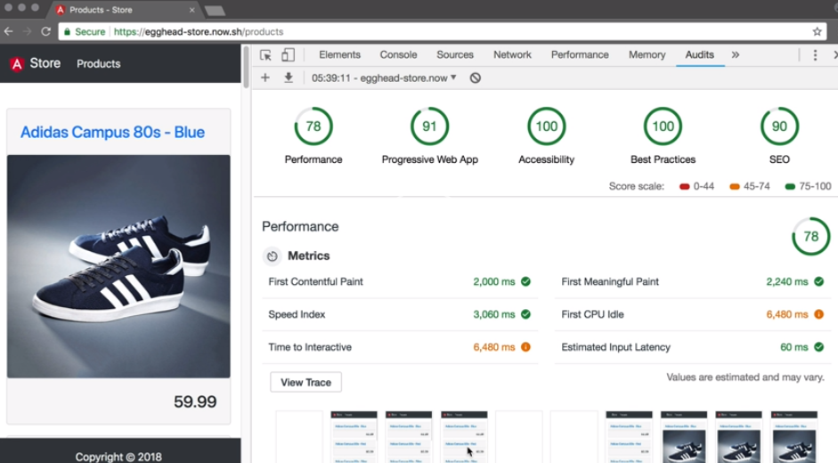
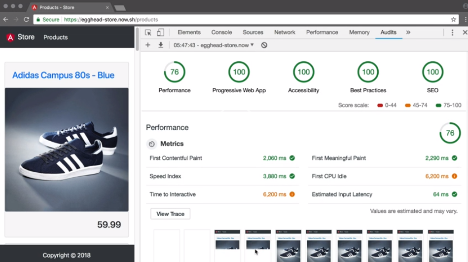

When we open the [Chrome dev tools](https://egghead.io/browse/tools/chrome-devtools) and go to the audit tab, we can run a Lighthouse test on our app. We get quite a decent score already, but there is still some things to improve.



Since Angular CLI version 6, we can simply run `ng add @angular/pwa` to convert our app into a progressive web app. 

#### Terminal
```bash
ng add @angular/pwa
```

This will install the packages `@angular/pwa` and `@angular/service-worker`. It will import the `ServiceWorkerModule` in our `app.module.ts`, and only enable it when running in production mode.

#### app.module.ts
```javascript
ServiceWorkModule.register('/ngsw-worker.js',{
    enabled: environment.production
})
```

In the file `manifest.json`, we can define how our PWA behaves when it gets installed on a user's device. 

Let's capitalize the value of the `name` property, and set our `theme_color` to `#343a40`. This is also where the icons of various sizes are defined.

Inside our `index.html`, we also have a `theme-color` defined. Let's also set this to `#343a40`.

When we run `npm run build && npm start`, we can browse to a production build on our local machine. In our dev tools in the application tab, we can see our service worker running.



Service worker can help running an application when the browser is in offline mode. However, once we tell our browser to go offline, we see that an error now comes up, because it's still trying to download data from our API.



We can cache our API and assets in the service worker configuration file `ngsw-config.json`. Inside the `assetGroups` array, we define a new object with the name, `externals`.

We set `installMode` and `updateMode` both to `prefetch`. 

In the resources object, we add a `urls` property, which is an array of strings. This will prefetch these CDN URLs and cache the data.

#### ngsw-config.json
```javascript
{
    "name":"externals",
    "installMode":"prefetch",
    "updateMode":"prefetch",
    "resources": {
        "urls":[
            "https://ajax.googleapis.com/**"
        ]
    }
}
```

The next object has the name `images`, and `installMode` and `updateMode` set to `prefetch`. In resources, the URLs will link to the API so that our images will be cached, too.

```javascript
{
    "name":"images",
    "installMode":"prefetch",
    "updateMode":"prefetch",
    "resources": {
        "urls":[
            "https://egghead-products-api.now.sh/images/**"
        ]
    }
}
```

Below the `assetGroups`, we'll create a `dataGroups` object, which is an array. 

Inside the array, we create an object with the `name` set to `rest-api`. We add an array called `urls` and add our API endpoints. 

In the `cacheConfig` objects, we set `strategy` to `freshness`, `maxSize` to `100`, `maxAge` to `1h`, and `timeout` to `5s`.

```javascript
"dataGroups":[{
    "name":"rest-api",
    "urls":[
        "https://egghead-products-api.now.sh/api/**"  
        ],
        "cacheConfig":{
            "strategy": "freshness",
            "maxSize": 100,
            "maxAge": "1h",
            "timeout": "5s"
        }
}]
```

We refresh our app and click run to hydrate the cache. 

Then we can set the browser to offline. When we reload, we see that the resources from our API are cached by the service worker. 

Let's re-deploy our app and run a new Lighthouse audit. We see that PWA score improves to 91 percent.



The one error that we have is that there should be fallback content if JavaScript is not available. We open `index.html` and add a `<noscript>` tag to the `body`, and add a message that this page is best viewed using JavaScript.

We deploy our app again and run another Lighthouse test. 

To improve the SEO score, we need to add a robots.txt file. In our src directory, we add a file called `robots.txt`, set the content to `User-agent:*`, and `Allow: /`

We then open `angular.json`, and in our builds object in the `assets` array, we add `src/robots.txt`. In the test object in the `assets` array, we add the same `src/robots.txt`. 

When we redeploy the app and run another Lighthouse audit, we can see that the SEO and PWA scores are now both 100 percent.

