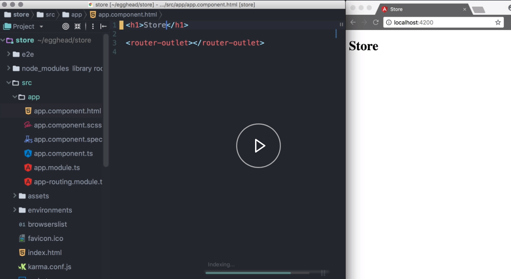

We install the latest version of Angular CLI globally. 

#### Terminal
```javascript
npm install -g @angular/cli@latest
```

We then run `ng new` followed by the name of our project, `store`.

We pass in the `--routing` flag to add a routing module and set the `--style` to `scss`. 

```javascript
ng new store --routing --style scss
```

This will create a new folder, scaffold our base application and run npm install.

To start a development server, we `cd` into our new folder and run `ng serve`. 

We open src then `app` then `app.component.html` and change the contents. 

#### app.component.html
```html
<h1>Store</h1>

<router-outlet></router-outlet>
```

We see that the development server picks up the change, and rebuilds the app.

