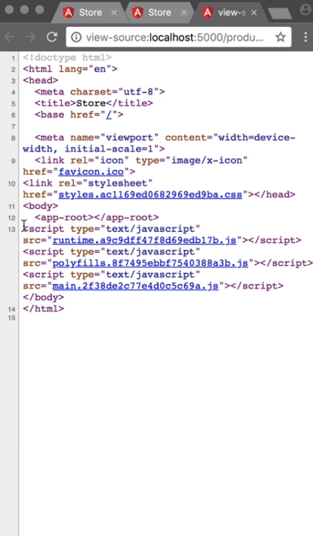
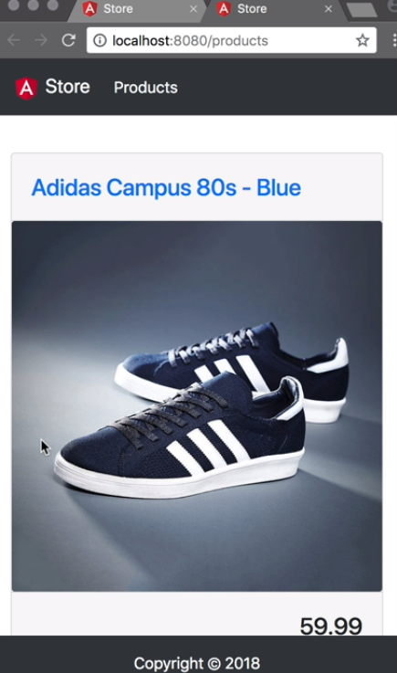
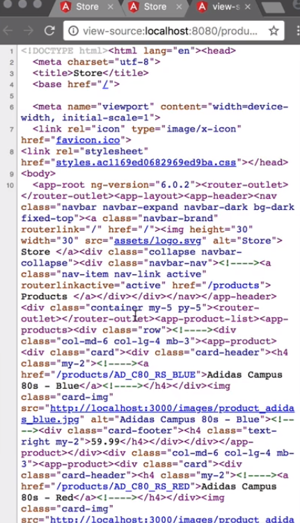

The default `index.html` file that is generated with our project is a simple file with a few tags inside the `head`, and only one tag in the `body` -- the selector of our app component `<app-root>`, where we run `ng build store --prod` in our project folder, and serve the output with `npx serve -s ./dist/store/`

We can check the source and see that it only consists of the content of our `index.html`, plus some additional scripts. This is also how most search engines and social media sites will see the page, which is far from ideal.



Let's add Angular Universal to make our application SEO-friendly. Since Angular CLI version six, this process has been simplified a lot. We can simply run the command `ng generate universal`, and pass in the flag, --client project store, which is the project name found in angular.json.

#### Terminal
```bash
ng generate universal --clientProject store
```

We see that this command generated a few files for us, updated a few others, and it ran `npm install`. Let's take a look at `angular.json` first. In our project, in the `architect` object, we see that there is a new object called `server`.

In the options we see that the output path is set to `dist/store-server`, and that it uses a different `main` file and `tsConfig`. Here, we're going to add a new object called `configuration`, and inside that, an object called `production`.

01:16 We add a file replacements array, where we replace `src/environments/environments.ts` with `src/environments/environments/prod.ts`. This makes sure that our production apply settings get applied where we build the server-side version of our app.

#### angular.json
```javascript
"configurations": {
    "production": {
        "fileReplacements": [
            {
                "replace": "src/environments/environment.ts",
                "with": "src/environments/environment.prod.ts"
            }
        ]
    }
}
```

The `tsConfig` for the server extends the default `./tsconfig.app.json`. The main difference here is that the output is set to `commonjs` to make sure that Node JS can handle it. We also see that the `angularCompilerOptions` has an `entryModule`, which is our new `app/app.server.module#AppServerModule`.

The file `main.server.ts` is used to bootstrap our app on the server. Because our Angular app uses `zone.js`, this is a great place to import `zone.js/dist/zone-node` for Node. 

The `AppServerModule` is a simple module that imports `AppModule`, `ServerModule` from `@angular/platform-server`, and it bootstraps `AppComponent`, just like `AppModule` does for the browser.

Because we're using lazy loading, we need to add an extra module to `AppServerModule`. From npm, we `npm install` the module `@nguniversal/module-map-ngfactory-loader`, and also `@nguniversal/express-engine` that we need in server.ts in a bit.

Once installed, we can add `ModuleMapLoaderModule` to the imports array, and make sure to import it. 

#### app.server.module.ts
```javascript
imports: [
    AppModule,
    ServerModule,
    ModuleMapLoaderModule
]
```

Now, in `package.json`, let's update the build script, set it to `ng build store --prod && ng run store:server:production`.

We run `npm run build`, and we see that both apps got built. 

Angular Universal requires a web server to host a generated app. Let's implement that using [Node](https://egghead.io/browse/platforms/node) and [Express](https://egghead.io/browse/libraries/express). 

We create a new file, `server.ts`, in the project root, and first, add some imports.

We import `express`. We import `join` from `path`. We import `ngExpressEngine` from `@nguniversal/express-engine`, and we import `provideModuleMap` from `@ngUniversal/module-map-ngFactory-loader`.

#### server.ts
```javascript
import * as express from `express`;
import { join } from 'path';

import { ngExpressEngine } from '@nguniversal/express-engine';
import { provideModuleMap } from '@nguniversal/module-map-ngfactory-loader'
```

We add a const `PORT` that we take from the environment variable, or set it to a default `8080`. We add a const `staticRoot` that returns the join method with the current working directory, and then `dist` and `store`, so it points to the browser build.

```javascript
const PORT = process.env.PORT || 8080;
const staticRoot = join(process.cwd(), 'dist', 'store');

```

Next, we destructure `AppServerModuleNgFactory`, and `LAZY_MODULE_MAP` that we will require from a file called `../dist/store-server/main`, which is our server build. 

The last const is `app` which invokes Express. 

```javascript
const { AppServerModuleNgFactory , LAZY_MODULE_MAP } = require('../dist/store-server/main')

const app = express();
```

We use the `app.engine` method to define the view engine, and we pass in two parameters.

The first is `html`. The second parameter is a method that gets invoked for this type of file. We pass in the `ngExpressEngine` function, we add a property, `bootstrap`, and set it to `AppServerModuleNgFactory`. The second property, `providers`, which is an array.

Inside that array, we invoke the `provideModuleMap` function, and pass in `LAZY_MODULE_MAP` as a parameter. Now that the view engine is defined, we can use it using `app.set`, and we set views to `staticRoot`.

```javascript
app.engine('html', ngExpressEngine({
    bootstrap: AppServerModuleNgFactory,
    providers: [
        provideModuleMap(LAZY_MODULE_MAP)
    ]
}))

app.set('view engine', 'html');
app.set('views', staticRoot);

```

We then use `app.get` to listen to `*.*`, and pass in `express.static`, with `staticRoot` as a parameter and then listen to '*'. Pass in a method with the standard express signature request and result. This method implicitly returns `res.render` method, takes a string `index`, and an object with one value, the request.

```javascript
app.get('*.*', express.static(staticRoot));
app.get('*', (req, res) => res.render('index', { req }));
```

Now that the server is configured, we tell it to listen to the `PORT`, and log a friendly message, so we know it's listening. 

```javascript
app.listen(PORT, () => console.log(`Listening on http://localhost:${PORT}`))
```
We open `package.json`, update the `start` script, and set it to value `ts-node ./server.ts`. 

We start the server with `npm start`, and when we open the listening port in the browser, we should see the server side rendered version of our page.



We can view the source and see that the content gets rendered and added inside the HTML body by the server.

