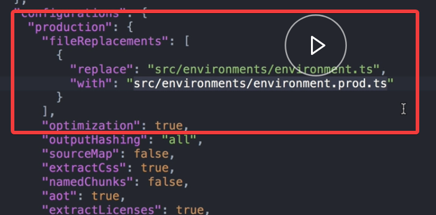

We open `src/environments/environments.ts` and set the `apiUrl` property to our local development API. 

In the `src/environments/environments.prod.ts`, we set the `apiUrl` to the production version of the API.

In `angular.json` in our project, we'll find a configuration object that defines our production builds. Inside there, we see that in the production builds, prod file will replace the other.

