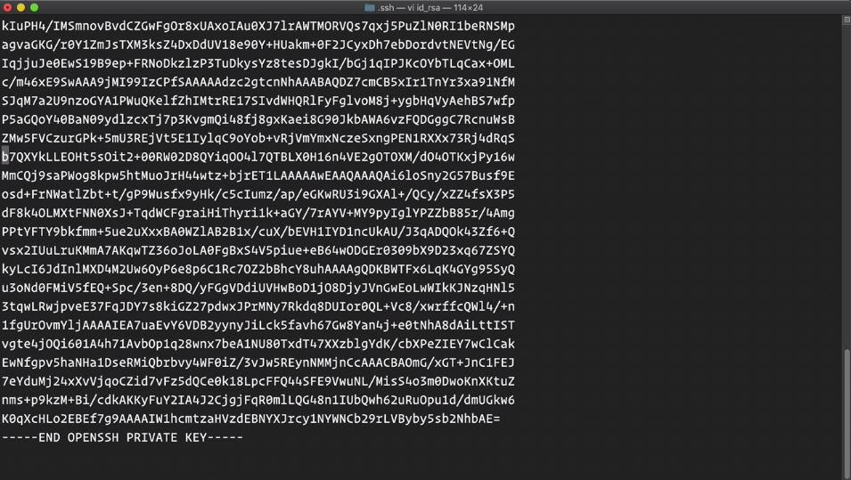

Instructor: [00:01] SSH keys are used as a very secure method for server authentication. Keys can be easily generated by running the `ssh-keygen` command.

#### Terminal

```bash
ssh-keygen
```

If you then hit enter three times in succession, the keys will be created. Note that this is the most common way of generating SSH keys, and will place your keys in their default locations and create them without a passphrase.


[00:25] SSH keys created are placed within a `.ssh` directory within your home directory. If you view the contents of this folder, you will see the private and public keys. The private key is `id_rsa`, and the public key is `id_rsa.pub`.


[00:45] Note the permissions set on the folder and keys. The `.ssh` folder and private key are both only readable and writable by the current user, while the public key is readable by any user on the system.

[00:59] Let's check out the private key, `id_rsa`. You must never give out or display the contents of your private key with anyone. This is your secret, the equivalent of a password.



Now look at the public key, `id_rsa.pub`. Feel free to share your public key with anyone, or any server which you would like to authenticate with.


[01:23] You may also edit the last part of your public key after the space. This is treated as a comment to document which public key this is, and can be helpful when keeping track of many servers using different keys.
