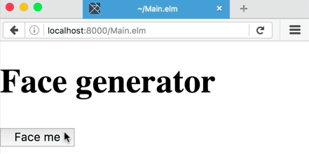
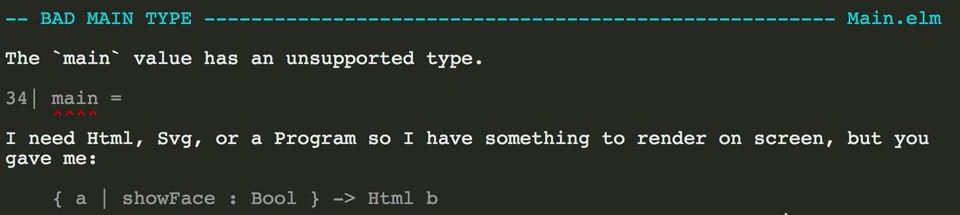
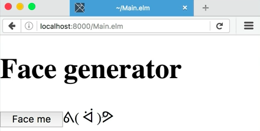

Here, inside of my HTML function, let's start by adding a `button`. We won't give it any attributes for now. We'll give it some `text` that says, `"Face me"`.

####Main.elm
```javascript
view = 
    div []
        [ h1 [] [ text "Face generator" ]
        , button [] [ text "Face me" ]
        ]
```

In the browser, there is a button. It works. 



It doesn't quite work. Nothing happens when we click on it. We want it to react to that click, but right now, we don't have anything set up to listen to events and react to them.

Elm comes with an architecture built in for making apps just like this. In order to use it, we need four parts.

The first and most essential part is called the `model`. The model's a piece of data that represents the state of the app -- the entire state of the app -- at any given time. If there's any part of your app that has state that can change, it should keep its state inside of this `model`.

In this case, the only state we're going to have is a record with an attribute that says, `showFace` and we're going to start that as `False`. By default, the face isn't showing.

```javascript
model = 
    { showFace = False }
```

Next, we're going to make a new `type`, and then the name, which, by convention is going to be `Msg` for message. This is part of the general architecture that Elm suggests. We create a new type called `Msg`, and we populate it with the value `ShowFace`.

```javascript
type Msg = 
    ShowFace
```

This is entirely custom to us. We made a new custom `type` with the name `Msg`, and we made a value called `ShowFace` that is part of the message type. This is basically a constant that we can use in our application as a value. Elm uses these constants in its application architecture to signify that things have happened.

Next, we'll need to define a function called `update` and that `update` takes in a `msg` and a `model`. I'm going to put a `_` after the `model` here to differentiate from the `model` function that's defined outside.

Now for the body of the `update` function. Based on the message type that we get, `case msg of`, we're going to do something to the `model`, and then, we'll return a different copy of that `model`. The only case we can have in this circumstance is `ShowFace`.

```javascript
update msg model_ = 
    case msg of 
        ShowFace
```

After this `ShowFace`, we want to update the model. It's a record, and so, the syntax for updating a record is `{`, the name of the record, then a `|`, and then the attribute we want to update, which is `showFace`, in this circumstance, assigned to some new value, then `}`.

```javascript
update msg model_ = 
    case msg of 
        ShowFace -> { model_ | showFace = True}
```

`update` is a pure function, which means it does nothing except for take in values and return a value. In this case, it's taking in a `msg` and a copy of the `model_`, and it's going to return a new copy of the model that's changed.

The last of the four parts is the `view` function, which we already have here, except we're missing one important piece. The `view` function takes a `model_` so that we can change what we're seeing on screen based upon the data that we have.

Down here, below `button`, I can put an `if` statement and say, `if model.showFace then`, and then, I'll insert a `text` note with the face in it, `else text ""`. 

```javascript
view = 
    div []
        [ h1 [] [ text "Face generator" ]
        , button [] [ text "Face me" ]
        , if model_.showFace then 
            text "┗(＾0＾)┓" 
        else 
            text "" 
        ]
```


You may wonder, why did I have to include an `else` statement here? Why didn't I just leave it `if`, `then`?

`if` in Elm, is not a statement. It's an expression, which means that it takes some condition, and then, always returns some value. Wherever you write an `if`, the logic will branch, and it'll return some value, no matter what. Those values have to be of the same type.

Let's load it up in the browser. Oh, we've got a compiler error. Let's take a look.



It's saying that the value for `main` has an unsupported type. It needs HTML. What we got instead is a function that takes a model and returns HTML.

That's because in order to actually package all of these four things up, `model`, `type`, `update`, and `view`, we need to use a special function. We're going to `import` that by typing `import Html exposing (beginnerProgram)`.

Down here at `main` again, instead of `view`, we'll type in `beginnerProgram` and we'll pass in a record. `beginnerProgram` takes three arguments. One is `model`, which we've named `model`. The next one is `update`, which we've named `update`, and the last one is `view`, which we've named `view`.

```javascript
main = 
    beginnerProgram 
        { model = model
        , update = updatte
        , view = view
        }
```

Let's try that in the browser. It seems to have worked. 


You notice when I click this button, nothing happens. That's because we haven't fired any events yet in order to update the model. In order to do that, let's go back up to the top, and let's `import Html.Events`, `exposing` all of them.

```javascript
import Html.Events exposing (..)
```

Let's go back down to our `button` here, and in the attributes list, we can pass in the function `onClick`, which is going to take a constant for a message, which we have right here, called `ShowFace`, and it's going to return an HTML attribute. That's going to be compatible with the attributes list for button. `onClick ShowFace`. 

```javascript
view = 
    div []
        [ h1 [] [ text "Face generator" ]
        , button [ onClick ShowFace ] [ text "Face me" ]
        , if model_.showFace then 
            text "┗(＾0＾)┓" 
        else 
            text "" 
        ]
```

Try it out in the browser. It looks like we didn't get any compiler errors, and when we click the button, we get a face out.



Now, we have an app that can accept events, respond to them, and modify the view based upon how the model has been changed. In our text editor, we've got all the parts we need for our basic program, including `model`, `message`, `update`, and `view`. We've packaged them all up with `beginnerProgram` and assigned it to `main`.

We've added the `onClick` function, which takes a message and returns an HTML attribute, and that's allowed us to update our model in reaction to an event that is fired in the browser.