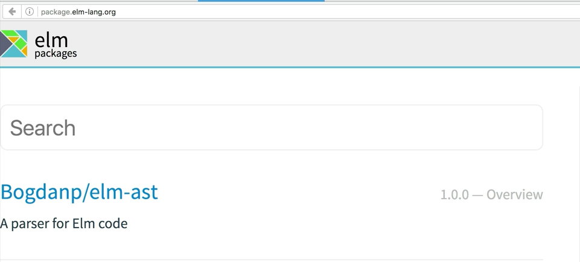
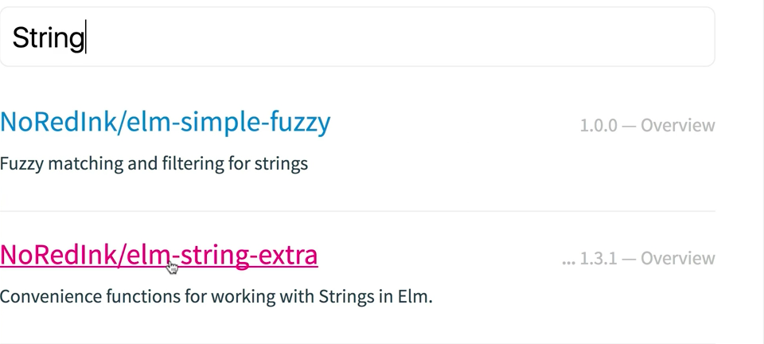
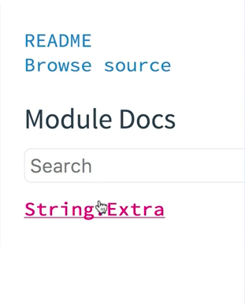
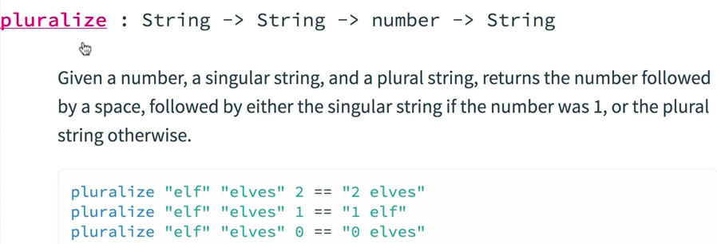
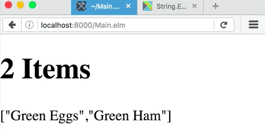
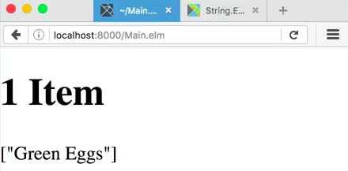

Here, I've got a fake little shopping cart, and my goal is to change this header in the browser, `ITEMS` to say one item or two items or three items depending upon how many items I actually have in the cart. I don't have a function already to pluralize this name according to the number of items that I have, but I bet you there's something available on the Elm package index.

Let's go take a look by navigating to `package.elmlang.org`. Now here, I've got a search box. 



Question is how do I go about finding something like this? Let's just take a look for a string since we know we're going to want to do something to a string. Let's just take a look at this Elm string extra library. 



It looks like it might have some functions around strings that we can go explore, see if somebody's already done this. Over here on the right-hand side, we have the sub packages of this whole package, we'll go click on string.extra. 



Now, we get a listing of the functions that are available in this library, capitalize which we're not looking for. But the second function in the list is called "pluralize." It looks like what we want. Let's take a quick look at the arguments here.



It takes a `string` and a `string` and a `number` and it will return a `string`. Let's look at the example. It looks like you can give it the singular form and then the plural form, and then the number, and it'll return the appropriate pluralization of that string.

Let's give it a try. In order to start using this package, we should take note of this name right here, the user name, the user who published the package, and the name of the package itself.

Once we remember those things, we can go over to our terminal and open up a new shell even while the Elm active server is running. Here, we can type `elm-package install` and then the user name, `NoRedInk/` and then the package, `elm-string-extra`, then hit enter.

####Terminal
```bash
elm-package install NoRedInk/elm-string-extra
```

It's going to ask if we want to add that to the Elm package.JSON as a dependency and we do. Then, it'll give us a summary of the things that it wants to install.

We approve of that too, and now, we're set to use it. Let's go back to our editor and we can `import String.Extra exposing (pluralize)`.

####Main.elm
```javascript
import String.Extra exposing (pluralize)
```

Now down in the `main` function with the `h1` instead of just calling `text` `Items`, we can call the function `pluralize` to pluralize this string, which we'll do by putting in a pair of parentheses since we're about to call a new function and we don't its arguments to get confused with other arguments.

We're going to call `pluralize` and the first thing we pass in it `item`, because that's the singular form, and then `items` as the secondary form. And then, we can pass in but in parentheses again, because we're going to call another function, `List.length items`, and we'll delete this extraneous string

```javascript
main = 
    div []
        [ h1 [] 
            [ text <| (pluralize "Item" 
                "Items" (List.length items))
                ]
            , text <| toString <| items
            ]
```

Now go to the browser, reload. It looks like it's working.



It is now pluralized to two items. Let's remove one of these items and see if it still works. It does. 



Here, we've seen a need that we didn't have a function for already, in this case, pluralizing a string, and we thought we might be able to find that on the Elm package index.

We went to `package.elm-lang.org`, found a package that looked like it might accommodate what we were needing, found the function we needed, installed the package with `elm package install` and then used it in our project.