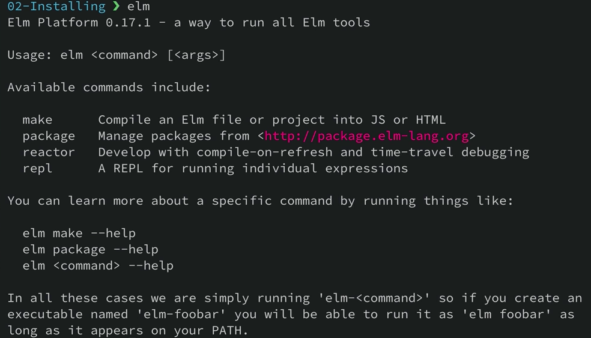
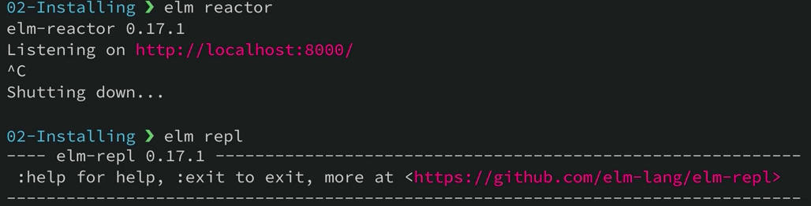

Here I am in an empty folder and I want to get Elm installed. Elm's binaries are available through npm. I can install them just by typing `$ npm install -g elm`. 

####Terminal
```bash
$ npm intall -g elm
```

Then I wait for a while. There it is. Now I can type `elm`. It should be in my path.



I can also type elm-reactor to start the dev server, or I can type elm-repl to start a Read-eval-print-loop. 



Inside of here I can test it out, `foo = 1`, looks good, `bar = 2`, and `foo + bar` equals 3. We have elm installed.

```bash
foo = 1
1 : number

bar = 2
2 : number

foo + bar
3 : number
```