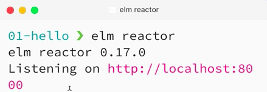
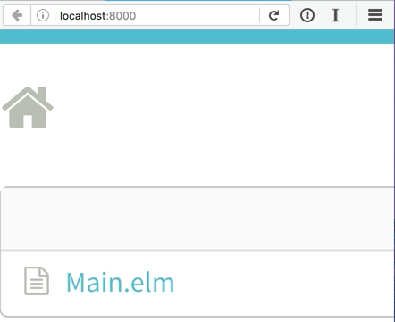
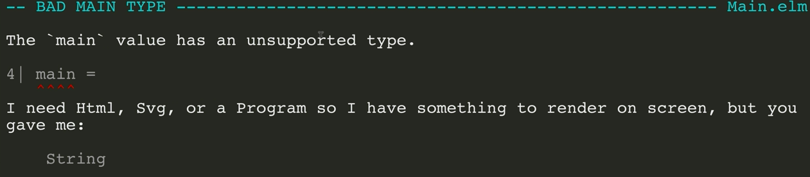
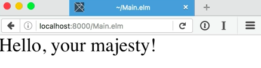

I'm going to make a new file here, and I'm going to call it `Main.elm`. The very first thing I'll do is type the word `module` to make a new elm module, and then I'm going to type the same name of the file that we just made, `module main`. Then I'll type `exposing (..)` that just tells elm that everything inside this file will be exposed for import later.

####Main.elm
```javascript
module Main exposing (..)

main = 
    "Hello"
```

We don't really need it right now, but it's required, so you can just type it in and forget it. I'll define anew value here at the top level called `main`. This value can either be a function or a constant, and elm uses this to know how to start your program.

Let's just pass in a string and see what happens, `Hello`. Save the file, and then over here on the right side, Elm's got a nifty little tool that comes with it, a dev server, and that's called Elm Reactor. You can see that it's listening on `localhost:8000`. 



Let's pop open Firefox here, and go to that address, `localhost:8000`. You can see that it's got a list of files, and `main.elm` is here. 



I'm going to click on it and see that Elm compiles my project as I wait. Uh-oh, it looks like we've got some errors. The main value has an unsupported type. It needs HTML, SVG, or a program, and we gave it a string.



Let's actually pass in the HTML type, but in order to do that, we're going to have to get the HTML library downloaded. Let's stop Elm Reactor and type in "elm package install elm-lang/HTML." 

####Terminal
```bash
$ elm package intall elm-lang/html
```

Hit enter, and it's going to ask you if that's OK and I'm going to say it is OK. Do I approve of this plan? Yes, I do, I always approve of this plan.

Now let's start Elm Reactor again, and now let' go back to our code and `import Html`. Now we're going to `expose` a function from HTML called `text`. 

####Main.elm
```javascript
import Html exposing (text)
```

This function takes a string and converts it into an HTML node, which is what main wanted. Let's go ahead and type `text`, that's how invoke a function in Elm.

```javascript
main = text
    "Hello"
```

Now we're going to pass it a parameter by putting in a `space`, and then putting in the string we want to pass to it. Let's modify this string to be a little bit more polite. 

```javascript
main = 
    text "Hello, your majexty!"
```

Save the file and open up Firefox, reload, and there we go, we've got a string.



Here's what we did. We defined a new `module`, we exposed all of the values inside the `module` for import elsewhere. We `imported` the `Html` library after installing it, and we `exposed` the function `text`.

Here we used the function `text` to convert a string into an HTML value and assigned that to the special `main` function. Then we saved our file and ran it with Elm Reactor, and got something beautiful in the browser.