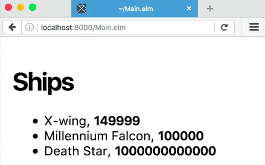

Let's make a new function here called `renderShips`. The goal is to take some data, 

####Main.elm
```javascript
ships = 
    [ { name = "X-wing", cost = 149999 }
    , { name = "Millennium Falcon", cost = 100000 }
    , { name = "Death Star", cost = 1000000000000 }
    ]
```
a bunch of spaceship data, and instead of just spitting out raw text in the browser, I want to actually insert real HTML. Before we actually do that, though, we're going to have to adjust our imports.

Right now, we're just importing the `text` function from `Html`. Delete `text`, and put in `(..)` instead so that we can import everything from `Html` into our modules namespace. Also, we're going to want to import `Html.Attributes` so that we have access to things like `style`, for example.

```javascript
import Html exposing (..)
import Html.Attributes exposing (..)
```

Back down to `renderShips`. This is going to take in a list of `ships`, and we're going to return a `div`. `div` is a function that comes from the `Html` library. It takes two arguments, which are two lists, `[] []`. The first is a list of HTML attributes, and the second is a list of other pieces of HTML.

```javascript
renderShips ships =
    div [] []
```

That is the pattern that the whole Elm `Html` library uses, so it's good to learn. First thing we want to do is give this `div` an attribute of `style`, which takes a list of tuples. A tuple is expressed by these parentheses right here, and a comma inside the parentheses.

```javascript
renderShips ships =
    div [
        style [(,)]
    ] []
```

A tuple is a fixed-length grouping of data, and the data can be different types, unlike a normal list. In this case, we want a tuple of two strings. On the left of the comma, I'm going to type the name of my style, `"font-family"`, and on the right of the comma, I'm going to type in the special font name, `"-apple-system"`.

```javascript
...
style [ ("font-family", "-apple-system") ]
] []
```

That value just comes with CSS, and it'll know to use my Apple system font. Let's also give this another style rule by inserting a comma, and putting in another tuple, and typing in `"padding"`. Then a comma, and then `"1em"`.

```javascript
...
[style 
    [ ("font-family", "-apple-system") 
    , ( "padding", "1em")
    ]
]
 []
```

Now, let's add some HTML children. First thing I want to do is add an `h1`. It has no attributes, but it's going to have some children, which are `text "Ships"`. Remember, we've got to use the `text` function whenever we want to render a string.

```html
...
[style 
    [ ("font-family", "-apple-system") 
    , ( "padding", "1em")
    ]
]
[ h1 [] [text "Ships"]
]
```

In this case, we need to turn this string into a piece of HTML that we can pass as a child to `h1`. Next, let's drop in a `ul` with no attributes. For the children, instead of passing in a normal list, I'm going to call a new function by mapping over a list of data, `list.map`. Then we'll call a function, `renderShip`, which doesn't exist yet, and then, we'll pass in `ships` as the data.

```html
...
]
[ h1 [] [text "Ships"]
, ul [] (List.map renderShip ships)
]
```

Above the `renderShips` function, let's make that new function, `renderShip`, which takes in a `ship`, and will return an `li` with no attributes. It does have some children. That first child is going to be `text ship.name`. Second child is going to be `text`, and then a `", "`. 

```html
renderShip ship = 
    li []
        [text ship.name
        , text ", "
        ]
```

Then, let's put it in bold, so we'll put in a `b` tag with no attributes, but some children. `text <| toString`, since the cost of the `ship` is an `int`, `ship.cost`. 

```html
renderShip ship = 
    li []
        [text ship.name
        , text ", "
        , b []
            [text <| toString ship.cost]
        ]
```


Now down here in `main`, we can rid of all the stuff that we had there already. We can just call the function we made, `renderShips`, and pass in the `ships` data to it.

```javascript
main = 
    renderShips ships
```

There we go. 



We've got some nicely formatted HTML, an `h1`, and a list with information in it. What we did is we made a function called `renderShips`, passed in the `ships` data. We called a function from Elm called `div`, which takes in two lists, one of attributes, and one of children.

We passed in some attributes for style, and then as children, we passed in an `h1`. We called the function to generate an unordered list, but instead of passing in an explicit list of children, we mapped over the ships data and generated a list of HTML by calling the function, `renderShip`.

Inside of `renderShip`, we did some nesting of tags right, `b` inside of an `li`, and we rendered out to the browser some nice text.