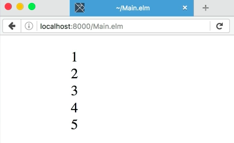
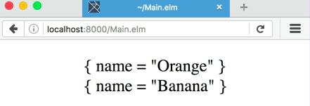

Let's make a function that'll allow us to print these numbers, `printNumbers` to the screen. It's going to take an `int` and it's going to return `Html msg`. Don't really worry about what `msg` means right now. That's there for building interactive applications.

####Main.elm
```javascript
printNumbers : Int -> Html msg
```

Let's define the body of this function. `printNumbers` is going to take in an `int` and it's going to return an `ul` with no attributes and then we'll put a `text` note in here, and we'll pass in `toString` of the `int` that we get in. 

```javascript
printNumbers : Int -> Html msg
printNumbers int =
    ul [] [ text <| toString int ]
```

Now down in the `main` function, instead of this list of children, we can put in some parens and call it `List.map printNumbers numbers`.

```javascript
main = 
    ul [] (List.map printNumbers numbers)
```

OK, so we've got a list of numbers in the browser. 



Now, let's say we wanted to print out the `fruits` instead of the numbers. We can't call `printNumbers` with `fruits` because it's expecting an integer and `fruits` is a list of objects, but we look at the code inside of `printNumbers`, and this should all be pretty generic. All we're doing is doing a two string and then putting that into a `text` note.

This actually should be adaptable between numbers and objects. Let's make adaptable by changing the upper case `int` type in `printNumbers` to a lower case `thing`. 

```javascript
printNumbers : thing -> Html msg
...
```

It doesn't matter what word I use here. What matters is that it's lower case. When Elm sees a lower case word inside of a type signature, it knows that that's a variable, that that can change depending upon the context.

Just to make things make sense, let's change `printNumbers` now to be instead `printThing`, and let's change the `int` argument to be `thing`. 

```javascript
printThing : thing -> Html msg
printThing thing = 
    ul [] [ text <| toString thing ]
```

Down in the `main` function, we'll have to change the reference to `printThing`. 

```javascript
main = 
    ul [] (List.map printThing numbers)
```

Let's make sure it still works in the browser. It does. 


What if we pass in fruits? 

```javascript
main = 
    ul [] (List.map printThing fruits)
```

It works. 



Here we've defined a function called `printThing` that takes in any `thing` and does something to it.

We know it can take in any type because it's got a lower case word instead of an upper case word as its type, and we've been able to call it with both a list of integers and a list of objects.