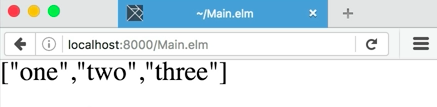
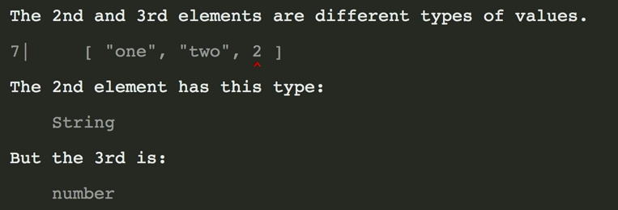
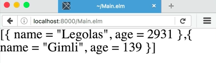
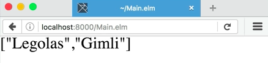
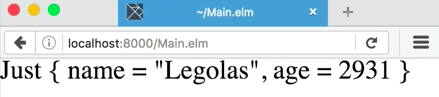

Let's start by make a list of strings by typing `foo`, and then a `[]` to open a list, and then `"one"`, `"two"`, and `"three"`. Now, let's print out this list `toString <| foo`. 

####Main.elm
```javascript
foo = 
    [ "one", "two", "three" ]

main = 
    text <| toString <| foo
```

We've printed out a list of strings in the browser.



Now, let's try changing one of these strings to an integer and see what happens. Looks like we got a compiler error. 



That's because in Elm, you can't have a list of mixed types. They all have to be the same type. You could a list of integers or a list of strings, but you can't have a list of integers and strings.

Let's scrap this whole thing and, for exemplary purposes, let's define a new type, `type alias Person =`, and then, I'm going to use a curly brace to open, because that's the way we open a type alias.

Then, I'll type `name` to define a field with a `:` and then `string` as the type of the field and then a `,` to separate the fields and `age` with the type of the field being `int`.

```javascript
type alias Person = {
    name : String
    , age : Int
}
```

Now, let's make a list of persons or a list of people which we can do by typing `people =`, and then once again, open square brace for the beginning of the list, and then, open bracket to define a new record. Here, we'll type `name`, and then, the `=` instead of the colon, because we're not defining a type here.

We're actually defining a piece of data. `name = Legalos`, and then a `,` to separate the fields and `age = 2,931`. Now a `,`, and then curly braces for another new record, `name = Gimly` and `age = 139`.

```javascript
people = 
    [ { name = "Legolas", age = 2931 }
    , { name = "Gimli", age = 139 }
    ]
```

Now, we've got a list of people. Let's try printing it out and see what happens. Great, looks like it worked fantastically. 



What is we want to print a list of the people's names instead of all of the people's information?

Let's make a function called `names`. We'll give it a type `List Person -> List String`. We're going to need a function that can go through the list and pick out one of the fields that's a string and return a list of that instead, `names peeps =`. 

```javascript
names : List Person -> List String
names peeps = 
```

Now, I'm going to need something that's going to let me iterate over each item in the list and do something to it. The list library fortunately has some functions included that'll help me with that. I'm going to `import list` up at the top, and then, back down inside of `names`, I'll type `List.map`.

```javascript
names : List Person -> List String
names peeps = List.map 
```

Map is a function that takes each item in the list, let me apply some transformation to it, and then, it'll spit out a list again at the end when I'm all done.

What it does is it first takes and anonymous function, which we're going to define by using parans, a back slash, and then the function argument, which is going to be `peep` and then an arrow to define the body of the function. Then we type out here `peep.name`. This should be a function that takes a person and gives us back the person's name. Now last thing we've got to do is pass in the list to `list.map`, which we can add on the end.

```javascript
names : List Person -> List String
names peeps = List.map (\peep -> peep.name) peeps
```

Let's see if it worked by replacing people with a call to `names` and then passing `people` into that. 

```javascript
main = 
    text <| toString <| names people
```

Yep, looks like it worked just fine.



What if I come upon a situation where instead of giving back a list of names I want to take a list of people and return just one person from that list? Let's make a function that does that.

Let's call it `findPerson`. It's going to take in a `String` for a name, and then, it's going to take in a `List Person`. It'll return a `Maybe Person`, because we don't know if the person's going to be in the list or not. 

```javascript
findPerson : String -> List Person -> Maybe Person
```

Maybe is another library that's included in the core of Elm. This represents values that can either exist or not. You'd use this instead of using null like you would in JavaScript.

Now, let's define the body of the function, `findPerson names peeps =`. We need a function that's going to take a list and return a single value from that list. There happens to be a function already called "List.foldl."

```javascripts
findPerson : String -> List Person -> Maybe Person
findPerson name peeps = List.foldl
```

There's also `foldr`. Each of these functions just take a list, and they iterate from either the left side or the right side. They let you build up a single value, ultimately returning just that value in the end.

We're going to add our anonymous function at the end of `findPerson` by putting in our paran and our back tick. The arguments to this function this time are going to be `peep`, the person we're iterating over, and `memo`. Memo is going to be a value that we start with when we begin iterating through the list.

```javascripts
findPerson : String -> List Person -> Maybe Person
findPerson name peeps = List.foldl
(\peep memo -> )
```

We can transform it and change it until we reach the end. At the end, whatever the value of memo is is going to be the return value of the entire call to the function. In this case, our memo is going to a maybe person.

Inside of this anonymous function, let's check to see if the memo is already occupied by a value or not. We'll do this using a case statement and a feature of Elm called "pattern matching." `case memo of`, and then right now, we can enter `Just`, and then a `_` and an `->`, and then `Nothing`, and then an `->`.

```javascript
...
(\peep memo -> case memo of 
    Just _ -> 
    Nothing ->
        )
```

What we've done here is we've said to Elm in this function we're going to branch here. We're going to say if the `memo` is occupied by a value that is just anything, we're going to use that `_` to represent any value.

This, `Just _`, is of the type `Maybe Person`. We're saying if the memo is adjust, go ahead and return the memo, because if we've already found the person, we don't want to try to find them again.

But if we haven't found the person yet, if we get a nothing in, then, let's look for the person. Here, let's use an if expression, if `peep.name == name`, then, we're going to return `Just peep`. Otherwise, we're going to return nothing, `else Nothing`. 

```javascript
...
(\peep memo -> case memo of 
    Just _ -> memo
    Nothing -> if peep.name == name then
        Just peep
        else Nothing
        )
```

Down at the end of the parans, we're going to pass in the initial value of our memo, which is `Nothing`, and then, we'll pass in the things we want to iterate over, which are `peeps`. Save the file, get some formatting in there.

```javascripts
findPerson : String -> List Person -> Maybe Person
findPerson name peeps = 
    List.foldl
        (\peep memo -> case memo of 
            Just _ -> memo
            Nothing -> if peep.name == name then
                Just peep
                else Nothing
    )
    Nothing 
    peeps
```

Now, let's try calling it. This time instead of calling `names people`, let's call `findPerson` and pass in the name, `"Legalos"`, and the we got to pass in the list of `people`. 

```javascript
main = 
text <| toString <| findPerson "Legolas" People
```

Reload it in the browser. It looks like we found Legalos. We got back this value, just Legalos with his age.



What happens if we try to find someone who isn't in the list, such as Veramere? We get back nothing.


What we've done here is we've defined a list of `people`, we made a function that can transform each item in the list into something else, in this case, extracting the `name` from a `person`, and we've also made a function that can go through a list of things and return one thing. In this case, we're trying to find a person in the list of people by name.