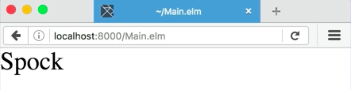
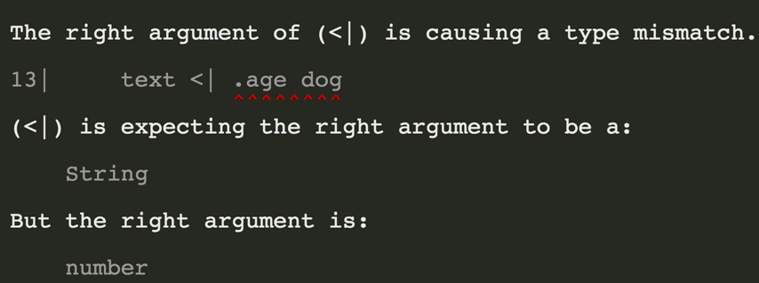
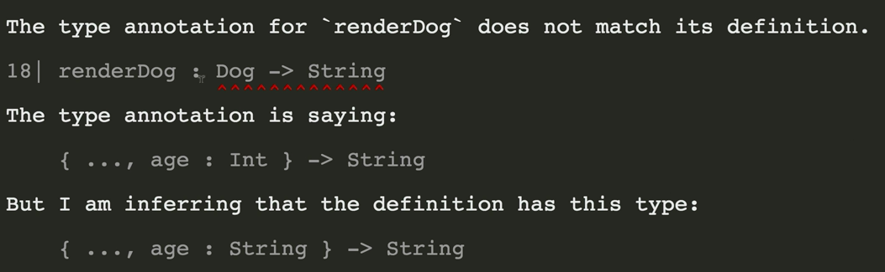
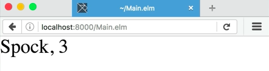

Let's make a new record. Type `dog` right here, and then an `=`. Now, there's a formatting convention in Elm where we start a record with a curly brace, we end it with a curly brace, and they should on the same line.

The first key in the record goes on the same line as the first curly brace. In this case, let's put in the name of the dog, `"Spock"`. Now I put a leading comma. This is just the general Elm style. Then we can put our next field, `age`. Let's give him an age of `3` years old. Here's our first record. 


####Main.elm
```javascript
dog = 
    { name = "Spock"
    , age = 3
    }
```

Now, let's print out one of these fields. Get rid of this string, and we're going to type `dog.name`. 

```javascript
main = 
    text <| dog.name
```

Now, let's load it up in the browser. Spock, there we go.



We've accessed the name field on the dog record. Elm supports another way of accessing fields. Let's take a look at what that looks like, `.name dog`. I've taken the `.name` off the end, and I've put it before as a function.

```javascript
main = 
    text <| .name dog
```

When I write something like this, with a dot at the beginning, Elm knows to generate a small function that takes a record, and looks for a field with that name on the function. Let's save the file and see if it works. It does. 


Now, let's try rendering Spock's `age` instead of his `name`. It looks like we got a compiler error. 



The pipe is expecting the right argument to be a string, but it's a number. That's because `text` expects just a string, and the `age` field is taking an int. We can fix that by throwing it after `text` but before `.age`, `toString`, which is a global function in Elm that takes any value, and turns it into a string.

```javascript
main = 
    text <| toString <| .age dog
```

Let's check that out. It works. 


Now, let's make a function for rendering our dog to a string. Let's call it `renderDog`, and we'll start out with a type definition here. 

```javascript
renderDog:
```

I want to take a `dog`, and return a string. The problem is, I don't know how to represent the `dog` as a type yet.

That's because we haven't given it a type. Up here at the top, above `dog`, we'll type `type alias Dog =`. `type alias` means that I'm giving a new name to a type. Records can be types all in themselves. Right here, the first field, I'm going to type `name`.

Then, I'll give it a `type`, which is `string`. Then, I'll type `age`, and I'll give it a type, which is `int`. 

```javascript
type alias Dog =
    { name : String
    , age : Int
    }
```

Now, I can refer to this type, which is a record, with the name `dog`. Down here in `renderDog`, I can type `dog -> string`. I'm going to take a dog, and return a string.

Then, I'll give the definition for the function right here. `renderDog dog` equals, and we could do `dog.name ++ ", " ++ dog.age`. 

```javascript
renderDog : Dog -> String
    dog.name ++ ", " ++ dog.age
```

Now lets use that function instead of the function currently in `main`, `renderDog dog`.

```javascript
main = 
    text <| renderDog Dog
```

Looks like we have a compiler error. The type annotation is saying that `renderDog` takes a `Dog`, and returns a `String`. That dog should have a field called `age`, which is an `int`. It's inferring that the `age` field is actually a string. 



That's because we've used it incorrectly in `renderDog`.

We're trying to add an `int`, which is `dog.age`, onto a couple of strings. First, we've got to convert `dog.age` to a string, which we can do by adding `toString` in front of `dog.age` inside of parenthesis. 

```javascript
renderDog : Dog -> String
renderDog dog = 
    dog.name ++ ", " ++ (toString dog.age)
```

Let's try it again. It works. 



Here, we've defined a new record called `dog`. We've given it a couple of fields of different types. We've accessed those fields down here inside of the `renderDog` function, and we've made a new `type alias` so that we can refer to this record in type signatures.