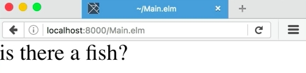
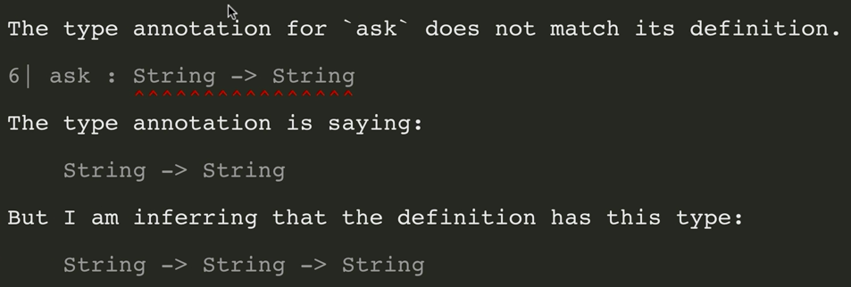
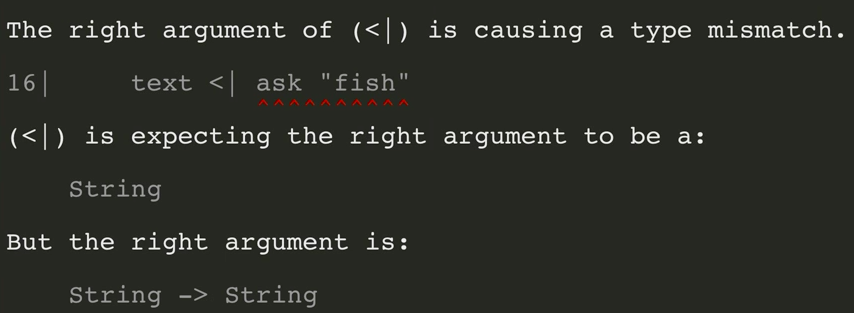
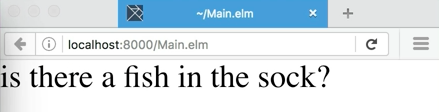
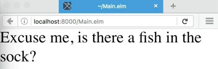
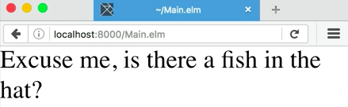

I'm going to add a new function to the `Main.elm` file by typing the function name, 'ask', and then the first parameter name, `thing`. For now, we'll just have one parameter. I'll throw in `=`, and everything to the right of the equal sign will be the body of the function.

####Main.elm
```javascript
ask thing =
```

Let's do some string concatenation here. We're going to type, `"Is there a "` leave a trailing space, then we'll use the `++`, which is the string concatenation operator in Elm. Then we'll drop in, `thing` right there, add another `++`, and then the question mark, `"?"`.

```javascript
ask thing = 
    "is there a " ++ thing ++ ?
```

Now we've got a function that should take a string and return another string. Let's use it in our main function. Here, I'll insert the lesser than character and then the pipe character, `<|`. These two characters combined make what's called the pipe operator.

What this means is that everything on the right of the pipe operator will be evaluated and then passed in to whatever is on the left of the operator. In this case, let's type, `ask` and then, `"fish"`. 

```javascript
main = 
    text <| ask "fish"
```

Save the file, go to the browser and reload. Is there a fish? It worked.



Elm is a strictly typed language, but you'll notice that we don't have any type definitions here at the moment. That's because it does some pretty impressive type inference. However, it is good practice to insert type definitions on their own, so let's do that.

Ask, and then add `:`. That indicates to Elm where about to start a type definition. Then we'll put in a type. In this case, `String` the type of thing. Then we also need to add the return type. We can do that by putting in the minus character, `-`, and then the greater than character, `>`.

```javascript
ask : String ->
```

Now, we can insert the type of our return value, `String`. 

```javascript
ask : String -> String
```

This is the function from `string` to `string`. In Elm, the type definitions are parameters separated by arrows, and then whatever is after the last arrow is the type of the return value.

What if we want to add another argument to this function? Let's go down and type in `place`. Then we'll insert another string here, `"is there a" ++ thing ++ "in the" place ++ "?"` This is getting a little long, so I'll go back and make a line break wherever there are concatenation operators.

```javascript
ask thing place =
    "is there a "
    ++ thing
    ++ " in the "
    ++ place 
    ++ "?"
```

Let's save the file and reload in the browser again. Oops, looks like we got an error. It's saying, "The type annotation for ask doesn't match its definition." Our annotation says that we're taking a string and returning a string but, in reality, we seem to be taking two strings and returning a string.



That's the fact. We forgot to modify our type definition here. At the top, let's add in another string and then an arrow, 

```javascript
ask : String -> String -> String
```

save the file, try it in the browser. Looks like we've got another error. It says, "The right argument of the pipe is causing a type mismatch." We've got ask fish, but the pipe is expecting the right argument to be a string, and instead we've got a function from string to string. 



Let's look at that again. Down here, we're calling ask with one argument, but it takes two. 

```javascript
main = 
    text <| ask "fish"
```

Elm's type system is telling us that what it's got is a function from string to string instead of the value string.

This is because in Elm, all functions are curried by default. Practically, curry just means that I can call a function with fewer parameters than it requires, and what I'll get back is a function that just requires the remaining parameters.

In this case, `ask "fish"`, instead of returning a string, returns a function that takes a string and then returns the string. Let's fix that down here by adding in our next value, sock. 

```javascript
main =
    text <| ask "fish" "sock"
```

It works this time. Is there a fish in the sock? I don't know, you tell me.



Let's try working with more than one function. Let's make a new one above `ask`. We're going to call it, `politely`. It's going to take a `string` and return a `string`. Here's our definition, `politely`, `phrase`, equals `"Excuse me"`, and then we'll add the phrase.

```javascript
politely : String -> String
politely phrase = 
    "Excuse me, " ++ phrase
```

Let's take the result of calling `ask` and pass that into `politely`, and then pass that into `main`. Down at the bottom, we can do that pretty easily by adding another pipe operator. For the first pipe operator, I'll add a return, and right above, on the next line here, I'll add another pipe operator, and I'll type in `politely`.

```javascript
main = 
    text
    <| politely
    <| ask "fish" "sock"
```

What that's going to do is take the very last one and evaluate it first. This returns the string. Then it will get passed into `politely`, which takes a string. That will return a string, which gets passed into `text`. Let's try it out on the browser. It worked.



Here is where we're going to get into some of the really powerful concepts, the function composition in Elm. Let's make another new function. We're going to call it, `askPolitelyAboutFish`. It's going to take a `string`, and it's going to return a `string`. Here's the definition. You're going to note something different this time. I'm not going to specify any parameters. 

```javascript
askPolitelyAboutFish : String -> String
askPolitelyAboutFish =
```

That's because we're going to use what's called a point-free style. I'll enter my first function name here, `politely`, and then I'm going to use another character that's built into Elm, which is the double less than character, `<<`.

```javascript
askPolitelyAboutFish : String -> String
askPolitelyAboutFish = politely <<
```

This character is for function composition. This is built for taking two functions that have compatible inputs and outputs, and building them up to make one function. On the right side of this operator, I'll put parens, and then I'll type, "Ask fish."

```javascript
askPolitelyAboutFish : String -> String
askPolitelyAboutFish = politely << (ask "fish")
```

What I've got inside these parens is a partially applied function. In other words, I have called `ask` with the first argument, and I've gotten back a function that takes the second argument and then gives us the return value.

What this needs is a `place`. I've put that together, so now I've got a function that takes a string and returns a string. Then I'm telling Elm that I want to combine this with another function that takes a string a string and returns a string. Then I want to assign that whole value to ask politely about fish.

Ask politely about fish on the right side will take the `place`, run it through `ask fish`, and then it will run it through `politely`, and then we're going to get a return value of a string. Down here, instead of doing these two calls, `<| politely` and `<| ask "fish" "sock"`, I can go ahead and call `ask politely about fish "hat"`. 

```javascript
main =
    text <| askPolitelyAboutFish "hat"
```

Save the file, go to the browser, reload. It worked.



What we've done here is define a function that takes a couple of arguments. We've talked about type annotations a bit. We've talked about function composition. We've talked about the composition operator, a point free style.

We've talked about the pipeline operator. We've talked about partial application, and we've put together a nice function that can be reused with any value like hat to ask where the fish is.