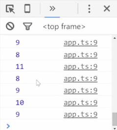

We'll `"start"` with a simple `<button>` with an `id` of `"start"` and with a label of `"start"`, so that we have something to click on over here. We'll `import {Observable} from 'rxjs/Rx'`. We'll find our `<button>` so that we can use it with the `.querySelector`. Look up the `#start` id, give that a reference, and let's call this `startButton`.

```javascript
import {Observable} from 'rxjs/Rx';

const startButton = document.querySelector('#start');
```

Now what you've probably seen in RxJS examples or docs is using something like `fromEvent` to use that element, the `startButton` element, listen for clicks, and then `.subscribe()` as a way to handle the clicks.

```javascript
Observable.fromEvent(startButton, 'click')
	.subscribe();
```

I'll use an arrow function. This will handle the event and we can log out the `'click'` event. We'll hit save, click `"start"`, and you can see we get our `MouseEvent` down here. Every time I click `"start"`, we'll keep getting that `MouseEvent`.

```javascript
Observable.fromEvent(startButton, 'click')
	.subscribe((event) => console.log(event));
```

Similarly, if we wanted to set up a timer or `.interval()` every second, and we want to `.subscribe()` to that, this function actually gets the count of how many times it's ticked through that time. I'll log that out, hit save, and you can see it's logging out. 0, 1, 2, 3, 4.

```javascript
Observable.interval(1000)
	.subscribe((x) => console.log(x));
```

If I click the `startButton`, I get my `MouseEvent`s. If I want the `startButton` to `"start"` a timer like this `.interval()`, then you probably think you can cut this block of code, change this from a one-line, inline function block to an actual block and paste the code in there.

```javascript
Observable.fromEvent(startButton, 'click')
	.subscribe((event) =>{
		Observable.interval(1000)
			.subscribe((x) => console.log(x));
	});
```

You think from experience, "I have a `<button>`. I click on it. I handle that click with `.subscribe()`, and then I create an `Observable` and then handle those ticks with another `.subscribe()`." I'll save and do this, click `"start"`, you can see it works as expected, but this is wrong.

Do not do it this way. Do not have multiple `.subscribe()` blocks nested inside of each other. For one, you'll lose the ability to save this stream and reuse it, because when you call `.subscribe()` what comes out of `.subscribe()` is a subscription, not an `Observable`.

I could not pass this around and reuse it in other places. Also, if you try to do this right now and click multiple times -- I'll click `"start"` and `"start"` and `"start"` and `"start"` and `"start"` -- you'll see that I'm getting this behavior where it's creating an `.interval()` every single time I click.



For a stopwatch, that's not what we want to happen. Instead, what you should think about is when I click the `startButton` -- the `startButton` click -- I want to switch over to an `.interval()` `Observable`. Instead of saying, "I want to `.subscribe()` to the click," you want to say, "When I click I want to `switchMap`," or basically switch to.

```javascript
Observable.fromEvent(startButton, 'click')
	.switchMap()
	.subscribe((event) =>{
		Observable.interval(1000)
			.subscribe((x) => console.log(x));
	});
```

This takes the function which should return the `Observable` we want. The `Observable` we want is this `Observable` `.interval()`. I'll cut this out and paste it in there.

```javascript
Observable.fromEvent(startButton, 'click')
	.switchMap(() => Observable.interval(1000));
```

Now the way this reads is from my `startButton`, when I click, switch over to an `.interval()`, and when I `.subscribe()` to this, what the output is going to be is those ticks. 

```javascript
Observable.fromEvent(startButton, 'click')
	.switchMap(() => Observable.interval(1000))
	.subscribe((x) => console.log(x));
```

I'll hit save. I'll click `"start"`. Clicking on the `startButton` switched over to the `.interval()` and is now logging out each of those ticks.

If you wanted to use this first `Observable`, the `fromEvent` one, to define how the second one that it's mapping to should work, then you can still take the event and do something like create an `Observable` with an `.interval()` of `event.x`, meaning the position I click on the mouse `<button>` is going to determine how fast that `.interval()` runs.

If I click really far to the left here, it's going to go super-fast. If I click further over to the right, it will slow down a bit. Super-duper fast and a little bit slower, but I'm going to undo that, because I just want an `Observable` with an `.interval()` of 1000, or one second.

The other thing I can do now is, if I want to pull this out and say this is my `.interval()` `Observable`, then I can just drop it in here. I can even pull this out, saying that this is my `"start"` `Observable`, and put that right there. This now works the exact same way.

```javascript
const start$ = Observable.fromEvent(startButton, 'click');
const interval$ = Observable.interval(1000);

start$
	.switchMap((event)=> interval$)
	.subscribe((x)=> console.log(x));
```

I'll click and it will tick every second as expected. Also, I can even define this one. I'll cut this out. I'll say, `startInterval$`, and then use that down here -- `startInterval$` -- hit save, and then clicking `"start"` will again trigger that same timer.

```javascript
const startInterval$ = start$
	.switchMap((event)=> interval$);

startInterval$
	.subscribe((x)=> console.log(x)); 
```

Instead of thinking of that original nested event handler way, that line of thought, think of, "I have something that's going to fire that when that fires I want it to `"start"` this other thing, so that eventually when I `.subscribe()` to it, this is the starting event, but these are the things that are going to come through." It's going to switch over to this `.interval()`, so we're starting a timer.

One final notable shortcut is if you don't need this event or the thing coming from the original stream, you can say `switchMapTo`, and that will save you from writing that arrow function.

You can pass in the `Observable` itself instead of passing in a function that returns an `Observable`, so that when I save we get the exact same behavior. It saves us a few characters of code and maybe makes it a bit more readable.

```javascript
const startInterval$ = start$
	.switchMapTo(interval$);
```