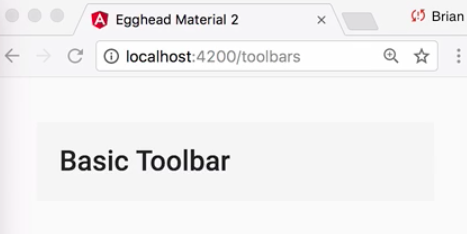
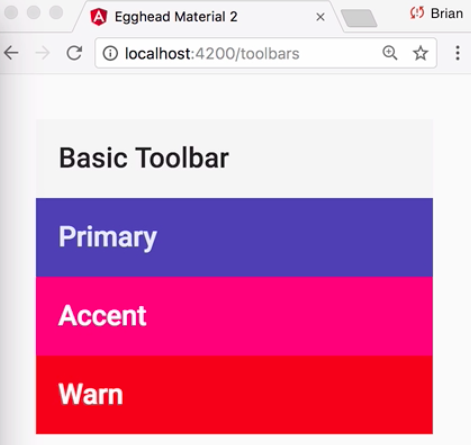
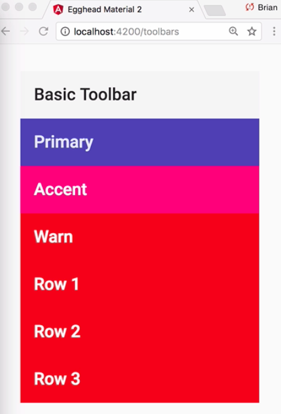
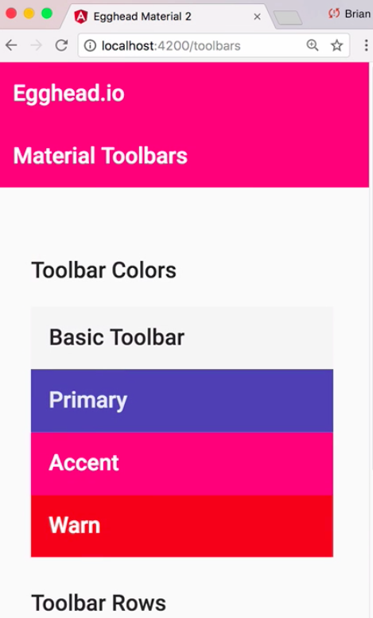
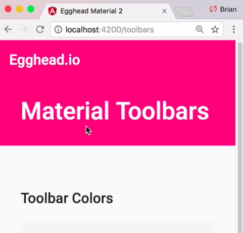
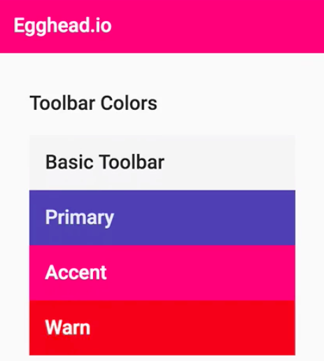
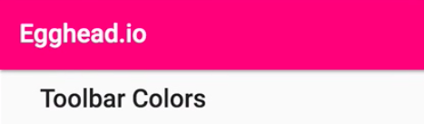

Instructor: [00:00] To get started with the toolbar component, you first need to include the `MatToolbarModule`. 

#### toolbar-lesson.module.ts
```javascript
import { CommonModule } from '@angular/common';
import { NgModule } from '@angular/core';
import { MatToolbarModule } from '@angular/material';
import { ToolbarLessonComponent } from './toolbar-lesson.component.ts';

@NgModule({
    declearations: [ToolbarLessonComponent]
    imports[CommonModule, MatToolbarModule]
})
export class ToolbarLessonModule {}
```

In `toolbar-lesson.component.html`, we'll start by adding a toolbar with no settings. 

#### toolbar-lesson.component.html
```html
<div class="lesson-content">
    <mat-toolbar>Basic Toolbar</mat-toolbar>
</div>
```

When we refresh, we can see we have a basic toolbar with a light gray background.



[00:18] Like other themable components in Angular Material, the mat-toolbar component accepts the usual options of `primary`, `accent`, and `Warn` corresponding with your app theme.

```html
<div class="lesson-content">
    <mat-toolbar>Basic Toolbar</mat-toolbar>
    <mat-toolbar color="primary">Primary</mat-toolbar>
    <mat-toolbar color="accent">Accent</mat-toolbar>
    <mat-toolbar color="warn">Warn</mat-toolbar>
</div>
```


[00:30] If you have a use case for stacked toolbars, you can use the `mat-toolbar-row` component. All we need to do, we'll go ahead and copy down out toolbar component. Inside the toolbar component, we can add our `mat-toolbar-row`. You can stack as many toolbars as you want. For our case, we'll just add three toolbars.

```html
<div class="lesson-content">
    <mat-toolbar>Basic Toolbar</mat-toolbar>
    <mat-toolbar color="primary">Primary</mat-toolbar>
    <mat-toolbar color="accent">Accent</mat-toolbar>
    <mat-toolbar color="warn">Warn</mat-toolbar>

    <mat-toolbar color="warn">
        <mat-toolbar-row>Row 1</mat-toolbar-row>
        <mat-toolbar-row>Row 2</mat-toolbar-row>
        <mat-toolbar-row>Row 3</mat-toolbar-row>
    </mat-toolbar>

</div>
```

[00:46] When we refresh, we can see we have our extra three stacked toolbars. 



It's worth noting that the toolbar color is based off the wrapping toolbar. If we change the color to `primary` here, all three toolbars will reflect the primary color of our application.

[01:04] One pattern we can create using the [Material toolbar](https://material.io/guidelines/) is the extended header. As we scroll down, the title pops up and box-shadow appears at the right position. Let's see how we can replicate this with Angular.

[01:18] The first thing that we need to do is add our two toolbars to the top. Let's name one `egghead.io`. The one beneath it we'll call `Material Toolbars` so we can see a separation.

```html
<mat-toolbar>Egghead.io</mat-toolbar>
<mat-toolbar color="primary">Material Toolbars</mat-toolbar>
```

[01:31] Let's also switch the colors of both toolbars to the `accent` color of our app. We also need to assign each a `class` so we can add a little extra styling. We're going to call the first one the `"primary-toolbar"`, and the one below we'll call the `"secondary toolbar"`.

```html
<mat-toolbar color="accent" class="primary-toolbar">
    egghead.io
</mat-toolbar>
<mat-toolbar color="accent" class="secondary-toolbar">
    Material Toolbars
</mat-toolbar>
```

[01:44] Let's see where we're at. 



We have our stacked toolbars, but we need the bottom toolbar to scroll under the top. Let's add a little styling. We're going to go ahead and target the `.primary-toolbar`. We'll fix the `position` to the top of the screen. We also need to add a little `padding` and adjust the `font-size` to make the secondary toolbar slightly bigger.

#### toolbar-lesson.component.scss
```css
.primary-toolbar {
    position: fixed;
    top: 0;
}

.secondary-toolbar {
    font-sized: 34px;
    padding: 100px 0 48px 32px;
}
```



[02:11] At this point, we just need to add the logic to hide and show the appropriate toolbar text and show our box-shadow at the right time. We'll start by adding a couple of properties that can act as flags to determine whether our text should be shown and hidden and whether our box-shadow should be applied based on the scroll position.

[02:26] I went ahead and added a reference to our scroll container and grabbed the element via the querySelector API. 

#### toolbar-lesson.component.ts
```javascript
export const SCROLL_CONTAINER = '.mat-drawer-content';

@Component({
    selector: 'egm-toolbar-lesson',
    templateUrl: './toolbar-lesson.component.html',
    styleUrls: ['./toolbar-lesson.component.scss']
})

export class ToolbarLessonComponent implements OnInit, OnDestroy {
    public popText: boolean;
    public applyShadow: boolean;

    constructor(private _lessonConfigService: LessonConfigService) {
    }

    ngOnInit() {
        const container = document.querySelector(SCROLL_CONTAINER);

    }
}
```

All that's left to do is listen to the scroll events from this container. To do this, we're going to create an observable from the scroll event. We can call `fromEvent`, passing it our `container` and the event that we want to listen to, which in this case is the `'scroll'` event.

[02:45] We can go ahead and `.subscribe` to this observable. What we want to do is we want to create a function that we're going to pass the `.scrollTop` position of our container on every event. This will determine the status of our header. For now, I'm going to create an empty method that accepts a scroll position. 


```javascript
...
    ngOnInit() {
        const container = document.querySelector(SCROLL_CONTAINER);

        fromEvent(container, 'scroll')
            .subscribe(_ => this.determineHeader(container.scrollTop))
    }

    determineHeader(top: number) {

    }
```

I'm going to define the scroll and shadow thresholds as constants. 

```javascript
export const SCROLL_CONTAINER = '.mat-drawer-content';
export const PRIMARY_TEXT_THRESHOLD = 22;
export const PRIMARY_SHADOW_TRESHOLD = 78;
```

Next, I'm going to add a simple `if/else` statement in `determineHeader` that depending on the current scroll position we're going to set the previously declared properties to either `true` or `false`. I'll do the same for the `applyShadow` property.

```javascript
...
    determineHeader(top: number) {
        if (top >= PRIMARY_TEXT_THRESHOLD) {
            this.popText = true;
        } else {
            this.popText = false;
        }

        if (top>= PRIMARY_SHADOW_THRESHOLD) {
            this.applyShadow = true;
        } else {
            this.applyShadow = false;
        }
    }
```

[03:24] Now that our flags are being set, we can add a `*ngIf` state for each header. The top header will be shown when the `popText` property is `true`. The opposite will be the case for our extended `"Material Toolbars"` header. 

#### toolbar-lesson.component.html
```html
<mat-toolbar color="accent" 
             class="primary-toolbar">
    <span *ngIf="popText">Egghead.io</span>
</mat-toolbar>
<mat-toolbar color="accent" 
             class="secondary-toolbar">
    <span *ngIf="!popText">Material Toolbars</span>
</mat-toolbar>
```

We now have the extended header text and our primary toolbar text disappearing and reappearing in the right location.



[03:45] Next, we need to imply our `box-shadow`. We can do this utilizing a simple class binding with our `applyShadow` property as well as Material's elevation helpers, `mat-elevation-z2`. It's worth noting that with Material's elevation helpers you can supply a value between 0 and 24. For instance, if we made this `z24`, then it would have a higher elevation than if we made it `z2` or even `z10`.

```html
<mat-toolbar color="accent" 
             class="primary-toolbar"
             [class.mat-elevationo-z2]="applyShadow">
    <span *ngIf="popText">egghead.io</span>
</mat-toolbar>
```

[04:11] Our box-shadow is now applying correctly. 



All that's left is to perform a little cleanup on our component. We need to clean up the scroll subscription when this component is no longer active. To do this, we're going to utilize the `.takeUntil` operator that accepts an observable. When this observable emits, it completes the subscription.

####toolbar-lesson.component.ts
```javascript
...
    ngOnInit() {
        const container = document.querySelector(SCROLL_CONTAINER);

        fromEvent(container, 'scroll')
        .takeUntil()
        .subscribe(_ => this.determineHeader(container.scrollTop))
    }
```

[04:27] Next, we're going to add a `private` property that's a subject that we'll use to emit a value in the `ngOnDestroy` lifecycle hook. 

```javascript
export class ToolbarLessonComponent implements OnInit, OnDestroy {
    public popText: boolean;
    public applyShadow: boolean;
    private _onDestroy = new Subject();
...
}
```

`onDestroy`, we're going to call `.next()` on our subject in order to trigger subscription cleanup. 

```javascript
export class ToolbarLessonComponent implements OnInit, OnDestroy {
    ...
    ngOnDestory() {
        this._onDestroy.next();
    }
}
```

All that's left to do is add this to our `takeUntil` operator. 

```javascript
fromEvent(container, 'scroll')
    .takeUntil(this._onDestroy)
    .subscribe(_ => this.determineHeader(container.scrollTop));
```

Our Material extended header is now complete.