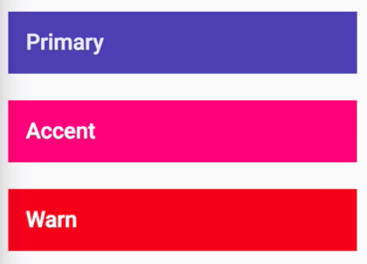
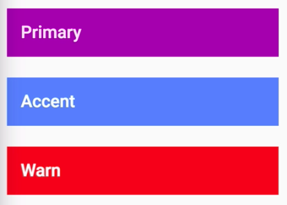

Instructor: [00:00] In our previous lessons, we've been using Angular Material's built-in themes. While this works in basic scenarios, in a real app you'll probably want to customize your own theme. Let's see how this works.

[00:10] To start, you need to `@import '~@angular/material/theming';` mixins. 

#### styles.scss
```javascript
@import '~@angular/material/theming';
@import './styles/general';
```

These are helpers that set up the base Material styling as well as configure your theme based on your custom Material color combination. The first mixin you'll want to `@include` is `mat-core`. This configures all the non-theme-dependent Material styling, such as typography, elevation helpers, ripple effects, and overlays.

[00:35] Next, you'll want to configure the colors to be used in your application or your application's palette. To do this, we'll utilize the `mat-palette` mixin. We'll store the result in a Sass variable called primary.

```javascript
@include mat-core();

$primary: mat-palette();
```

[00:47] The `mat-palette` mixin accepts a base palette, returning a palette or a map of additional color variables, including lighter and darker variations, and additional color contrasts which your application may need.

[00:57] To find out which colors are available for your palette, you can check out the colors section on the [Material Design](https://material.io/guidelines/style/color.html#color-color-palette) guidelines site. You can also take a look at the `_theming.scss` file and find the appropriate color variables. If you're interested, these include the contrast and hues that will be used within your palette.

[01:15] Next, you need to create a palette for your `$accent` color. We'll go ahead and use the `mat-palette` mixin again. For now, we'll choose pink to match our current theme. For our `$accent` color, we will also utilize the three optional parameters for the `mat-palette` mixin. This gives us fine-grained control over the default lighter and darker colors for a particular palette.

```javascript
$primary: mat-palette($mat-indigo);
$accent: mat-palette($mat-pink, A200, A100, A400);
```

[01:32] To see which options are available, you can again utilize the [Material Design](https://material.io/guidelines/style/color.html#color-color-palette) color guidelines site or come into the `_theming.scss` file and look at the particular color you're interested in.

[01:42] Next, we need to create an overall $theme color map by using the `mat-light-theme` mixin, passing it our already created `$primary` and `$accent` palettes. 

```javascript
$theme: mat-light-theme($primary, $accent);
```

This mixin will utilize these color palette maps as well as the default for the `warn` color, returning an aggregated app-theme color map.

[01:57] All that's left to do is `@include` the `angular-material-theme` mixin, passing it the `$theme` we just created. 

```javascript
@include angular-material-theme($theme);
```

This includes all the component styles, passing it the theme map for appropriate coloring. When we refresh, we can see we had the same colors we had before with the prebuilt theme. 



There's also a `mat-dark-theme` mixin which modifies your theme's foreground and background colors.

```javascript
$theme: mat-dark-theme($primary, $accent);
```

[02:18] Now that we have our theme configured, let's see how easy it is to switch up the theme's palettes. Let's go ahead and modify the primary color to `purple` and our accent color to `blue`. We'll also switch `$theme` back to a `light` theme. 

```javascript
$primary: mat-palette($mat-purple);
$accent: mat-palette($mat-blue, A200, A100, A400);
$theme: mat-light-theme($primary, $accent);
```

When we refresh, we can see our theme has updated accordingly.



[02:31] One thing you may want to do is create your own custom styling that depends on your theme's colors. To do this, we can take a similar strategy to the Material component mixins. We'll create our own mixin which accepts the `$theme`. We can retrieve our palettes using Sass as `map-get` helper, assigning each to a variable.

[02:49] Once that's complete, we can reference a particular color from the palette using the mat `color` mixin. For demonstrations, we're going to create a `$primary` text class and pass the mat `color` mixin our `$primary` palette. 

#### _custom_lesson_theme.scss
```javascript
@mixin custom-lesson-theme($theme) {
  $primary: map-get($theme, primary);
  $accent: map-get($theme, accent);
  $warn: map-get($theme, warn);
  $background: map-get($theme, background);
  $foreground: map-get($theme, foreground);

  .primary-text {
    color: mat-color($primary, darker, 0.7);
  }
}
```

Next, in `styles.scss`, we need to `import` our mixin from the lessons folder and include it underneath our `angular-material-theme`, passing it our theme variable.

#### styles.scss
```javascript
@import './app/lessons/theming/custom_lesson_theme';

@include custom-lesson-theme($theme);
```

[03:05] Let's create a `<h3>` with our `class` applied just to make sure this is working. 

#### theming-lesson.component.html
```html
<h3 class="primary-text">Based on Theme</h3>
```

When we refresh, we can see the primary theme color is applied to the text. We can also pull specific shades out using the `mat-color` mixin. For instance, if we want the darker shade from that palette, we can supply it as a second parameter. 

#### _custom_lesson_theme.scss
```javascript
    .primary-text{
        color: mat-color($primary, darker);
    }
```

You can also supply a third parameter to influence the color's opacity.

```javascript
    .primary-text{
        color: mat-color($primary, darker, 0.7);
    }
```

[03:27] Lastly, if your app is going to have multiple themed modules, it's good practice to create an `app-theme` mixin that then includes the rest of your module mixins. 

```javascript
@include custom-lesson-theme($theme);
```

Here, I'm creating an `egghead-app-theme` mixin that then invokes our custom theme mixin. We can then import this into our main stylesheet and include it under the creation of our Angular Material theme.

#### styles.scss
```javascript
@include angular-material-theme($theme);
@include egghead-app-theme($theme);
```