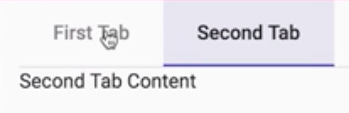
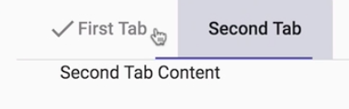
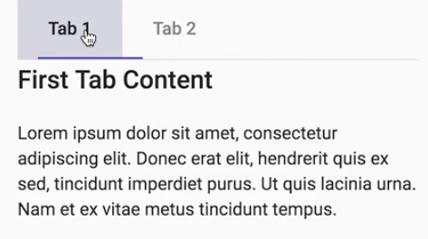

Instructor: [00:00] To start using the Material tabs component, you need to include the `MatTabsModule` in your `NgModule` imports.

#### tabs-lesson.module.ts
```javascript
import { CommonModule } from '@angular/common';
import { NgModule } from '@angular/core';
import { MatTabsModule } from '@angular/material';

import { TabsLessonComponent } from './tabs-lesson.component';

@NgModule({
    declarations: [TabsLessonComponent], 
    imports: [CommonModule, MatTabsModule]
})
export class TabsLessonModule {}
```

[00:05] To create a basic tabbed interface, you start with a `<mat-tab-group>` component. You can then add tabs by including the `<mat-tab>` component within your `<mat-tab-group>`. Content containing within the tab is what we'll be seeing when in the tab is active, while the label input on a tag component is what will display on the tab itself.

#### tabs-lesson.component.html
```html
<mat-tab-group>
    <mat-tab label="First Tab">First Tab Content</mat-tab>
</mat-tab-group>
```

[00:20] Let's go ahead and create a second tab, so we can see how a basic example looks. 

```html
<mat-tab-group>
    <mat-tab label="First Tab">First Tab Content</mat-tab>
    <mat-tab label="Second Tab">Second Tab Content</mat-tab>
</mat-tab-group>
```

This gives us a material design themed tag UI, which transitions between the content and the active tab. 



If you want to further customize your tab label, you can include a template inside the `MatTab` component with the mat-tab-label directive.

[00:34] I'm going to go ahead and add a `ng-template` with the `mat-tab-label` directive. Inside this template, we can include anything that we want to see on our tab. For now, I'm just going to include a `mat-icon` next to the tab name.

```html
<mat-tab-group>
    <mat-tab>
        <ng-template mat-tab-label>
            <mat-icon>check</mat-icon>
            First Tab
        </mat-tab>
    <mat-tab label="Second Tab">Second Tab Content</mat-tab>
</mat-tab-group>
```

[00:45] We now have a check mark appearing on our first tab. 



If you would like each tab to be its own route, you can use the `mat-tab-nav-bar` directive. To demonstrate this, I went ahead and added some child routes to our tabs lesson component.

#### tab-route-one.component.ts
```javascript

import { Component, OnInit } from '@angular/core';

@Component({
  selector: 'egm-tab-route-one',
  template: `
    <h2> First Tab Content </h2>
    <p>
    Lorem ipsum dolor sit amet,
    consectetur adipiscing elit.
    Donec erat elit, hendrerit quis ex sed, tincidunt imperdiet purus.
    Ut quis lacinia urna. Nam et ex vitae metus tincidunt tempus.
    </p>
 `
})
export class TabRouteOneComponent implements OnInit {
  ngOnInit() {}
}
```

#### tab-route-two.component.ts
```javascript
import { Component, OnInit } from '@angular/core';

@Component({
  selector: 'egm-tab-route-two',
  template: `
    <h2> Second Tab Content </h2>
    <p>
    Nam sit amet tempor magna, quis rhoncus erat.
    Aenean varius risus aliquam risus ullamcorper faucibus ac imperdiet ante.
    </p>
  `
})
export class TabRouteTwoComponent implements OnInit {
  ngOnInit() {}
}
```

[00:55] I also made the default `TabRouteOneComponent`, which is going to be our tab that appears first. I then simply added a header and some dummy content for each tab. 

#### lessons.routes.ts
```javascript
import { Route } from '@angular/router';

import { ListLessonComponent } from './lists/list-lesson.component';
import { IconsLessonComponent } from './icons/icons-lesson.component';
import { InputsLessonComponent } from './inputs/inputs-lesson.component';
//...

export interface LessonRoute extends Route {
  data: {
    readonly shortName: string;
    readonly lessonName: string;
  };
}

export type LessonRoutes = LessonRoute[];

export const LESSON_ROUTES: LessonRoutes = [
  {
    path: 'icons',
    component: IconsLessonComponent,
    data: {
      shortName: 'Icons',
      lessonName: 'Utilize Material Design Icons for App Icons and Buttons'
    }
  },
  {
    path: 'toolbars',
    component: ToolbarLessonComponent,
    data: {
      shortName: 'Toolbars',
      lessonName: 'Utilize Material Design Toolbars for Application Headers'
    }
  },
  {
    path: 'inputs',
    component: InputsLessonComponent,
    data: {
      shortName: 'Inputs',
      lessonName:
        'Manage User Input with Material Design Inputs and AutoComplete'
    }
  },
  //...
];
```

In our tabs lesson component, I created an array of tab routes using our route config.

#### tabs-lesson.compont.ts
```javascript
import { Component, OnInit } from '@angular/core';
import { LESSON_ROUTES } from '../lessons.routes';

@Component({
  selector: 'egm-tabs-lesson',
  templateUrl: './tabs-lesson.component.html',
  styleUrls: ['./tabs-lesson.component.scss']
})
export class TabsLessonComponent implements OnInit {
  public tabRoutes = LESSON_ROUTES.filter(r => r.path === 'tabs')
    .map(({ children }) => children)
    .reduce((acc, curr) => [...acc, ...curr], [])
    .filter(({ path }) => !!path);

  ngOnInit() {}
}
```

[01:07] To create routable tags, we'll include a `<nav>` element with the `mat-tab-nav-bar` directive. We can then loop through our child tab routes, creating an anchor tag for each. We'll then add a `mat-tab-link` directive to each anchor tag. This identifies it is a tab. We'll then add a `routerLink` to route to the appropriate path given our config.

#### tabs-lesson.component.html
```html
<nav mat-tab-nav-bar>
    <a *ngFore="let tab of tabRouts"
        mat-tab-link
        [routerLink]="tab.path"
        >
    </a>

</nav>

<router-outlert></router-outlert>
```

[01:25] `mat-tab` links accept an `active` input to determine which tab is currently active and display the ink-bar under. We'll include the router-link-active directive which determines whether an element is active, based on the router link and the current URL.

[01:38] We can then grab a reference to this and pass it as a flag to our `active` input. For now, I'm just going to grab the current index from our `*ngFor` and give each tab a generic name. 

```html
<nav mat-tab-nav-bar>
    <a *ngFore="let tab of tabRouts"
        mat-tab-link
        [routerLink]="tab.path"
        routerLinkAcive
        #rla="routerLinkActive">
      Tab {{ i + 1 }}
    </a>

</nav>

<router-outlert></router-outlert>
```

When we refresh, we can see we still have our Material tabs UI, but now clicking on each tab transitions to a unique route.

