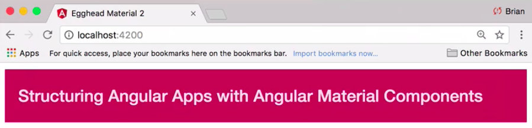

Instructor: [00:01] To get started with Angular Material, we need to install a few packages. The first is Angular CDK, `@angular/cdk`. This is a toolkit for more general functionality, such as platform recognition, key codes, and overlays.

[00:11] Next is the Angular Material module, `@angular/material`. This includes all the Material-Design-themed Angular components you can use within your application. Last is Hammer.js, `hammerjs`, which provides gesture support for some Material components such as a slider. While this package isn't required, it is suggested.

#### Terminal
```bash
npm install --save @angular/cdk @angular/material hammerjs
```

[00:26] Once the installation is complete, we need to create an Angular module that `exports` the Material components we're going to use within our application. Let's call it `app-material.module.ts`. We'll start with the Material toolbar module. We can go ahead and add it to our module exports. The components will be available in our app.

#### app-material.module.ts
```javascript
import { NgModule } from '@angular/core';
import { MatToolbarModule } from '@angular/material';

@NgModule({
    exports: [MatToolbarModule]
})
export class AppMaterialModule {}
```

[00:41] We'll then `import` our Material module into our main app module. These components will be available in our templates. We'll also include the `BrowserAnimationsModule` for smooth animations and transitions. 

#### app.module.ts
```javascript
import { BrowserModule } from '@angular/platform-browser';
import { NgModule } from '@angular/core';
import { BrowserAnimationsModule } from '@angular/platform-browser/animations';
import { AppMaterialModule } from './app-material.module';
import { AppComponent } from './app.component';

@NgModule({
    declarations: [
        AppComponent
    ],
    imports: [
        BrowserModule,
        BrowserAnimationsModule,
        AppMaterialModule
    ],
    providers: [],
    brootstrap: [ AppComponent ]
})
export class AppModule { }
```

For gesture support, we need to include `'hammerjs'` in our app entry point.

#### main.ts
```javascript
import { enableProdMode } from '@angular/core';
import { platformBrowserDynamic } from '@angular/platform-browser-dynamic';

import { AppModule } from './app/app.module';
import { environment } from './environments/environment';

import 'hammerjs';

if (environment.production) {
    enableProdMode();
}

platformBrowserDynamic().bootstrapModule(AppModule);
```

[00:55] Last, we need to add an `@import` for a Material theme. For now, we'll choose one of the prebuilt themes that come packaged with the Angular Material module. 

#### styles.css
```javascript
@import '~@angular/material/prebuilt-themes/pink-bluegray.css'
```

We can now swap out this `<div>` for the Material toolbar. We'll give it a color of `primary` for now.

#### app.component.ts
```javascript
import { Component, HostListener } from '@angular/core';

@Component({
    selector: 'egm-app',
    template: `
    <mat-toolbar color="primary">
        Structuring Angular Apps with Angular Material Components
    </mat-toolbar>
    `
})
export class AppComponent {}
```

[01:09] To make sure everything is working, we'll go ahead and run the app with `npm start` in the terminal. We can see we have our Material toolbar component displaying on the screen.

