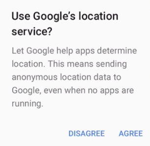
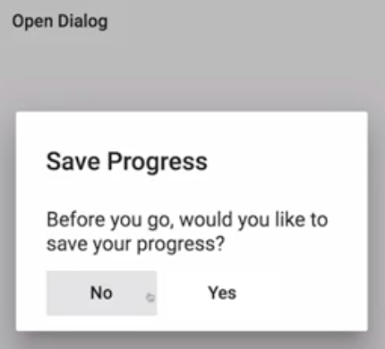
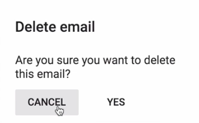

Instructor: [00:00] to get started with Material Design dialogs, you need to include the `MatDialogModule` in your NG module imports.

#### dialog-lesson.module.ts
```javascript
import { CommonModule } from '@angular/common';
import { NgModule } from '@angular/core';
import { MatDialogModule } from '@angular/material';

import {
  DialogLessonComponent,
  DialogComponent
} from '../dialogs/dialog-lesson.component';

@NgModule({
  declarations: [DialogLessonComponent, DialogComponent],
  imports: [CommonModule, MatDialogModule]
})
export class DialogLessonModule {}
```

[00:05] Next, you need to have a component that's going to serve as your dialog template. For sake of demo, I'm going to include this component and the component that's going to trigger the dialog in the same file so you can more easily see how these two interact.

#### dialog-lesson.component.ts
```javascript
import {Component, OnInit, ViewEncapsulation } from '@angular/core';

@Component({
    selector: 'egm-dialog-lesson',
    template: `

    `,
    styleUrls: ['./dialog-lesson.component.scss']
})
export class DialogLessonComponent {
    constructor(){}
}

@component({
    selector: 'egm-dialog',
    template:`

    `
})
export class DialogComponent {

}
```

[00:16] If we look at the Material Design guidelines, we can see that each dialog is generally split up into three sections, the title, content, and then actions. 



As such, the dialog module offers components and directives that correspond to each section. For our dialog header, we'll add an `<h2>` and include the `<mat-dialog-title>` directive. The dialog we'll be creating will be a save confirmation.

[00:35] Next, you want to wrap your main content in the `<mat-dialog-content>` component. Finally, the action button sphere dialog, generally a cancel and a confirmation, should be included in the `<mat-dialog-content>`` component.

```html
@component({
    selector: 'egm-dialog',
    template:`
        <h2 mat-dialog-title> Save Progress </h2>
        <mat-dialog-content>
            Before you go, would you like to save your progress?
        </mat-dialog-content>
        <mat-dialog-actions>
            <button mat-button> No </button>
            <button mat-button> Yes </button>
        </mat-dialog-actions>
    `
})
```

[00:48] There are a couple of ways to trigger a close via your dialog action buttons. The first is to inject a `MatDialogRef`, which is a reference to the currently open dialog. This should be injected in the dialog component itself. You can then create a method on your dialog component.

[01:03] Here, we'll just call it `closeDialog` which calls close on the current `dialogRef`, optionally passing it whatever data you choose. 

```javascript
export class DialogComponent {
    constructor(public dialogRef: MatdialogRef<DialogComponent>){}

    closeDialog() {
        this.dialogRef.close('Some Data');
    }
}
```

We can then create a `(click)` event on the `<button>` which calls our `closeDialog` method. 

```html
    <button mat-button (click)="closeDialog()"> Yes </button>
```

While this works, it's generally not necessary.

[01:19] Let's see an easier way to accomplish this same task. The code that we created within our component to close the dialog can be replicated using the `[mat-dialog-close` directive. This accepts data or can be used without for a cancel-like scenario.

```html
    <button mat-button mat-dialog-close> No </button>
    <button mat-button [mat-dialog-close]="'SomeData'"> Yes </button>
```

[01:35] Now, we just need to trigger this dialog within our parent component. To do this, we need to inject `MatDialog` into our component. Next, we'll create a method that calls `dialog.open`, passing in our `DialogComponent`. We'll then create a `<button>` that's going to invoke this method within our template.

```javascript
@Component({
    selector: 'egm-dialog-lesson',
    template: `
        <button mat-button (click)="openDialog()"> Open Dialog </button>
    `,
    styleUrls: ['./dialog-lesson.component.scss']
})
export class DialogLessonComponent {
    constructor(public dialog: MatDialog){}

    openDialog() {
        this.dialog.open(DialogComponent)
    }
}
```

[01:53] Because dialog components are created at runtime, we also need to include our dialog component in our app entry components in order for ahead of time compilation to work. 

#### app.module.ts
```javascript
//...

@NgModule({
  declarations: [AppComponent],
  imports: [
    BrowserModule,
    BrowserAnimationsModule,
    HttpClientModule,
    LayoutModule,
    RouterModule.forRoot(EGGHEAD_MATERIAL_ROUTES),
    AppMaterialModule,
    IconsLessonModule,
    ListLessonModule,
    InputsLessonModule,
    ToolbarLessonModule,
    LoadingLessonModule,
    TabsLessonModule,
    SnackbarLessonModule,
    DataTableLessonModule,
    DatepickerLessonModule,
    DialogLessonModule,
    ThemingLessonModule
  ],
  entryComponents: [DialogComponent],
  providers: [LessonConfigService],
  bootstrap: [AppComponent]
})
export class AppModule {}
```

Once that's done, we can test out our first dialog. Our button opens a nice Material Design-themed dialog with the title, content, and actions that dismiss the dialog.



[02:10] The `dialog.open` method also sets a second parameter which is settings for your dialog. This includes ways to manually set the height, width, control backdrop behavior, and pass data to your dialog.

[02:20] We updated our dialog to a delete confirmation. We want to pass the dialog the name of the item the user is wishing to delete.

#### dialog-lesson.component.ts
```javascript
export class DialogLessonComponent {
    constructor(public dialog: MatDialog){}

    openDialog() {
        this.dialog.open(DialogComponent, {
            data: 'email'
        })
    }
}
```

[02:27] To access this data within our dialog component, we need to inject the `MAT_DIALOG_DATA` token. We'll assign this a property `{{itemType}}` which we know will be a string. Next, we can replace the instances of `item` in our template with our now dynamically supplied `{{itemType}}`. 

```html
@component({
    selector: 'egm-dialog',
    template:`
        <h2 mat-dialog-title> Delete {{itemType}} </h2>
        <mat-dialog-content>
            Are you sure you want to delete this {{ItemType}}?
        </mat-dialog-content>
        <mat-dialog-actions>
            <button mat-button mat-dialog-close> Cancel </button>
            <button mat-button [mat-dialog-close]]="'Some Data'"> Yes </button>
        </mat-dialog-actions>
    `
})
```

We now have a dialog that could be reused for multiple scenarios in your application.



[02:47] Now, what if you wanted to take action when the user clicks one of the buttons in the dialog? In this case for our delete dialog, we must take no action if the user clicks cancel. But we want to delete the item if the user clicks yes.

[02:57] To do this, we'll pass `"true"` through our `[mat-dialog-close]` directive when the user clicks yes. We'll then come up to our open dialog method and assign the reference return from `dialog.open` to a variable. Dialogs expose an `afterClosed` observable which emits the value that was passed when the dialog was closed.

[03:11] In the case of our delete, we could use `mergeMap` to make our network request once the action was received. We also want to `filter` out non-truthy responses which would our cancel action. Finally, we can `subscribe` to the observable, logging the response to make sure this is working.

```javascript
export class DialogLessonComponent {
    constructor(public dialog: MatDialog){}

    openDialog() {
        const dialogRef = this.dialog.open(DialogComponent, {
            data: 'email'
        });

        dialogRef.afterClose().pipe(
            filter(r => !!r),
            mergeMap(_ => of('network request here'))
        )
        .subscribe(console.log);
    }
}
```

[03:27] When we refresh, we'll go ahead and pull our console over. When we open our dialog and confirm, you can see our network request would be fired.

#### Console
```
network request here.              Subscriber.js:239
```

Let's go ahead and clear the console. If we open again and hit cancel, nothing happens. It's worth noting that clicking the backdrop to close the dialog is also filtered out...