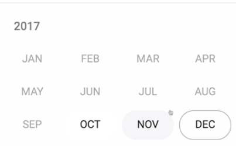

Instructor: [00:00] To get started with the material design date picker, you need to include the `MatDatepickerModule` and the `MatNativeDateModule` in your `NgModule` imports. The `MatNativeDateModule` allows the date picker to deal with native JavaScript date objects.

#### datepicker-lesson.module.ts
```javascript
//...

@NgModule({
  declarations: [DatepickerLessonComponent],
  imports: [
    CommonModule,
    PlatformModule,
    MatDatepickerModule,
    MatNativeDateModule,
    MatInputModule,
  ]
})
export class DatepickerLessonModule {}
```

[00:12] If you want to utilize moment js dates, we'll see how to do that later in the lesson. Like other material design inputs, you'll start by adding a `<mat-form-field>` which will wrap your date picker input.

[00:21] Next, we'll add an `input` with the `matInput` directive. This will give us the placeholders, validation, and material design styling we're used to. After that, we'll add the `<mat-datepicker>` component, which provides the calendar and means for the user to make their date selections.

[00:33] Lastly, we need to add the `mat-datepicker-toggle` component which is going to be the trigger to open and close the date picker. We'll go ahead and add the `matSuffix` directive to this component to align the toggle button at the end of the input. Both the `mat-datepicker-toggle` component and our `input` require a reference to the date picker.

#### datepicker-lesson.component.html
```html
<h2>Basic Datepicker</h2>

<mat-form-field> 
    <input matInput>
    <mat-datepicker-toggle></mat-datepicker-toggle>
    <mat-datepicker></mat-datepicker>
</mat-form-field>
```

[00:49] We'll go ahead and create that now and feed it into our `datepicker` toggle with the `for` input, and into our `input` field with the `mat-datepicker` input. 

```html
<h2>Basic Datepicker</h2>

<mat-form-field> 
    <input matInput
            [matDatepicker]="datepicker">
    <mat-datepicker-toggle matSuffix
                            [for]="datepicker"></mat-datepicker-toggle>
    <mat-datepicker #datepicker></mat-datepicker>
</mat-form-field>
```

Everything is now wired up correctly for a material design date picker. Let's see how this looks.


[01:01] We now have a nice material design themed date picker that allows the user to toggle between years and months and make a selection. If you want your date picker to start at a certain date, you can utilize the `startAt` input on the MatDatepicker component. 

```html
<mat-form-field> 
    <input matInput
            [matDatepicker]="datepicker">
    <mat-datepicker-toggle matSuffix
                            [for]="datepicker"></mat-datepicker-toggle>
    <mat-datepicker #datepicker [startAt]="startDate"></mat-datepicker>
</mat-form-field>
```

I went ahead and added a property to the `DatepickerLessonComponent`, making our start date November 1st.

#### datepicker-lesson.component.ts
```javascript
export class DatepickerLessonModule {
    public startDate = new Date(2017, 10, 1);
}
```
 
[01:17] When we refresh and open the date picker, we can see the selection now starts on November 1st. 


If you would prefer the date picker calendar start on the year view rather than the month, maybe for a long date range selection, you can utilize the `startView` input also on the `mat-datepicker` component.

#### datepicker-lesson.component.html
```html
<mat-form-field> 
    <input matInput
            [matDatepicker]="datepicker">
    <mat-datepicker-toggle matSuffix
                            [for]="datepicker"></mat-datepicker-toggle>
    <mat-datepicker #datepicker 
                    starView="year"
                    [startAt]="startDate"></mat-datepicker>
</mat-form-field>
```

[01:34] The user will now start on the year selection when they toggle the calendar open. The material design date picker also allows for a minimum date and a maximum date. To configure these dates, you can use the `[min]` and `[max]` input on your input element.

```html
<mat-form-field> 
    <input matInput
            [matDatepicker]="datepicker"
            [min]="minDate"
            [max]="maxDate">
    <mat-datepicker-toggle matSuffix
                            [for]="datepicker"></mat-datepicker-toggle>
    <mat-datepicker #datepicker 
                    starView="year"
                    [startAt]="startDate"></mat-datepicker>
</mat-form-field>
```

[01:46] For the demo, I'm going to set the min date property to October 1st and the max date property to December 24th. 

#### datepicker-lesson.component.ts
```javascript
export class DatepickerLessonModule {
    public startDate = new Date(2017, 10, 1);
    public minDate = new Date(2017, 9, 1);
    public maxDate = new Date(2017, 11, 24);
}
```

When we refresh, we see everything before October is disabled as well as everything after December 24th. 



Now while the current date picker works great for users with a mouse, it may not be ideal for touch scenarios.

[02:09] To handle this, the `mat-datepicker` component accepts a `touchUI` input of `"true"` or For now, we're going to hard-code `"true"` just to see how it looks like. 

#### datepicker-lesson.component.html
```html
    <mat-datepicker #datepicker 
                    starView="year"
                    [startAt]="startDate"
                    [touchUI]="true"></mat-datepicker>
```

The touch UI date picker is modal-based, and centered on the screen with larger buttons, allowing for easier selections for mobile users.

[02:23] One way you could determine whether the user is on a touch device, is by utilizing the Angular CDK `PlatformModule`. We'll jump back to our lesson module and `import` the `PlatformModule` from angularcdk/`platform`.

#### datepicker-lesson.module.ts
```javascript
import { PlatformModule } from '@angular/cdk/platform';
```

[02:34] Next, we'll include in our module imports. We can then inject the platform service in our `DatepickerLessonComponent`.

#### datepicker-lesson.component.ts
```javascript
export class DatepickerLessonModule {
    public startDate = new Date(2017, 10, 1);
    public minDate = new Date(2017, 9, 1);
    public maxDate = new Date(2017, 11, 24);

    constructor(private _platform: Platform)
}
```

[02:43] Finally, we'll create a getter name, `isTouchDevice`, which uses the platform service which returns 1 if this is an iOS or Android device. 

```javascript
export class DatepickerLessonModule {
    public startDate = new Date(2017, 10, 1);
    public minDate = new Date(2017, 9, 1);
    public maxDate = new Date(2017, 11, 24);

    constructor(private _platform: Platform)

    get isTouchDevice() {
        return this._platform.ANDROID || this._platform.IOS;
    }
}
```

We can then use this variable in the `touchUI` input, presenting users with a touch-enabled calendar when they're on one of these devices. 

#### datepicker-lesson.component.html
```html
    <mat-datepicker #datepicker 
                    starView="year"
                    [startAt]="startDate"
                    [touchUI]="isTouchDevice"></mat-datepicker>
```


To enable this, you need to install the Angular Material Moment Adapter.

#### Terminal
```bash
npm install --save @angular/material-momen-adapter
```

[03:01] Next, we need to `import` the `MatMomentDateModule` and include it in our imports. We'll go ahead and `import` the `moment` library and convert the native JavaScript dates we were using before into `moments`.

#### datepicker-lesson.component.ts
```javascript
import * as moment from 'moment';

...

export class DatepickerLessonModule {
    public startDate = moment[(2017, 10, 1)];
    public minDate = moment[(2017, 9, 1)];
    public maxDate = moment[(2017, 11, 24]);

    constructor(private _platform: Platform)
}
```

[03:13] When we refresh, we can see the date picker functions just as it did before, but now utilizing `moment` js.