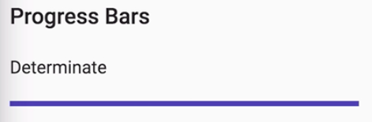
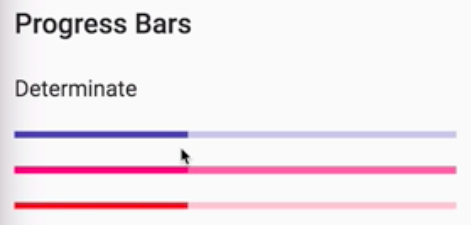
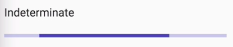
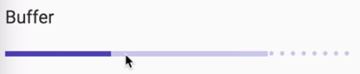
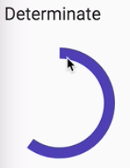
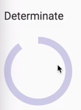

Instructor: [00:00] To use Material loading tools in your application, you need to include the `MatProgressBarModule` and `MatProgressSpinnerModule` in your `NgModule` imports.

#### loading-lesson.module.ts
```javascript
//...

@NgModule({
  declarations: [LoadingLessonComponent],
  imports: [CommonModule, MatProgressBarModule, MatProgressSpinnerModule]
})
export class LoadingLessonModule {}
```

[00:06] Let's start by looking at the Material progress bar component in `loading-lesson.component.html`. The default setting for progress bars is determinate, meaning it will fill based on the `input` value between 1 and 100. For the demo, this value will be based on our loadingPercent property in our component.

#### loading-lesson.component.html
```html
<h2>Progress Bars</h2>

<h3>Determinate</h3>

<mat-progress-bar [value]="loadingPercent"></mat-progress-bar>
```

[00:20] To update this value in order to mimic a real-world scenario, I created a `loadingProgress` helper that accepts a speed of milliseconds, using the RxJS interval operator to emit a value each time this duration passes.

[00:32] I then multiply this by 10 to give us the value we need to supply to our progress bar component. 

#### loading-lesson.component.ts
```javascript
export class LoadingLessonComponent implements OnInit {
  public loadingPercent = 0;

  ngOnInit() {
    this.loadingProgress(500)
        .subscribe(i => (this.loadingPercent = i));
  }

  loadingProgress(speed: number) {
    return interval(speed)
        .pipe(
            map(i => i * 10), 
            takeWhile(i => i <= 100)
        );
  }
}
```

We now have a Material-Design-themed progress bar that fills based on the provided value.



[00:42] Progress bars and progress spinners are themeable, meaning we can provide a color input of `primary`, `accent`, or `warn` to correspond with the appropriate color of our theme. 

#### loading-lesson.component.html
```html
<h2>Progress Bars</h2>

<h3>Determinate</h3>

<mat-progress-bar [value]="loadingPercent"></mat-progress-bar>
<mat-progress-bar [value]="loadingPercent"
                  color="accent"></mat-progress-bar>
<mat-progress-bar [value]="loadingPercent"
                  color="warn"></mat-progress-bar>
```

When we refresh, we now have progress bars that match the corresponding theme color.



[00:55] There may be times when you don't have the data need to provide the correct loading percentage. For these cases, you can use the mode of `'Indeterminate'` by adjusting the mode input on the `mat-progress-bar` component. 

```html
<h3>Indeterminate</h3>

<mat-progress-bar mode="indeterminate"></mat-progress-bar>
```

This provides us with a progress bar with an up and down fill animation that does need to correspond to a value input.



[01:11] If you have a situation where the user will be waiting for a response, but once the response is received, you want to show a clear progress bar think maybe a download, then you can use the mode `query`.

[01:19] To simulate this, I'm creating an observable that emits after two seconds, `2000`. Once this happens, we'll switch the query mode to `'determinate'`. We'll update our progress bar value by `10`, which we'll store in our query value every half a second after that.

#### loading-lesson.component.ts
```javascript
export class LoadingLessonComponent implements OnInit {
  public loadingPercent = 0;
  public queryValue = 0;
  public queryMode = 'query';

  ngOnInit() {
    this.loadingProgress(500).subscribe(i => (this.loadingPercent = i));

    concat(
      interval(2000).pipe(
        take(1),
        tap(_ => (this.queryMode = 'determinate')),
        ignoreElements()
      ),
      this.loadingProgress(500)
    ).subscribe(i => (this.queryValue = i));
  }

  loadingProgress(speed: number) {
    return interval(speed).pipe(map(i => i * 10), takeWhile(i => i <= 100));
  }
}
```

[01:31] To utilize this, all we have to switch is the mode of our `mat-progress-bar` to `query`, which is the initial `value` of our `queryMode` property. 

#### loading-lesson.component.html
```html
<h3>Query</h3>

<mat-progress-bar mode="queryMode" [value]="queryValue"></mat-progress-bar>
```

While a mode is a query, the value will be ignored, but once we switched the mode to determinate, the value will then be used. We now have a progress bar that starts with a more randomized animation, then switches to a fill based on the provided value.

[01:49] The last progress bar mode is `Buffer`, which can be used with something like a video which has playback progress combined with loading progress. To utilize this, we need to switch the `mode` of our progress bar to `buffer`. We also need to add a `bufferValue` to go along with our normal progress bar input value.

```html
<h3>Query</h3>

<mat-progress-bar mode="queryMode" 
                  [value]="queryValue"
                  [bufferValue]="currentPlayback"></mat-progress-bar>
```

[02:08] To demo this in our component, I'm going to add an extra property called `currentPlayback` and set the initial value to `0`. I'm then going to copy the loading progress observable and set the interval to slightly less than our normal loading progress so we can see both the loading progress and the buffer bar.

#### loading-lesson.component.ts
```javascript
export class LoadingLessonComponent implements OnInit {
  public loadingPercent = 0;
  public currentPlayback = 0;
  public queryValue = 0;
  public queryMode = 'query';

  ngOnInit() {
    this.loadingProgress(500).subscribe(i => (this.loadingPercent = i));

    this.loadingProgress(250).subscribe(i => (this.currentPlayback = i));

    ...
    }
    ...
}
```

[02:22] When I refresh, we can see our buffer progress bar load at a slightly lighter shade than our normal progress bar.



[02:28] Angular Material also provides a loading spinner component. The default mode for Material spinners is indeterminate, meaning we don't know the current value of the load. Material spinners are themeable, like progress bars, with the typical values of primary, accent, and warn.

[02:40] If you do have a loading value, you can switch to use the `material-progress-spinner` and provide a `[value]` input. In this case, we're going to use the same value input that we used for our progress bar. 

#### loading-lesson.component.html
```html
<h3>Determinate</h3>

<mat-progress-spinner [value]="loadingPercent"></mat-progress-spinner>
```

When we refresh, we can see we now have a spinner that loads incrementally.



[02:55] Lastly, say you wanted your spinner to fade out once the loading percentage hit 100. You can do this with a combination of `*ngIf` and an Angular animation. We'll add a `ngIf` that says, "Only show this spinner if the loading percentage is less than 100." We'll also add our animation hook.

```html
<mat-progress-spinner [value]="loadingPercent"
    *ngIf="loadingPercent < 100"
    [*fadeOut]="'in"
></mat-progress-spinner>
```

[03:09] All that's left to do is add our animation definition to our component. To do this, we'll add an `animations` property to our component decorator. We'll then add a fadeIn `trigger` to match what we had in our component template. This will start with a state of n with an opacity of 1 and animate out to an opacity of 0when the ngIf condition is no longer met. 

#### loading-lesson.component.ts
```javascript
@component({
    selector: 'egm-loading-lesson',
    templateUrl: './loading-lesson.component.html',
    animations: [
        trigger('fadeOut', [
            state('in', style({ opacity: 1 })),
            transition('* => void', [
                animate(
                    1.5s ease-out`,
                    style({
                        opacity: 0
                    })
                )
            ])
        ])
    ],
    styleUrls: ['./loading-lesson.component.scss']
})
```

Let's see how this looks.

