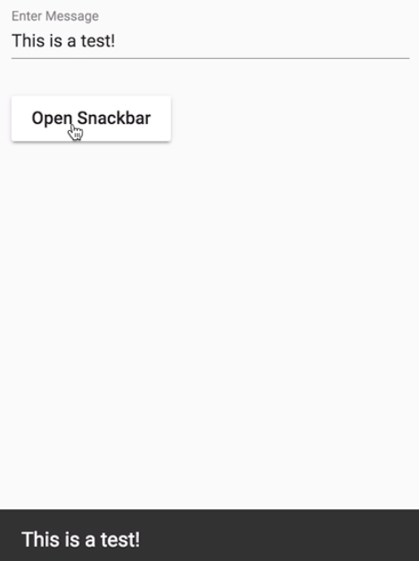

Instructor: [00:00] to get started using Material Design Snackbars, you need to include the `MatSnackbarModule` in your `NgModule` imports. 

#### snackbar-lesson.module.ts
```javascript
//...

@NgModule({
  declarations: [SnackbarLessonComponent],
  imports: [CommonModule, MatSnackBarModule],
})
export class SnackbarLessonModule {}
```

Next, you need to import Snackbar service and inject it in its component in which you wish to display Snackbar alerts.

[00:10] To display a Snackbar alert, you can call `_snackbar.open`, passing it the message you wish to display. 

#### snackbar-lesson.component.ts
```javascript
//...

@Component({
    selector: 'egm-snackbar-lesson',
    templateUrl: './snackbar-lesson.component.html',
    styleUrls: ['./snackbar-lesson.component.scss']
})
export class SnackbarLessonComponent implements OnInit {
    constructor(private _snackBar: MatSnackBar) {}

    ngOnInit() {
        this._snackBar.open('Hello World!');
    }
}
```

Our Snackbar now appears on the bottom of our screen but doesn't dismiss.


[00:20] To allow the user to dismiss the Snackbar manually, you can add a second parameter, which is the text to display on the dismiss button. 

```javascript
    ngOnInit() {
        this._snackBar.open('Hello World!', 'Close!');
    }

```

The Snackbar can now be dismissed by clicking the action button.


[00:29] If you prefer for the Snackbar to auto-dismiss after a certain duration, you can utilize the third parameter, which contains configuration options. One of these options is `duration`, which is the time before dismissal in milliseconds. For now, we're going to set this to one second.

```javascript
    ngOnInit() {
        this._snackBar.open('Hello World!', 'Close!', {
            duration: 1000,
        });
    }
```

[00:43] If you want to rely entirely on auto-dismissal, you can set the second parameter to `null`. This will remove the dismissal action button. If you prefer for your message to be at the top of the screen rather than the bottom, you can utilize the `verticalPosition` property, setting it to `'top'`.

[00:57] There may be times you want to respond to dismissal or manual closing of a Snackbar. To accommodate this, you can utilize the `afterDissmissed` and on action observables exposed through the Snackbar reference. We'll start by `subscribe` to dismiss event, logging a message. 

```javascript
export class SnackbarLessonComponent implements OnInit {
    constructor(private _snackBar: MatSnackBar) {}

    openSnackbar() {
        const snackBar = this._snackBar.open('Hello World!', 'Close!', {
            duration: 3000,
        });

        snackbar.afterDismissed().subscribe(_ => {
            console.log('DISMISSED!');
        });
    }
}
```

When the Snackbar closes after three seconds, we can see our message is logged in the console.

[01:16] If you want to respond instead to the user manually closing the Snackbar, you can `subscribe` to the `onAction` observable. 

```javascript
snackbar.onAction().subscribe(_ => {
    console.log('AFTER ACTION!');
});
```

When we refresh and open our Snackbar and then manually close it, you can see the `AFTER ACTION` message is now logged in the console.

[01:29] It's worth noting that if you subscribe to both, `dismissal` will be called even if the user manually closes the Snackbar. We can see now that both the `AFTER ACTION` and after dismiss messages are logged in succession. Remember that since after `dismiss` our action is an observable, you can use an operator like `mergeMap` to make a request off this action.

[01:45] The final thing to be aware with Snackbar is if you want to make a custom template with dynamic data, to do this, you can switch `snackbar.open` to `snackbar.openFromComponent`. The first parameter will then be your custom component. The second parameter is your config settings. If you want to supply data, this can be done through the data config setting.

[01:59] For the demo, we're just going to pass on the message we received from our input to our Snackbar. 

```javascript
openSnackbar() {
    const snackBar = this._snackBar
        .openFromComponent(CustomSnackBarcomponent, {
        data: message
    });
}
```

To access this custom message, we need to import the `MAT_SNACK_BAR_DATA` token into the component that we supplied. We can then inject it and access its value in our template. 

#### custom-snackbar-element
```javascript
import { Component, Inject } from '@angular/core';
import { MAT_SNACK_BAR_DATA } from '@angular/material';

@Component({
  selector: 'egm-custom-snackbar',
  template: `<span>{{message}}</span>`
})
export class CustomSnackBarComponent {
  constructor(@Inject(MAT_SNACK_BAR_DATA) public message: string) {}
}
```

Since this is a dynamic component, we also need to add it to our module's bootstrap array.

#### snackbar-lesson.module.ts
```javascript
@NgModule({
  declarations: [SnackbarLessonComponent, CustomSnackBarComponent],
  imports: [CommonModule, MatSnackBarModule, MatButtonModule, MatInputModule],
  bootstrap: [CustomSnackBarComponent]
})
```

[02:17] We can now type in a custom message. It will be displayed on our Snackbar...

