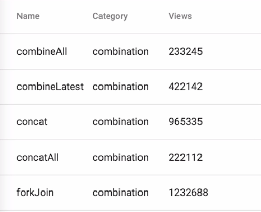

Instructor: [00:00] To get started using material data tables, you need to include the `MatTableModule` in your NgModule imports. It's worth noting that this component is built off the Angular CDK table component, so if you'd like to use a data table without material design styling, you can include that module instead.

#### datatable-lesson.module.ts
```javascript
//..

@NgModule({
  declarations: [DataTableLessonComponent],
  imports: [CommonModule, MatTableModule]
})
export class DataTableLessonModule {}
```

[00:15] Before we get into the display of the data, we first need to initialize the data itself. To make this easier, angular material provides a `MatTableDataSource` class, which accepts the data you wish to display. This provides a simple API for hooking up to the data table, and makes setting typical called data table functions like sorting and paging relatively easy.

#### datatable-lesson.component.ts
```javascript
import {
  Component,
  ViewChild,
  AfterViewInit,
  ViewEncapsulation
} from '@angular/core';
import { MatTableDataSource, MatPaginator, MatSort } from '@angular/material';
import { OPERATOR_INFO } from './fake-data';

@Component({
  selector: 'egm-datatable-lesson',
  templateUrl: './datatable-lesson.component.html',
  styleUrls: ['./datatable-lesson.component.scss']
})
export class DataTableLessonComponent implements AfterViewInit {
  public dataSource = new MatTableDataSource(OPERATOR_INFO);
}
```

[00:32] The data set we're going to use in this lesson includes an array of commonly used rxjs operators, their category, and a made-up number of views I've made up in `fake-data.ts`. 

####fake-data.js
```javascript

export interface OperatorInfo {
  name: string;
  category:
    | 'combination'
    | 'filtering'
    | 'creation'
    | 'error handling'
    | 'multicasting'
    | 'transformation'
    | 'utility';
  views: number;
}

export const OPERATOR_INFO: OperatorInfo[] = [
  { name: 'combineAll', category: 'combination', views: 233245 },
  { name: 'combineLatest', category: 'combination', views: 422142 },
  { name: 'concat', category: 'combination', views: 965335 },
  //more data...
];
```

Next, in our template, we need to include the `<mat-table>` component. This component will wrap all other data table components and directives and accepts an input of `[dataSource]`, which is the `MatTableDataSource` we initialized in our component.

#### datatable-lesson.component.html
```html
<div class="mat-elevation-z4">
    <mat-table [dataSource]="dataSource">

    </mat-table>
</div>
```

[00:51] Inside this component, we then need to include a definition for each column we wish to display. We can do this by utilizing the `<ng-container>` directive, giving it the `"name"` of the property that the column on include.

```html
<div class="mat-elevation-z4">
    <mat-table [dataSource]="dataSource">
        <ng-container matColumnDef="name">

    </mat-table>
</div>
```

[01:00] Each definition must include two things.

[01:02] The first is the `<mat-header-cell>`. This will define the label that's displayed in the column header. For our case, it would be named to correspond with the name of the operator. Next is the `<mat-cell>` which will display the actual data in each row.

[01:13] This component exports the row's data, so we go ahead and assign that to a local variable and display the correct property on our operator item. 

```html
<div class="mat-elevation-z4">
    <mat-table [dataSource]="dataSource">
        <ng-container matColumnDef="name">
            <mat-header-cell *matHeaderCellDef>
                Name
            </mat-header-cell>
            <mat-cell *matCellDef="let operator">
                {{operator.name}}
            </mat-cell>
        </ng-container>
    </mat-table>
</div>
```

We need to do this for each display property, so I'm going to go ahead and copy down the column definition two more times and adjust the data accordingly. 

```html
<div class="mat-elevation-z4">
    <mat-table [dataSource]="dataSource">
        <ng-container matColumnDef="name">
            <mat-header-cell *matHeaderCellDef>
                Name
            </mat-header-cell>
            <mat-cell *matCellDef="let operator">
                {{operator.name}}
            </mat-cell>
        </ng-container>
        <ng-container matColumnDef="name">
            <mat-header-cell *matHeaderCellDef>
                Name
            </mat-header-cell>
            <mat-cell *matCellDef="let operator">
                {{operator.category}}
            </mat-cell>
        </ng-container>
        <ng-container matColumnDef="name">
            <mat-header-cell *matHeaderCellDef>
                Name
            </mat-header-cell>
            <mat-cell *matCellDef="let operator">
                {{operator.views}}
            </mat-cell>
        </ng-container>
    </mat-table>
</div>
```

Finally, we need to tell a data table which row should be rendered in the order they should be displayed.

[01:31] We can do this by using the `<mat-header-row>` and `<mat-row>` components. For the header row, we'll include the `*matHeaderRowDef` directive, passing it the corresponding name of the `header` cells in the appropriate order.

```html
    <mat-header-row 
        *matHeaderRowDef="['name', 'category', 'views']">

    </mat-header-row>
```

[01:40] Next we'll add the `<mat-row>` component which includes the `*matRowDef` directive. We'll pass this in an array of `columns` that should be included in each table row.

```html
    <mat-row
        *matRowDef="let row; columns: ['name', 'category', 'views']">

    </mat-row>
```

[01:51] When we refresh, the material design themed data table is now displayed with our rxjs operator info. 



To recap where we're at so far, we first need to create a data source. The simple way to do this is to create a `MatTableDataSource` instance, passing it our data.

[02:05] Next, we created a `<mat-table>` component, passing it the `dataSource` as an input. We then need to include a template for both the column header and column cell for every column we wish to include in our data table. Finally, matching our column definitions, we define which columns to include and the order in both our header and our rows.

[02:21] Now that we have our base data table set up, it's very easy to add paging and sorting. We'll start by coming over to our `datatable-lesson.module.ts` and including the `MatPaginatorModule` and the `MatSortModule`.

#### datatable-lesson.module.ts
```javascript
//...

@NgModule({
  declarations: [DataTableLessonComponent],
  imports: [CommonModule, MatTableModule, MatPaginatorModule, MatSortModule]
})
export class DataTableLessonModule {}
```

[02:30] Next, we need to include the `<mat-paginator>` component in our template. This gives us paging controls for our data table. The paginator component accepts a couple inputs for configuration.

[02:39] The first is `[pageSize]` which is the default number of entries the data table will show at one time. For now, we're going to set that to `10`.

#### datatable-lesson.component.html
```html
    <mat-paginator
        [pageSize]="10"
        >

    </mat-paginator>
```

[02:46] Next is `[pageSizeOptions]` which is the options the user has to select from. We'll set that to `5`, `10`, and `25` for now. 

```html
    <mat-paginator
        [pageSize]="10"
        [pageSizeOptions]="[5,10,25]">

    </mat-paginator>
```

In order to control paging in your data source, the `MatTableDataSource` accepts an instance of the material paginator.

[02:57] To grab a reference to the paginator from our template, we're going to use the `@ViewChild` decorator passing it a `(MatPaginator)`. We then need to wait until after our view is rendered using the ng `AfterViewInit` lifecycle hook. At this point, we can assign the MatPaginator reference to our MatTableDataSource.

#### datatable-lesson.component.ts
```javascript
//...

@Component({
  selector: 'egm-datatable-lesson',
  templateUrl: './datatable-lesson.component.html',
  styleUrls: ['./datatable-lesson.component.scss']
})
export class DataTableLessonComponent implements AfterViewInit {
  @ViewChild(MatPaginator) paginator: MatPaginator;
  public dataSource = new MatTableDataSource(OPERATOR_INFO);

  ngAfterViewInit() {
    this.dataSource.paginator = this.paginator;
  }
}
```

[03:10] When we refresh, we now have paging in our data table. 


We can jump between pages and select the number of items we would like to see per page. It's equally as easy to add sorting to the data table, within our template we just need to add the `matSort` directive to our `<mat-table>` component.

[03:30] For any column you wish to enable sorting, you just need to add the `mat-sort-header` directive to the `matHeadderCell` component. For our example, we're going to make all three columns sortable.

#### datatable-lesson.component.html
```html
<div class="mat-elevation-z4">
    <mat-table [dataSource]="dataSource" matSort>
        <ng-container matColumnDef="name">
            <mat-header-cell *matHeaderCellDef mat-sort-header>
                Name
            </mat-header-cell>
            <mat-cell *matCellDef="let operator">
                {{operator.name}}
            </mat-cell>
        </ng-container>
        <ng-container matColumnDef="name">
            <mat-header-cell *matHeaderCellDef mat-sort-header>
                Name
            </mat-header-cell>
            <mat-cell *matCellDef="let operator">
                {{operator.category}}
            </mat-cell>
        </ng-container>
        <ng-container matColumnDef="name">
            <mat-header-cell *matHeaderCellDef mat-sort-header>
                Name
            </mat-header-cell>
            <mat-cell *matCellDef="let operator">
                {{operator.views}}
            </mat-cell>
        </ng-container>
        <mat-paginator
        [pageSize]="10"
        >

    </mat-paginator>
    <mat-paginator
        [pageSize]="10"
        [pageSizeOptions]="[5,10,25]">

    </mat-paginator>
    </mat-table>
</div>
```

[03:39] Finally, just like the paginator, you can grab a reference using `@ViewChild`, and assign it to your data source sort property. 

#### datatable-lesson.component.ts
```javascript
export class DataTableLessonComponent implements AfterViewInit {
  @ViewChild(MatPaginator) paginator: MatPaginator;
  @ViewChild(MatSort) sort: MatSort;
  public dataSource = new MatTableDataSource(OPERATOR_INFO);

  ngAfterViewInit() {
    this.dataSource.paginator = this.paginator;
    this.dataSource.sort = this.sort;
  }
}
```

We now have a material design themed data table with paging and sorting column, both descending and ascending. This provides an excellent solution for tabular data display within your application.