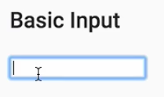
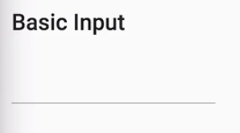
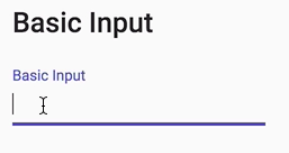
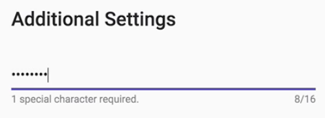
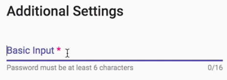
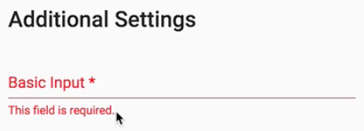

Instructor: [00:00] To start using Material inputs, you need to include the matInput module in your NgModule imports. 

#### inputs-lesson.component.ts
```javascript
//...

@NgModule({
  declarations: [InputsLessonComponent],
  imports: [CommonModule, MatInputModule, FormsModule, ReactiveFormsModule]
})
export class InputsLessonModule {}
```

Every input in `textarea` requires the `matInput` directive. This allows it to be identified within a Material form field container, which we'll see here in a second. 

#### inputs-lesson.component.html
```html
<h2>Basic Input</h2>
<input type="text" 
       matInput>
```

At this point, our input is still vanilla. We have no additional Material Design styling here, as you can see.



[00:24] To include Material Design styling and functionality, we need to wrap the input in the component. 

```html
<h2>Basic Input</h2>
<mat-form-field>
    <input type="text" 
       matInput>
</mat-form-field>
```

This holds true for the majority of form controls, including Material Design `select`s and `datepicker`s. When we refresh, we now have the Material Design focused underline we're used to.



[00:40] Next, we'll add a `placeholder`. Let's call it `"Basic Input"`. Let's see how this looks. 



By default, you get a placeholder that floats on focus. If you want to change this functionality, then you can change the `floatPlaceholder` input on the `mat-form-field` component.

[00:53] The three options are `"auto"`, which we just saw. The second options is `"always"`, which we'll see here. This keeps the placeholder floating above the input, whether there's focus or not. The remaining placeholder option is `"never"`, which behaves like a classic input placeholder and disappears once you start typing.

[01:14] Suppose you like this functionality, but you don't want to have to override it in every form field. To fix this, you can utilize the `MAT_PLACEHOLDER_GLOBAL_OPTIONS` token and include this in your `NgModule` providers in `inputs-lesson.module.ts`, overriding the value.

[01:28] For this case, we're going to set the value of `float` to `'never'`, matching the settings we had in our last example. 

#### inputs-lesson.module.ts
```javascript
//...

@NgModule({
  declarations: [InputsLessonComponent],
  imports: [CommonModule, FormsModule, ReactiveFormsModule, MatInputModule]
  providers: [
    { 
        provide: MAT_PLACEHOLDER_GLOBAL_OPTIONS, 
        useValue: { float: 'never' } 
    }
  ]

})
export class InputsLessonModule {}
```

When we refresh, we'll see the exact same functionality even though we didn't utilize the floatPlaceholder input in our template.

[01:41] Now, wrapping our inputs in the `mat-form-field` component enables some pretty cool features for our inputs. The first we're going to look at are text `hints`. A good use case for hints are form fields that have special requirements or restrictions.

[01:54] In this example, we have a password field. We need to tell the users that there's one special character required for all passwords. To do this, we can use the `mat-hint` component. 

#### inputs-lesson.component.html
```html
<h2>Basic Input</h2>
<mat-form-field>
    <input type="text" 
       matInput>
    <mat-hint>1 special character required.</mat-hint>
</mat-form-field>
```

By default, all hints appear at the bottom of the form field that started the input, but we can adjust this by using the `align` property.


[02:09] The two options are `start`, which is the default, but if you want the hint to appear at the end of the input, you can use the `align="end"` setting. You can also combine starting and ending hints. In this case, we moved our special character hint to the `start` while we added a length hint to the end. 

```html
<h2>Additional Settings</h2>
<mat-form-field>
    <input type="text" 
       matInput>
    <mat-hint align="start">1 special character required.</mat-hint>
    <mat-hint align="end">{{password.value.length}}/16</mat-hint>
</mat-form-field>
```

When the user types, our end hint now displays how many valid characters they have remaining.



[02:31] Material form fields also make handling the display of input errors quite easy. For this example, we added an `[(ngModel)]` binding to our input. We also added a `minlength` requirement of `"6"` characters and a `required` attribute to our field for demonstration purposes.

```html
<h2>Additional Settings</h2>
<mat-form-field>
    <input type="password" 
           [(ngModel)]="password"
           placehodler="Basic Input"
           matInput
           minlength="6"
           required>
    <mat-hint align="start">Password must be at least 6 characerts.</mat-hint>
    <mat-hint align="end">{{password?.length}}/16</mat-hint>
</mat-form-field>
```

[02:46] By default, the required attribute adds an asterisk to our placeholder, signifying that this field is needed. 



At this point, if we come over and type into our input, and then remove the text, and lose focus, we'll see that the field turns red, signifying that this is an invalid state.

[03:02] Let's see how we can present the user with more information regarding each one of these possible error states. The first thing we need to do is create a reference to our `ngModel` so we can pick up the errors on our `#passwordInput`.

[03:12] We can now utilize the `<mat-errors>` component for error display. We'll control this display through a combination of `*ngIf` and the errors object on our password input. When the required error is found, we want to show a message to our user. For now, we'll just say, `This field is required.`

```html
<h2>Additional Settings</h2>
<mat-form-field>
    <input type="password" 
           [(ngModel)]="password"
           placehodler="Basic Input"
           matInput
           minlength="6"
           required>
    <mat-error *ngIf="passwordInput.errors?.required">
        This field is required.
    </mat-error>
    <mat-hint align="start">Password must be at least 6 characerts.</mat-hint>
    <mat-hint align="end">{{password?.length}}/16</mat-hint>
</mat-form-field>
```

[03:31] Let's see how this looks when we refresh. 



When we type into our input, and we lose focus, we can now see the error message that we supplied is shown. When we type back into the input, our hint reappears.

[03:45] Next, let's add the `minlength` error so we can see how multiple errors are handled. 

```html
    <mat-error *ngIf="passwordInput.errors?.minlength">
        This field is required.
    </mat-error>
```

Now, when we type, and the field loses focus, you'll see that our "Six characters required" error appears. If we meet this requirement, it disappears. If we go back, then our "Field is required" error will reappear.

[04:06] One thing you may have noticed up to this point is no errors are shown until the field is touched and then loses focus at least once, but what if we want to show errors right away? We can do this by implementing a `CustomErrorMatcherStrategy`.

[04:18] All we have to do is create a class that implements the `ErrorStateMatcher` interface. 

#### inputs-lesson.component.ts
```javascript
export class customErrorStateMater implements ErrorStateMatcher{
    isErrorState(
        control: FormControl | null,
        form: FormgroupDirecive | NgForm | null
    ): boolean {
        reutrn !!(control && control.invalid && control.dirty);
    } 
}
```

This interface contains one method, `isErrorState`, which accepts a `control` and a `form`, returning a `boolean` determining whether we should show error messages yet or not.

[04:33] In this case, we're going to override the default behavior, and go ahead and show error messages as soon as the control is both `dirty` and `invalid`. Next, we'll add this custom error matcher into our component providers and inject it into our component.

```javascript
@Component({
    selector: 'egm-inputs-lesson',
    templateUrl: './inputs-lesson.component.html',
    providers: [CustomErrorStateMatcher],
    styleUrls: ['./inputs-lesson.component.scss']
})
export class InputsLessonComponent implements OnInit {
    public password = '';

    constructor(public customErrorStateMatcher: CustomErrorStateMatcher)

    ngOnInit() {}
}
```

[04:45] All that's left to do is add the `ErrorStateMatcher` input to our Material input, passing it our `customErrorStateMatcher`. 

#### inputs-lesson.component.html
```html
<h2>Additional Settings</h2>
<mat-form-field>
    <input type="password" 
           [(ngModel)]="password"
           [errorStateMatcher]="customErrorStateMatcher"
           placehodler="Basic Input"
           matInput
           minlength="6"
           required>
    <mat-error *ngIf="passwordInput.errors?.minlength">
        This field is required.
    </mat-error>
    <mat-hint align="start">Password must be at least 6 characerts.</mat-hint>
    <mat-hint align="end">{{password?.length}}/16</mat-hint>
</mat-form-field>
```

Now, when we type into the form field, we'll see errors appear immediately rather than waiting for focus to be lost.