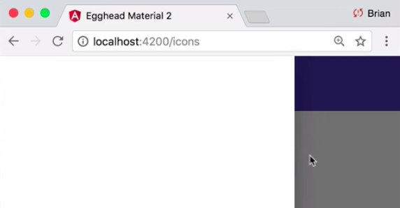
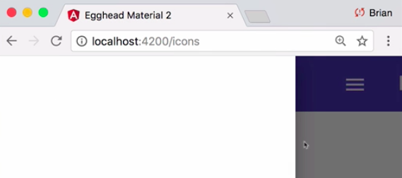
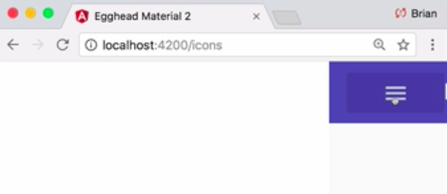
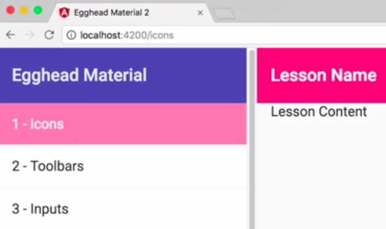
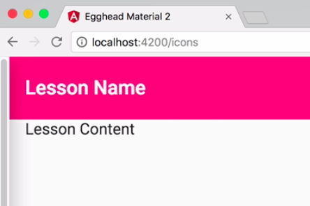
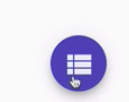

Instructor: [00:00] To start using the Angular Material `sidenav` components in our application, we'll include the `MatSidenavModule` in our app material module exports. 

#### app-material.module.ts
```javascript
//...

@NgModule({
    exports: [
        MatListMOdule,
        MatIdonModule,
        MatToolbarModule,
        MatButtonModule,
        MatSidenavModule
    ]
})
export class AppMaterialModule {}
```

To create a side navigation layout, the side navigation and the content contained within must first be wrapped in a `<mat-sidenav-container>`.

#### app.component.html
```html
<mat-sidenav-container>
    <mat-toolbar color="primary">
        <button mat-button>
            <mat-icon>menu</mat-icon>
        </button>
        egghead Material
    </mat-toolbar>
</mat-sidenav-container>
```

[00:13] Inside this container, you can include both the `<mat-sidenav>` component, which will hold your navigation items and the `<mat-sidenav-content>` component, which will house your main content container. Material `sidenav`s default to adding a backdrop and overlaying the content. To see this, we can make a reference to our `sidenav`.

[00:28] When the user clicks the menu button, we can call `toggle()` on our `sidenav` component. 

```html
<mat-sidenav-container>
    <mat-sidenav #sidenav></mat-sidenav>
    <mat-sidnav-content>    
        <mat-toolbar color="primary">
            <button mat-button (click)="sidenav.toggle()">
                <mat-icon>menu</mat-icon>
            </button>
            egghead Material
        </mat-toolbar>
    </mat-sidnav-content>    
</mat-sidenav-container>
```

We'll go ahead and give our `sidenav` a default width of 300 pixels for now. 

#### app.component.scss
```html
mat-sidenav {
    width: 300px;
}
```

When we refresh, we can see clicking our menu button opens up a `sidenav` with a backdrop behind. Clicking the backdrop will then close the `sidenav`.



[00:44] This works great for primary menu structures of your application. While a `sidenav` defaults to the left side of the screen, you can change this by utilizing the `position` input on the `MatSidenav` component. If we update the position to `end` and refresh, we'll see the `sidenav` now pops from the right rather than the left.

#### app.component.html
```html
<mat-sidenav #sidenav
            position="end"></mat-sidenav>
```

[00:58] While a `sidenav` that overlays is the default option, you can also utilize two other `mode`s depending on your use case, the first of which is `push`. 

```html
<mat-sidenav #sidenav
            mode="push"></mat-sidenav>
```

With `push` mode, instead of overlaying the content, the `sidenav` pushes it to the side, but still supplies a backdrop.



[01:12] The last `mode` is `side`, which appears alongside the content and provides no backdrop over top. 



This is useful for sticky navigation or subnavigation within your application. We'll take a look at a good use case here in a second. It's worth noting that while the `mat-sidenav-content` component makes it clear where your main content lies, it's not actually required.

[01:27] If we remove this `mat-sidenav-content` wrapper, the `mat-sidenav-container` component will implicitly use whatever's not contained in a `mat-sidenav` as the main content. What we'd like to do for our application is have a sticky `sidenav` on the left side that contains the lesson names, so when the user clicks on the lesson name, they'll navigate to the correct lesson in the main content container.

[01:45] What I had to add to the nav list containing all our lesson names as well as a toolbar that will display the active lesson name in a placeholder for the main content. 

```html
<mat-sidenav-container>
    <mat-sidenav class="lesson-list-sidenav"

                #lessonSidenav>
        <mat-toolbar color="primary">egghead Materials</mat-toolbar>
        <mat-nav-list>
            <a mat-list-item
                *ngFor="let lesson of lessons; let i = index"
                [routerLink]="lesson.path"
                routerLinkActive="active-lesson">
                {{i + 1}} - {{ lesson.data.shortName }}
            </a>
        </mat-nav-list>
    </mat-sidenav>
    <mat-toolbar color="accent">Lesson Name</mat-toolbar>
    <div class="lesson-wrapper">
        Lesson Content
    </div>
</mat-sidenav-container>
```

We'll start by adding a `mode` of `"side"` to our `mat-sidenav`. This will align it to the left of our content without the use of a backdrop.

[01:58] Next, since we want our `sidenav` to always be open, we'll set the `[opened]` input to `"true"`. Finally, since we prefer our `sidenav` to maintain a fixed position on the page, we'll also set the `fixedInViewport` to `"true"`.

```html
<mat-sidenav class="lesson-list-sidenav"
    mode="side"
    [opened]="true"
    [fixedInviewport]="true"
    #lessonSidenav>
```

We can see now that we have a sticky `sidenav` on the left side of the page that contains our lessons and allows the user to scroll up and down, navigating to the correct lesson.



[02:17] While this is mostly what we want, we still have one issue. If the user condenses the page or is on a small screen, to begin with, the `sidenav` will maintain its position, hiding our main content area. Let's see how we can fix this problem. We need a way to update the `sidenav` mode in the open input when the correct breakpoint is hit.

[02:33] To do this, we can utilize the `BreakpointObserver` that is included in the Angular CDK layout module, which I've included in the main application module's imports, `app.module.ts`. We can then programmatically observe when breakpoints are hit by using the BreakpointObserver's observe method.

[02:47] We'll pass this query of `max-width` of `901px`, which corresponds to a small screen size. We'll then go ahead and plug the property matches, which will tell us whether our media query is currently active. Finally, we'll `subscribe` and assign the value to a local property, `isSmallScreen`, which we'll use in our template.

#### app.component.ts
```javascript
ngOnInit() {
    this._breakpointObserver
        .oberserve(['(max-width: 901px)'])
        .pipe(pluk('matches'))
        .subscribe((m: boolean) => this.isSmallScreen = m);
}
```

[03:04] Next, we'll create a getter, which will control the `sidenav` mode based on the screen size. If the `isSmallScreen`, we'll overlay the content, `'over'`. If not, we'll fix the sidebar to the left-hand side of the screen, `'side'`. 

```javascript
get sidenavMode() {
    return this.isSmallScreen ? 'over' : 'side';
}
```

We can then come back to our template and swap out the mode and open inputs with properties that will be calculated on the fly.

#### app.component.html
```html
<mat-sidenav class="lesson-list-sidenav"
    [mode]="sidenavMode"
    [opened]="!isSmallScreen"
    [fixedInviewport]="true"
    #lessonSidenav>
```

[03:21] Now when we collapse our page, our `sidenav` collapses, allowing for our main content to fill the entire screen. 



All that's left is to add a way to toggle the `sidenav` back open and closed when the `sidenav` is collapsed. Let's go ahead and add a `mat-mini-fab` button with the `color` of `"primary"` underneath our SidenavContainer.

[03:35] We'll also utilize a simple `[@growInOut]` animation that will be triggered when the button is added and removed. When the user clicks this button, we want the toggle to `sidenav` overlay. I'll also add a `*ngIf` statement to correspond with our screen size property, `"isSmallScreen"`, and an icon to our button to make it more clear that clicking this will open the table of contents.

```html
<button
    *ngIf="isSmallScreen"
    mat-mini-fab
    color="primary"
    [@growInOut]="'in'"
    (click)="lessonSidenav.toggle()">
    <mat-icon>view_list</mat-icon>    
</button>
```

[03:55] Finally, we need to add some basic styling to correctly position our button. 

```html
class="sidenav-toggle"
```

We'll give it a `position` of `fixed`, slightly off-setting to the `right: 20px;`, and `bottom: 10px;` of the screen. We'll also bump the `z-index: 4;`.

#### app.component.sccs
```css
.sidenav-toggle {
    position: fixed;
    right: 20px;
    bottom: 10px;
    z-index: 4;
}
```

[04:06] Now when we collapse our screen, you can see our minifab button appears. 



Clicking it will open our table of contents as an overlay, but when we expand the screen again, we're back to our sticky `sidenav`.