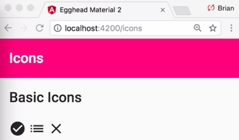
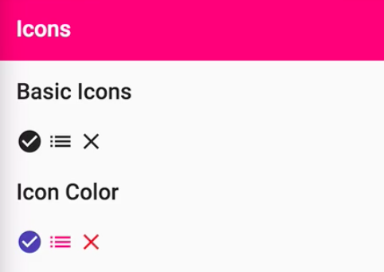
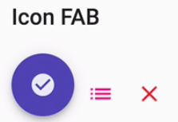
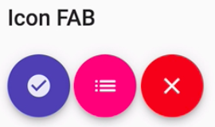
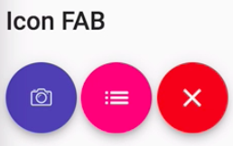

Instructor: [00:01] To get started using Material Design icons, you need to include a link to the font in your `index.html` file. 

```html
<!doctype html>
<html lang="en">

<head>
  <meta charset="utf-8">
  <title>Egghead Material 2</title>
  <base href="/">

  <meta name="viewport"
        content="width=device-width, initial-scale=1">
  <link rel="icon"
        type="image/x-icon"
        href="favicon.ico">
  <link href="https://fonts.googleapis.com/css?family=Roboto:300,400,500,600,700"
        rel="stylesheet">
  <link href="https://fonts.googleapis.com/icon?family=Material+Icons"
        rel="stylesheet">
</head>

<body>
  <egm-app></egm-app>
</body>

</html>
```

Next, you need to import the Material icon module, `MatIconModule` and include it in your `NgModule` imports. 

#### icons-lesson.module.ts
```javascript
import { CommonModule } from '@angular/common';
import { NgModule } from '@angular/core';
import { MatIconModule, MatButtonModule } from '@angular/material';
import { IconsLessonComponent } from './icons-lesson.component';

@NgModule({
  declarations: [IconsLessonComponent],
  imports: [CommonModule, MatIconModule, MatButtonModule]
})
export class IconsLessonModule {}
```

Once that's complete, you can start using Material icons in your components. A complete list of available icons can be found at [material.io/icons](https://material.io/icons/).

[00:26] Let's start with a couple of basic examples. To include an icon, you can use the `mat-icon` component, passing it the name of the appropriate icon. For now, we'll start with a couple of examples. We'll use a `check_circle`, a `list`, and let's also use the `close` button. 

#### icons-lesson.component.html
```html
<h2>Basic Icons</h2>
<mat-icon>check_circle</mat-icon>
<mat-icon>list</mat-icon>
<mat-icon>close</mat-icon>
```

We can refresh the page and see how this looks. We have our icons rendered in black.



[00:51] If we want to adjust the color, then we can use the color property on the `mat-icon` component. I'm going to copy the example from above so we can see the three built-in color options. These options are primary, `accent`, and `warn`, and correspond to your app theme, which we'll see how to adjust in a future lesson.

```html
<h2>Basic Icons</h2>
<mat-icon>check_circle</mat-icon>
<mat-icon>list</mat-icon>
<mat-icon>close</mat-icon>

<h2>Icon Color</h2>
<mat-icon color="primary">check_circle</mat-icon>
<mat-icon color="accent">list</mat-icon>
<mat-icon color="warn">close</mat-icon>
```



[01:09] Any component with a color input could be styled with these same three options. For instance, our list icon has a `color` of `"accent"`, which is pink. If we come over to our `app.component.html` which contains our icon's header, we can see it also has a `color` of `"accent"`. This keeps colors consistent throughout the app, unless you easily change the theme if necessary.

[01:30] Another common use case for icons is within buttons. Let's see how to set this up. What we really need to do is wrap the icon component in a `<button>`. Let's get a little formatting here. Next, we can add the `mat-icon-button` directive. What this does is add a little extra padding and give us a ripple effect every time we click on the icon button.

```html
<h2>Icon Buttons</h2>
<button mat-icon-button>
    <mat-icon color="primary">check_circle</mat-icon>
</button>
<button mat-icon-button>
    <mat-icon color="accent">list</mat-icon>
</button>
<button mat-icon-button>
    <mat-icon color="warn">close</mat-icon>
</button>
```

[01:55] The last major type of icon button is the floating action button. We can create the floating action button by changing `mat-icon-button` directive to `mat-fab`. When we refresh the page, we have our FAB button, but the color is a little off because our `color` property is actually on our icon. Let's move this from the icon to the button itself.

```html
<h2>Icon FAB</h2>
<button mat-fab color="primary">
    <mat-icon>check_circle</mat-icon>
</button>
<button mat-icon-button>
    <mat-icon color="accent">list</mat-icon>
</button>
<button mat-icon-button>
    <mat-icon color="warn">close</mat-icon>
</button>
```

[02:18] Now we have the look we need. 



I'm going to go ahead and replace the rest of these so we can see the different color options. 

```html
<h2>Icon FAB</h2>
<button mat-fab color="primary">
    <mat-icon>check_circle</mat-icon>
</button>
<button mat-fab color="accent">
    <mat-icon>list</mat-icon>
</button>
<button mat-fab color="warn">
    <mat-icon>close</mat-icon>
</button>
```

FAB buttons work great for the primary action on the page. They normally appear on the bottom right, or they split a header. You can think of actions like create email or take a picture, an action which has clear purpose on the page.



[02:41] There may also be times where you need a mini-fab -- generally when your floating action button is between your header and your main content. For that, we can use the `mat-mini-fab` directive instead of the `mat-fab` directive. This gives us a floating action button that's slightly smaller than the normal floating action button.

[02:56] Lastly, although the Material Design icon set has icons that can cover the majority of your use cases, you can also register new icons when needed. To demonstrate this, I added a `custom-camera.svg` icon. Next, you need to `import { MatIconRegistry } from '@angular/material';` as well as `import { DomSanitizer } from '@angular/platform-browser';`.

[03:21] Once these services are imported and injected, we need to call `_icon-registry.addSvgIcon`, giving it a name we will use to reference this icon in our templates, `'custom-camera'`. We need to use a DomSanitizer to say we're going to trust this URL. Let's go ahead and change the path to our `custom-camera.svg` path.

#### icons-lesson.component.ts
```javascript
import { Component, OnInit, ViewEncapsulation } from '@angular/core';
import { DomSanitizer } from '@angular/platform-browser';
import { MatIconRegistry } from '@angular/material';

@Component({
  selector: 'egm-icons-lesson',
  templateUrl: './icons-lesson.component.html',
  styleUrls: ['./icons-lesson.component.scss']
})
export class IconsLessonComponent implements OnInit {
  constructor(
    private _iconRegistry: MatIconRegistry,
    private _sanitizer: DomSanitizer
  ) {
    _iconRegistry.addSvgIcon(
      '',
      _sanitizer.bypassSecurityTrustResourceUrl(
        'assets/custom-icons/custom-camera.svg'
      )
    );
  }

  ngOnInit() {}
}
```

[03:41] All that's left to do is on the Material icon component you can use the SVG icon property to pass the name that we registered earlier, so, in this case, custom camera. 

#### icons-lesson.component.html
```html
<button mat-fab color="primary">
    <mat-icon svgIcon="custom-camera"></mat-icon>
</button>
```

We can go ahead and get rid of the check-circle icon text. When we reload, we can see we have our custom camera icon.

