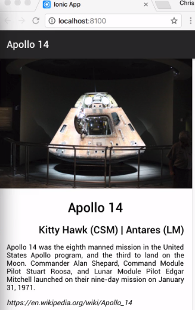
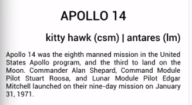

In this sample ionic application, I have two header tags and a paragraph. For the first header, I want this text to be centered, so I add the `text-center` directive to it. For the second header, I want this to be aligned to the right, so I will add the `text-right` to the tag. Finally, for the paragraph, I want this text to be justified.

This is done by adding a `text-justify` directive. 

#### home.html

```html
<h1 text-center>Apollo 14</h1>
<h4 text-right>Kitty Hawk (CSM) | Antares (LM)</h4>
<p text-justify>Apollo 14 was the eighth manned mission in the United States
</p>
```

When I save the file and the app is rebuilt, we will see my text now aligned correctly. 



Another modification that is quite common is the adjustment of the case of the text. Ionic also provides directive for changing the text case to all uppercase, which I'll add to the first header.

I want the second header to be all lowercase, so I'll add the `text-lowercase` to that tag. 

#### home.html

```html
<h1 text-center text-uppercase>Apollo 14</h1>
<h4 text-right text-lowercase>Kitty Hawk (CSM) | Antares (LM)</h4>
<p text-justify>Apollo 14 was the eighth manned mission in the United States
</p>
```

Saving again, we can see the changes. 



Ionic also includes a directive to capitalize the text by using `text-capitalize`. I'll change the second header to use this. 

```html
<h1 text-center text-uppercase>Apollo 14</h1>
<h4 text-right text-capitalize>Kitty Hawk (CSM) | Antares (LM)</h4>
<p text-justify>Apollo 14 was the eighth manned mission in the United States 
</p>
```

Each of the modifiers can be further controlled by adding responsive break points to the directive.

If we want the first header tag to only be centered when the minimum width is 576 pixels, I can change the directive to `text-sm-center`. Now, only when that breakpoint is met will the directive be applied.

```html
<h1 text-sm-center text-uppercase>Apollo 14</h1>
<h4 text-right text-capitalize>Kitty Hawk (CSM) | Antares (LM)</h4>
<p text-justify>Apollo 14 was the eighth manned mission in the United States 
</p>
```