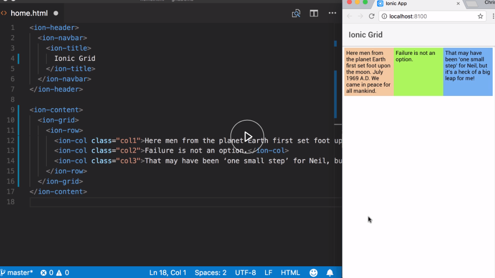
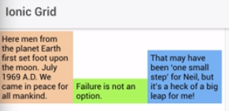
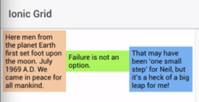
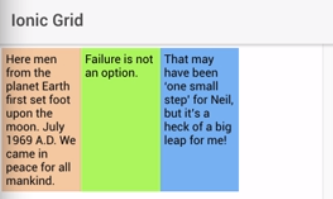
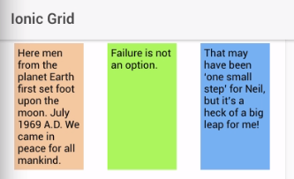

Since Ionic's grid system is built on top CSS's flexbox, we can use the same alignment system it uses. I have a three-column grid already in place in my template, along with some content in each column.

I've also added some CSS, so the columns are visible. 



Now, if I want a row's content to be aligned at the top, I can use the `align-item-start` directive. 


If I want the content to be aligned to be the bottom of the row, I can use `align-items-end`.



#### home.html

```html
<ion-grid>
    <ion-row align-items-start>
        <ion-col class="col1">...</ion-col>
        <ion-col class="col2">...</ion-col>
        <ion-col class="col3">...</ion-col>
    </ion-row>
</ion-grid>    
```

I can also apply these to individual columns as well. Let's set each column to be different. How about we set the columns to be top, middle, and bottom? That would be `align-self-start`, `align-self-center`, and `align-self-end.`

```html
<ion-grid>
    <ion-row>
        <ion-col align-self-start class="col1">...</ion-col>
        <ion-col align-self-center class="col2">...</ion-col>
        <ion-col align-self-end class="col3">...</ion-col>
    </ion-row>
</ion-grid>    
```

Saving, you can see the results. 



For horizontal layout, I can add additional directives to do this. Again, these directives mirror the flexbox alignment options. To demonstrate this, I'm going to first reduce the column widths by adding the `col-` and the number of columns I want.

```html
<ion-grid>
    <ion-row>
        <ion-col col-3 class="col1">...</ion-col>
        <ion-col col-3 class="col2">...</ion-col>
        <ion-col col-3 class="col3">...</ion-col>
    </ion-row>
</ion-grid>    
```


Now, I will apply the `justify-content-end` directive. 

```html
<ion-grid>
    <ion-row justify-content-end>
        <ion-col col-3 class="col1">...</ion-col>
        <ion-col col-3 class="col2">...</ion-col>
        <ion-col col-3 class="col3">...</ion-col>
    </ion-row>
</ion-grid>    
```

Saving, we can see the change. 


Let me show you another alignment in action. I will change the directive to `justify-content-around`. 

```html
<ion-grid>
    <ion-row justify-content-around>
        <ion-col col-3 class="col1">...</ion-col>
        <ion-col col-3 class="col2">...</ion-col>
        <ion-col col-3 class="col3">...</ion-col>
    </ion-row>
</ion-grid>    
```

Saving, and now the columns have a different alignment altogether.



One thing to note with the horizontal alignment options, they will be applied to all the columns. You may need to use other alignment solutions for your content if you need to mix the horizontal alignment of an individual column.