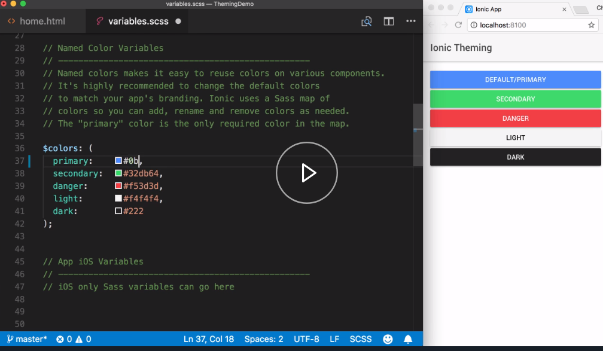
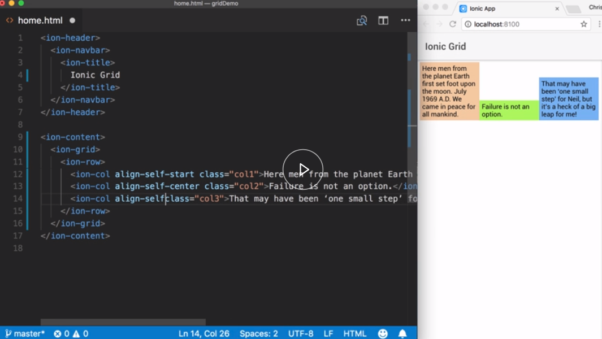

The goal of this course is to introduce you to the various methods you can apply to customize the look and feel of you Ionic application. 

From setting global Sass variables, defining style configuration properties, setting page specific styles, this course will lay the foundation for you to build your customized application. 

It will also show you how to use the built in CSS utilities to assist with many of the common layout needs, as well as show you how to use the Ionic Grid to layout more complex designs.

This course is perfect for Ionic developers looking to understand how to make their apps visually shine. Let's get started.