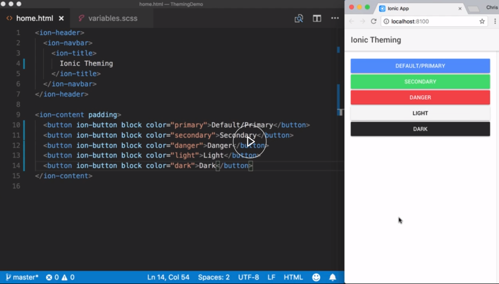
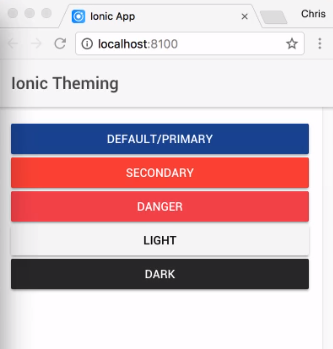
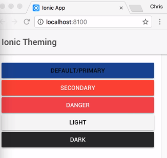
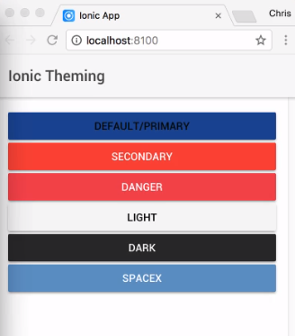

When starting to create a custom theme for your Ionic application, it's usually best to see how much you can leverage from the existing infrastructure.



The first adjustment you should consider making is adjusting the default color map. Ionic ships with five default color themes, `primary`, the Ionic blue, `secondary`, a nice green, `danger`, a red, `light`, an off-white, and `dark`, which is not quite a full black.

I had these colors applied to a set of Ionic buttons in my template by setting a `color` attribute to each of the names of my color map. Hopefully, you have seen these colors as you've explored the documentation.

#### home.html

```html
<ion-content padding>
    <button ion-button block color="primary">Default / Primary</button>
    <button ion-button block color="secondary">Secondary</button>
    <button ion-button block color="danger">Danger</button>
    <button ion-button block color="light">Light</button>
    <button ion-button block color="dark">Dark</button>
</ion-content>
```

Ionic components typically use the `primary` color as its default `color` value. That value would be the best place to start with our adjustments.

Let's change our `primary` color to be the NASA blue instead of the Ionic blue. Switching to the `variables.scss` file, we'll find our color map. We'll change the primary value to `#0b3d91`.

For the `secondary` color, we'll just set that to the NASA red, which is `#fc3d21`. 

#### variables.scss
```javascript
$colors: (
  primary:    #0b3d91,
  secondary:  #fc3d21,
  danger:     #f53d3d,
  light:      #f4f4f4,
  dark:       #222
);
```
Saving our file, we'll see our buttons are now being colored with our theme colors. `danger` and `light` remain unchanged.



If we want more control, we can combine the colors further by setting the `base` color and its `contrast` color. We can see the result of the `contrast` color in how the text is colored in each button.

If you note, nowhere in the template do I specify what the text color should be. This is all computed by the theme by picking up its `contrast` color value. Let's adjust our primary color to demonstrate this.

I'll set the base color to the same blue as before, and we will define its `contrast` color. First, I will set it to `#ffffff`. 
#### variables.scss
```html
$colors: (
  primary:    (base: #0b3d91, contrast: #ffffff),
```

Saving, and there's no difference. Let's change the `contrast` to `#000`. 

#### variables.scss
```html
$colors: (
  primary:    (base: #0b3d91, contrast: #000),
```

Saving, and now we can see our text is black.



It is possible to extend this color map to have another color option, say `spacex` blue. I can add this new value to my color map, say `#558d65`.

#### variables.scss
```html
$colors: (
  spacex:    #558d65,
```

Switching to my template, I'll copy a `button` and change its theme reference. 

#### home.html

```html
<ion-content padding>
    ....
    <button ion-button block color="spacex">SpaceX</button>
</ion-content>
```

Saving both files, and we can see it being applied.



A word of caution here. Each color that you add to the color map, Ionic will generate CSS styles for all the Ionic components.

This is approximately 50 kilobytes per color. If you need a custom color, but only for a specific component, consider limiting the scope that you apply the color to by either a custom status variable or overriding it directly.
