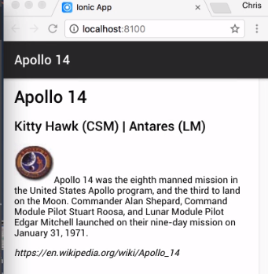

In this sample Ionic application, I have several elements that I want to adjust in our layout by changing their `float` values. Instead of writing the CSS myself, I can leverage the built-in directives. The non-floated version of this page is already shown on my browser.



For the image, I want it to be floated to the left, I'll add the `float-left` directive to the image. 

#### home.html

```html
<ion-content padding>
  <h1>Apollo 14</h1>
  <h4>Kitty Hawk (CSM) | Antares (LM)</h4>
  <p>
    Apollo 14 was the eighth manned mission in the United States Apollo program, and the third to land on the Moon. Commander
</ion-content>
```

Saving the file, we can see the results. 


Now, as you would suspect, if you need to float an image to the right, you would use `float-right`.

To control when this float is applied, we can modify the direction only to be triggered at a specific breakpoint. Changing the directive to `float-md-left`, we can cause the image only to be floated when the minimum width is 768 pixels. If my application supports right-to-left languages, I can use the `float-start` or `float-end` to achieve the same layout as a `float-left` or `float-right`.

```html
<ion-content padding>
  <h1>Apollo 14</h1>
  <h4>Kitty Hawk (CSM) | Antares (LM)</h4>
  <p>
    Apollo 14 was the eighth manned mission in the United States Apollo program, and the third to land on the Moon. Commander
</ion-content>
```

I can also quickly adjust an element's padding. You have already seen this directive as it's applied to the body tag for each of the three Ionic Starter Templates. To apply padding to a specific direction, you add `padding` then the direction.

For the image, I want the `padding` to be on the `right` and the `bottom`. 

```html
<ion-content padding>
  <h1>Apollo 14</h1>
  <h4>Kitty Hawk (CSM) | Antares (LM)</h4>
  <p>
    Apollo 14 was the eighth manned mission in the United States Apollo program, and the third to land on the Moon. Commander
</ion-content>
```
Saving again, now, there are 16 pixels of padding applied to the right and bottom of my image. 


To change that amount, I can override the SASS variable that defines it. Let's do that.

Switching to the `variables.scss` file in the theme directory, I will set the `$content-padding` variable to `32px`. 

#### variables.scss
```css
$content-padding: 32px;
```

Saving again, we can see our padding around our image has now doubled.


In addition to adding padding via specific direction, we can also use the `padding-vertical`, or `padding-horizontal` directives to set the padding for a specific axis.

In addition to an element's padding, we have the same control with the margins. We can set the margin of our paragraph tag by adding a `margin-left` directive. 

#### home.html
```html
<ion-content padding>
  <h1>Apollo 14</h1>
  <h4>Kitty Hawk (CSM) | Antares (LM)</h4>
  <p margin-left>
    Apollo 14 was the eighth manned mission in the United States Apollo program, and the third to land on the Moon. Commander
</ion-content>
```

Saving again, and now, we can see that our margins have been added.


These directives give you easy solutions to control your content spacing and layout within your Ionic application.