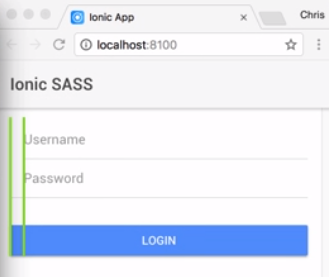
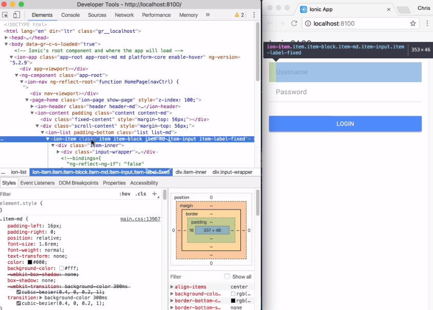
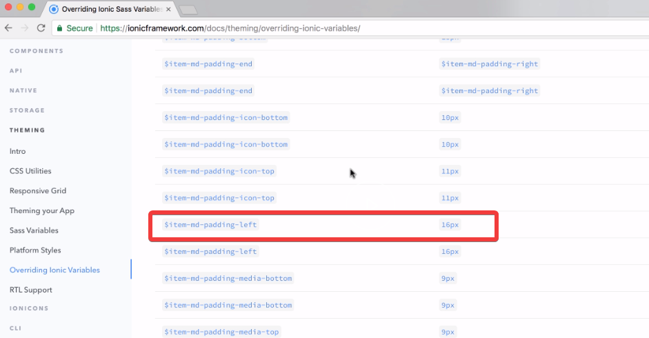
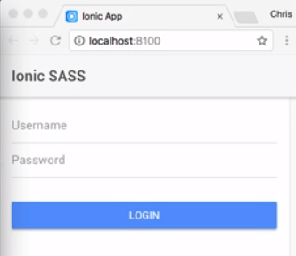

When styling Ionic components, it's best to see if there is an existing SASS variable that you can set directly. 

Here, we have the basics of a login form. Two inputs and a login button. 
#### home.html
```html
<ion-content padding>
  <ion-list padding-bottom>

    <ion-item>
      <ion-label fixed>Username</ion-label>
      <ion-input type="text" value=""></ion-input>
    </ion-item>
  
    <ion-item>
      <ion-label fixed>Password</ion-label>
      <ion-input type="password"></ion-input>
    </ion-item>
  
  </ion-list>
  <button ion-button block>Login</button>
</ion-content>
```

As you can see, the alignment of the two inputs does not match the left edge of the button. Let's fix that.



To move the inputs over, we need to understand what is causing them to be shifted to the right. Opening Chrome's dev tools and using the elements inspector, we can select each of the DOM elements until we find the `ion-item` that is introducing the `padding-left` that is shifting our inputs over.



Now, we could directly override these values, but I want to change this value globally in my application. To do this, first I'm going to see if the [Ionic framework](https://ionicframework.com/docs/api/components/item/item/#sass-variables) has exposed a SASS variable for this attribute.

If you go to the API section for that component, there is a listing of some of the SASS variable to use for that component. Since I do not see anything about padding or margins, I'm going to navigate over to the [overriding SASS variables page](https://ionicframework.com/docs/theming/overriding-ionic-variables).

This page contains a listing of all the SASS variables used in Ionic. I'm going to search on `item-md`. This list new filters the variables for us. There's the exact name of the SASS variable we need, `item-md-padding-left`. The iOS-specific value would be `item-ios-padding-left`.



We can also see the default value is `16px`, the same value we saw when we were inspecting the DOM. As you can tell, the naming scheme is pretty straightforward. We probably could have guessed the name of this variable if we really tried.

Let's switch back to our code. We can set these two values in our `variables.scss` file. 

#### variables.scss

```scss
$item-md-padding-left: 0;
$item-ios-padding-left: 0;
```

Saving them, and now, our two inputs are aligned to the left of the button. 



Ionic has exposed almost all their styling elements as SASS variables, making it fairly easy to apply custom styling to any of your components.