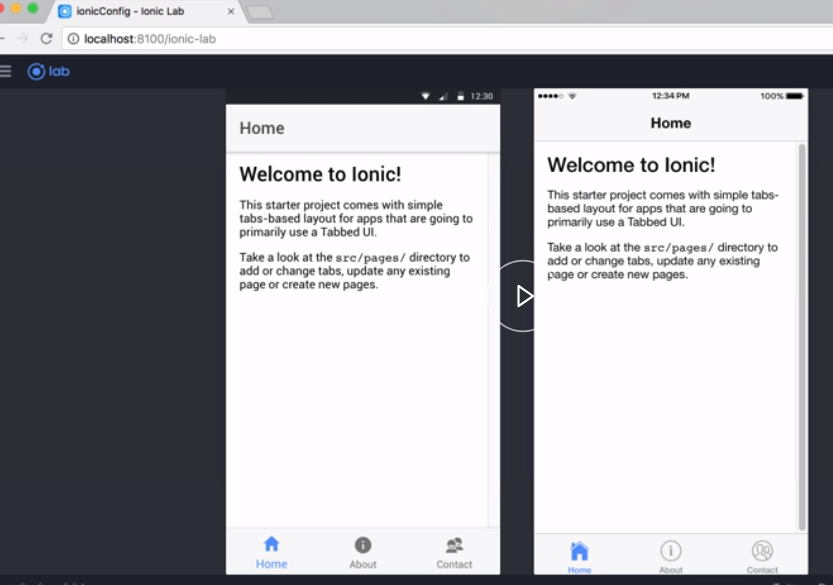
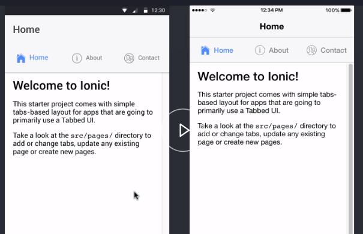
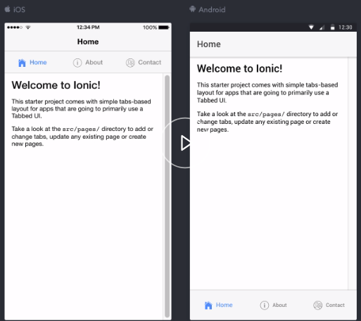

I have already created an Ionic application based on the tabs template. I'm running `ionic serve` with the `--lab` flagged. This flag allows us to see how our application will look on various platforms, in this case, iOS and Android.



Switching back to our code, we can change several of the properties of our tabs by changing the config properties. In the `app.modules.ts` file, we'll find the `IonicModule` reference in the `imports` array. 

#### app.modules.ts

```javascript
imports: [
    BrowserModule,
    IonicModule.forRoot(MyApp)
]
```

Now we can extend this by passing in an object to find the changes we want to make.

By default, Ionic will use material design for its styling and icon selection. We can change that by adding an `iconMode` and setting its value to ios. This will tell our application to use the iOS style of icons regardless of the platform our app is running on.

```javascript
imports: [
    BrowserModule,
    IonicModule.forRoot(MyApp, {
        'iconMode': 'ios'
    })
]
```

Saving the file, we see the three icons in the tabs are now different. 


Let's add two more properties. First, we'll add the `tabsLayout` and set its value to `icon-left`. This will tell our app to place any icons in our tabs to be on the left side of the label.

Finally, we'll add `tabsPlacement` and set its value to `top`. This will relocate the tabs to the top of the application. 

```javascript
imports: [
    BrowserModule,
    IonicModule.forRoot(MyApp, {
        'iconMode': 'ios',
        'tabsLayout': 'icon-left',
        'tabsPlacement': 'top'
    })
]
```

Saving again, we can see the changes to our design. The icons are now on the left, and the tab is now positioned at the top.



If we want to override a property for a specific platform, we can do that as well. For example, the material design guidelines used to recommend that the tabs be located at the top of the application, like we just changed, but the iOS guidelines state the tabs should be placed at the bottom of the app.

To handle that, we can add a `platforms` object and then add platform and then the specific property we want changed. `platforms`, add the object, `ios`, and then set the `tabsPlacement` to be `top`. 

```javascript
imports: [
    BrowserModule,
    IonicModule.forRoot(MyApp, {
        'iconMode': 'ios',
        'tabsLayout': 'icon-left',
        platforms:{
        ios: {'tabsPlacement': 'top'}    
        }
    })
]
```

Saving again, switching back to the browser, we can see the tabs are placed differently for each of the two platforms.

