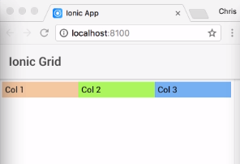
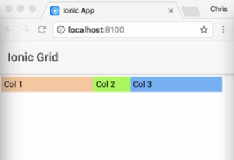
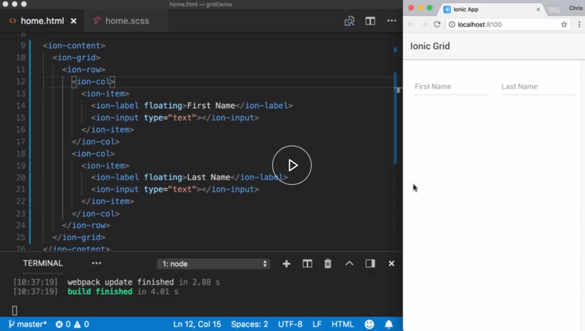
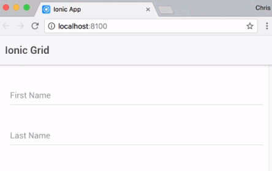
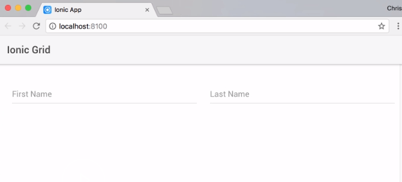

We'll start with an `ion-grid`. Next, we'll add our `ion-row`.

#### home.html

```html
<ion-grid>
    <ion-row></ion-row>
</ion-grid>
```

Now, we can't have content directly in an `ion-row`, so we'll need to use the `ion-column`. It is in this element that we'll place our actual content.

```html
<ion-grid>
    <ion-row>
        <ion-col></ion-col>
    </ion-row>
</ion-grid>
```

Our design has three cells, so I will have three `ion-columns` and put the column name in each, just so we can see what it initially looks like. I will add a custom `class` to each column, just to provide a background color so we can better see the columns on a page.

```html
<ion-grid>
    <ion-row>
        <ion-col class="col1">Col 1</ion-col>
        <ion-col class="col2">Col 2</ion-col>
        <ion-col class="col3">Col 3</ion-col>
    </ion-row>
</ion-grid>
```

Saving.



We can see each column's name in equally positioned across our screen. By default, each `ion-col` will have equal width. To set a col's width, we can add the col- and the number of columns that we want to use.

Let's change the three col widths. The first column will take up `5` columns. The middle will take `2`, and the third `5`, adding up to 12.

```html
<ion-grid>
    <ion-row>
        <ion-col col-5 class="col1">Col 1</ion-col>
        <ion-col col-2 class="col2">Col 2</ion-col>
        <ion-col col-5 class="col3">Col 3</ion-col>
    </ion-row>
</ion-grid>
```

Saving, and we can see the widths have changed.



We can further control the number of columns by including one of the responsive breakpoint identifiers. Let me switch to a more realistic example to show you this first.



Here we have a form that's asking for our first and last name. Currently, these two inputs are side by side. Fine for wider viewports, but on a smaller screen, I would like them stacked.

Ionic's grid columns have five breakpoints -- xs small, small, medium, large, and extra-large. This allows us to have different column widths at different screen sizes. These values can be changed through their associated sass values.

Switching in this new HTML code, we have our grid in our rows before. We have two columns, each containing our inputs.

```html
<ion-grid>
    <ion-row>
        <ion-col>
            <ion-item>
                <ion-label floating>First Name</ion-label>
                <ion-input type="text"></ion-input>
            </ion-item>
        </ion-col>
        <ion-col>
            <ion-item>
                <ion-label floating>Last Name</ion-label>
                <ion-input type="text"></ion-input>
            </ion-item>
        </ion-col>
    </ion-row>
</ion-grid>
```

I will define each column to take up `12` units, and once the small breakpoint width is reached, only to take up `6` units instead. Ionic will automatically wrap our content if the column total equals `12`.


```html
<ion-grid>
    <ion-row>
        <ion-col col-12 col-sm-6>
            <ion-item>
                <ion-label floating>First Name</ion-label>
                <ion-input type="text"></ion-input>
            </ion-item>
        </ion-col>
        <ion-col col-12 col-sm-6>
            <ion-item>
                <ion-label floating>Last Name</ion-label>
                <ion-input type="text"></ion-input>
            </ion-item>
        </ion-col>
    </ion-row>
</ion-grid>
```

Now, we can see with this new responsive set on the small screens, the inputs are stacked.



For larger viewports it becomes side by side. 



Using these additional modifiers can be extremely useful to change the layout of your content for different screen sizes.
