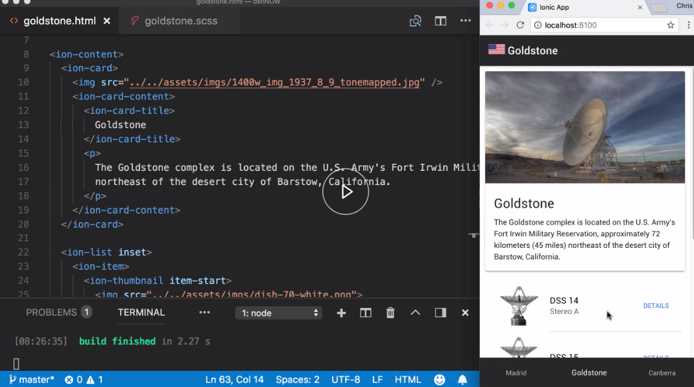
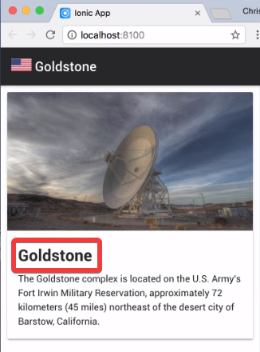
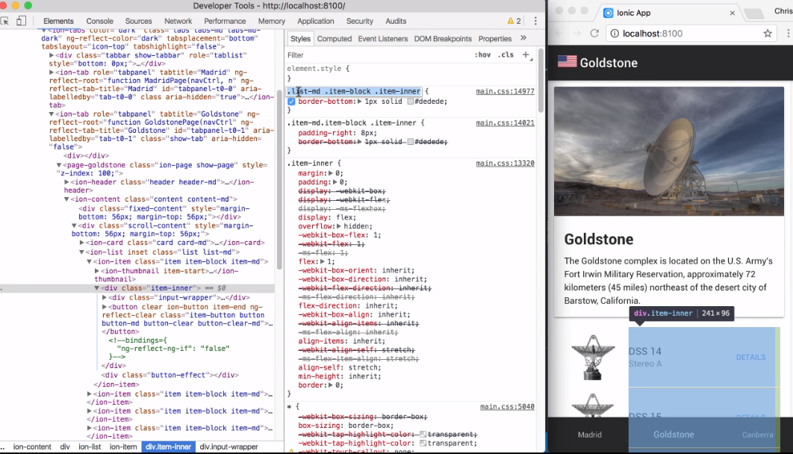
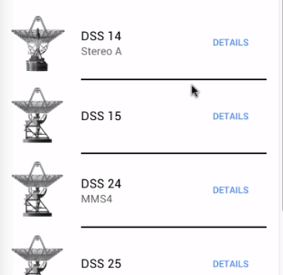

When you need to style a component or a tag on a specific page, we can use the Sass file that is bound to that particular template. I have a simple three-tab application, with each tab with a similar design.



Let's make the `ion-card-title` tag on the goalstone page bolder by setting the `font-weight` value. 

#### goldstone.scss

```javascript
page-goldstone{
    ion-card-title{
        font-weight: bold;
    }
}
```

Saving, we can see the text is bolder on the goalstone page, while the same tag on the other two tabs is the default weight.



Now, styling some Ionic components can be more difficult. Sometimes, the property that we want to change is not easily accessible, or is bound to a Sass variable. Since we cannot override a Sass variable for just one instance, we need to see what actually makes up the component's DOM.

Let's inspect the list item. We can see it's actually made up several divs, in addition to the actual h2 and paragraph tags. I want to change the color of the `bottom-border` of each list item. We can see that this is set in a div, and by the CSS classes of `list-md`, `item-block`, and `item-enter`.



I will copy this class chain, and add it to my Sass file. I will also add the iOS chain as well. I will then set the `border-bottom` to be `2px`, `solid`, and `black`. 

```javascript
page-goldstone{
    ion-card-title{
        font-weight: bold;
    }
    .list-md .item-block .item-inner, list-ios .item-block item-inner{
        border-bottom: 2px solid #000;
    }
}
```

Saving, we can see the change.



Another thing to note, sometimes due to the order of the cascade, we may need to include the `!important` override, to your rule for the style to take effect.