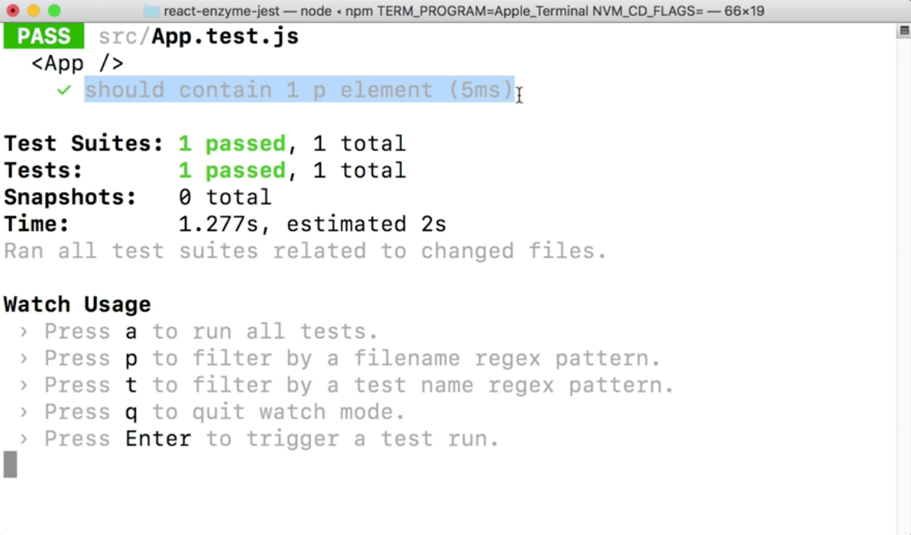
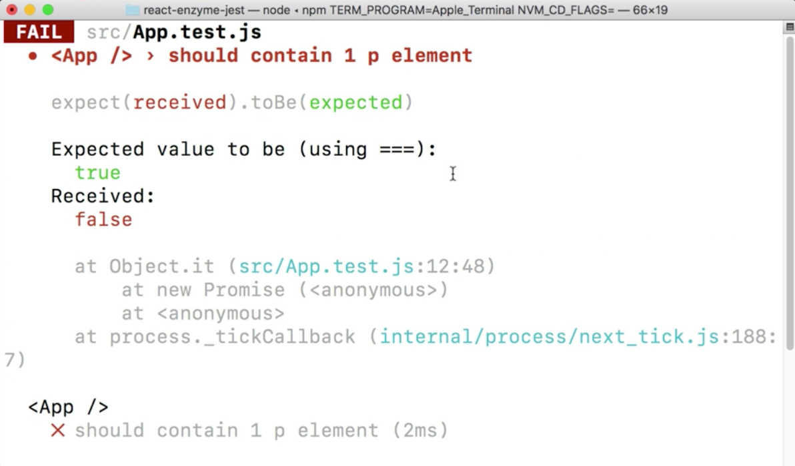

Instructor: 00:00 Now that we have a shallow rendered component, we can use some built-in methods to search for certain nodes. Then we'll use jests assertions to make sure that everything renders correctly. Let's write `expect(wrapper.find('p').length.toBe(1)`.

#### App.test.js
```javascript
describe('<App />', () => {
  it('should contain 1 p element', () => {
    const wrapper = shallow(<App />)
    expect(wrapper.find('p').length).toBe(1)
  })
```

00:19 Now, let's refactor our test, and change the wording to just `contain one p element`. Perfect. Now, if we go to our `App.js` file, we'll see that we only have one p tag inside of our `App` component. 

#### App.js
```javascript
class App extends Component {
  render() {
    return(
      <div className="App">
        <header className="App-header">
          
          <h1 className="App-title">Welcome to React</h1>
        </header>
        <p className="App-intro">
          To get started, edit <code>src/App.js</code> and save to reload.
        </p>
      </div>
    );
  }
}
```

When we shallow render this with Enzyme, we want to make sure that we just see this one p element.

00:37 Then this `find` method will find every node in the render tree, or a `wrapper` that matches the provided selector that we're passing it here. We can run our `npm test` script, and make sure that this test pass. We can see that it does contain just one p element.



00:58 Now, on our `find` method, let's change the `.length` to `exists`, and our `toBe` to be `true`. 

#### App.test.js
```javascript
expect(wrapper.find('p').exists()).toBe(true)
```

Our p tag has a classname called `App-intro`. Let's use that, to be more specific than just the generic p element. We've got our JS test script running in watch mode, so we are still passing on this test.

```javascript
expect(wrapper.find('.App-intro').exists()).toBe(true)
```

01:19 We could easily break this by changing our classname, resaving it. You can see that we fail. 

```javascript
expect(wrapper.find('.App-intr').exists()).toBe(true)
```



The `exists` method is handy for testing for one specific node. Now, let's say that our app had a `ul` with a bunch of lis.

01:38 Let's change exists to `children.length`, and we want that to equal three. 

```javascript
expect(wrapper.find('ul').children().length).toBe(3)
```

Then inside of our `App.js`, let's paste in a ul with three lis. With our terminal still in watch mode, we can see that our test is still passing.

#### App.js
```javascript
return(
  <div className="App">
    <header className="App-header">
      
      <h1 className="App-title">Welcome to React</h1>
    </header>
    <ul>
      <li>Test 1</li>
      <li>Test 2</li>
      <li>Test 3</li>
    </ul>
    <p className="App-intro">
      To get started, edit <code>src/App.js</code> and save to reload.
    </p>
  </div>
);
```

01:55 The `children` method is handy when scoping tests to a specific parent-child hierarchy. For example, if we added another outlying `li`, and saved this off, we can see that our tests still pass, because it's only looking for the children of the `ul`.

```javascript
return(
  <div className="App">
    <header className="App-header">
      
      <h1 className="App-title">Welcome to React</h1>
    </header>
    <ul className='tyler'>
      <li>Test 1</li>
      <li>Test 2</li>
      <li>Test 3</li>
    </ul>
    <li>Test 3</li>
    <p className="App-intro">
      To get started, edit <code>src/App.js</code> and save to reload.
    </p>
  </div>
);
```

02:11 If our `ul` had a class called tyler, we could use the `hasClass` method to search for specific classes. The `hasClass` method simply returns true or false if the class exists. 

#### App.test.js
```javascript
expect(wrapper.find('ul').hasClass('tyler')).toBe(true)
```

Then finally, let's check that our `h1` has the correct text, which is, "Welcome to React." It does, perfect.

```javascript
expect(wrapper.find('h1').text()).toBe('Welcome to React')
```