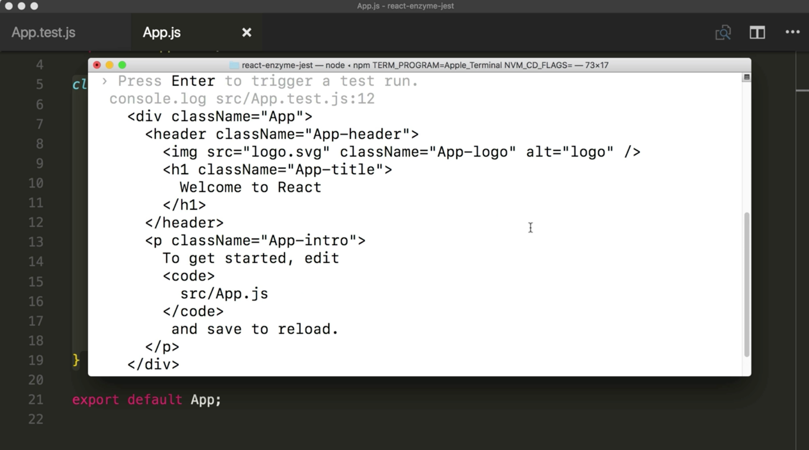
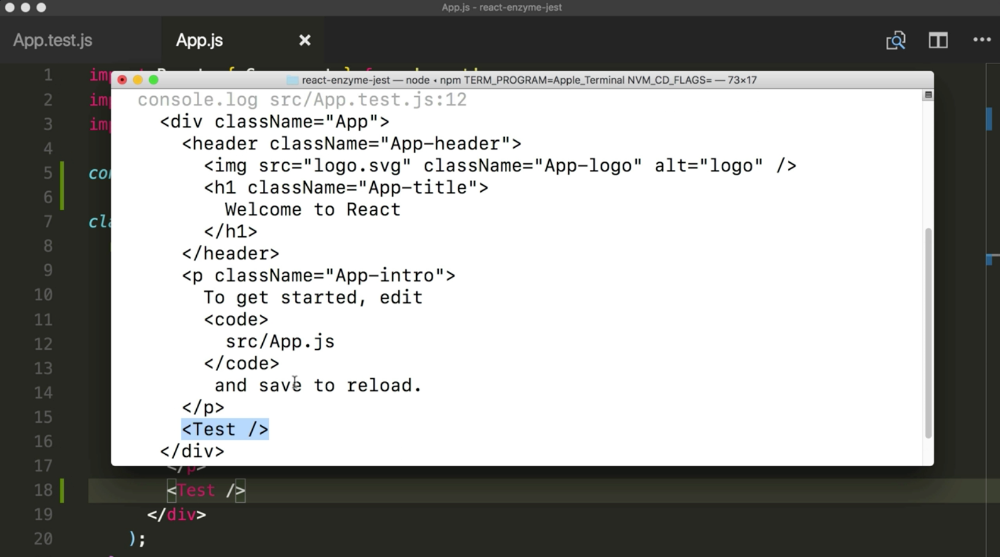

Instructor: 00:00 Shallow rendering is useful to constrain yourself to testing a component as a unit and to ensure that your test aren't indirectly asserting a behavior of child components.

00:11 Let's go ahead and import `shallow` from Enzyme. Then let's create our first `describe` block with our `App` component. Inside this, we'll make an `it` block that just renders our `App` component.

00:24 Next, we'll do a `const wrapper = shallow(<App />` component. Perfect.

#### App.test.js
```javascript
import { configure, shallow } from 'enzyme'

describe('<App />', () => {
  it('should render App', () => {
    const wrapper = shallow(<App />)
  })
```

00:30 As I mentioned, shallow rendering is easy to use when working with the component itself. It's not going to chase rendering child components. We could see what this shallow rendered component looks like by using the `debug` method on the wrapper.

```javascript
describe('<App />', () => {
  it('should render App', () => {
    const wrapper = shallow(<App />)
    console.log(wrapper.debug())
  })
```

00:44 Now let's go ahead and check out this app component, see what it looks like. This is the create-react-app static app component. This is what we expect to see inside of our terminal when we run our test script.

#### App.js
```javascript
class App extends Component {
  render() {
    return(
      <div className="App">
        <header className="App-header">
          
          <h1 className="App-title">Welcome to React</h1>
        </header>
        <p className="App-intro">
          To get started, edit <code>src/App.js</code> and save to reload.
        </p>
      </div>
    );
  }
}
```

00:59 Our test will run and we'll see a `console.log` with the shallow rendered component here. As you can see, it's the same from what we see in our file.



01:10 Now to test the rendering of children, we can create a quick react functional component called `Test` that renders a `<div>` with `Testing`. If we place this inside of our `App` component, we can see this new rendered log, and then it's not chasing the div testing child component here.

```javascript
const Test = () => <div>Testing</div>

class App extends Component {
  render() {
    return(
      <div className="App">
        <header className="App-header">
          
          <h1 className="App-title">Welcome to React</h1>
        </header>
        <p className="App-intro">
          To get started, edit <code>src/App.js</code> and save to reload.
        </p>
        <Test />
      </div>
    );
  }
}
```




01:34 We also have the ability to pass through some configurations to our shallow rendered component. Our second parameter here is going to be an object with a `context` property, as well as a `disableLifecycleMethods` property.

```javascript
describe('<App />', () => {
  it('should render App', () => {
    const wrapper = shallow(<App />, {context: {}, disableLifecycleMethods: bool})
    console.log(wrapper.debug())
  })
```

01:49 As you probably guessed, this is how we can provider context to our rendered component if we care about that in our test. This `disableLifecycleMethods` property with the bool value is how we could tell Enzyme to ignore the `componentDidMount` lifecycle method. The `componentDidUpdate` is also not called after `setProps` and `setContext` is used.