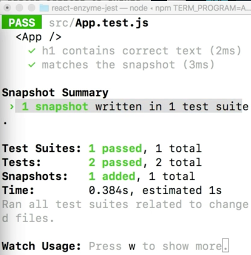
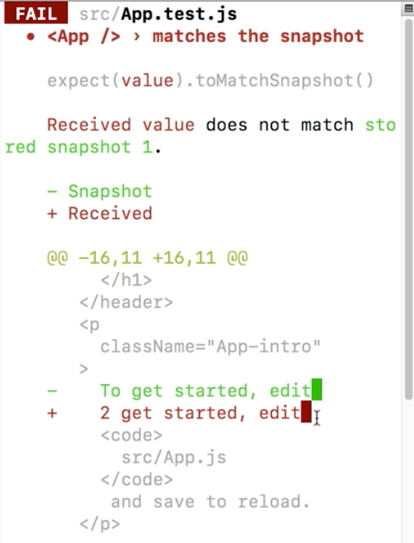

Instructor: 00:00 Something that most tests fail to do is test that the user interface of a component looks and works correctly. Even if we were to write unit tests for each part of our component, there would still be holes.

#### App.js
```javascript
class App extends Component {
  render() {
    return(
      <div className="App">
        <header className="App-header">
          
          <h1 className="App-title">Welcome to React</h1>
        </header>
        <p className="App-intro">
          To get started, edit <code>src/App.js</code> and save to reload.
        </p>
      </div>
    );
  }
}
```

00:11 For example, we could test that the `logo` and `title` are rendered correctly inside of this component, but how could we make sure that the `logo` is above the `h1` in hierarchy? This might not matter in every situation but if styles or JS depend on this hierarchy, we need to make sure that it stays this way.

00:29 We'll navigate to our test file and run a new test. We'll say `it matches the snapshot`. Inside of this, we'll do const `tree` equals shallow render our `App` component. We'll expect that our `tree` matches a snapshot.

#### App.test.js
``` javascript
describe('<App />', () => {
  it('h1 contains correct text', () => {
    const wrapper = shallow(<App />)
    expect(wrapper.find('h1').text()).toBe('Welcome to React')
  })
  it('matches the snapshot', () => {
    const tree = shallow(<App />)
    expect(tree).toMatchSnapshot()
  })
})
```

00:44 Jest snapshot feature enables us to take a picture of the current state of our component and save it away. This is how we can keep a record of our intended output of the component as other features or components use it.

00:59 The first time we run this test, it is going to pass and add a file for this test in an automatically generated `snapshot` folder. We can see here in the terminal that this snapshot was written.



01:10 If we navigate our explorer, we can see our `__snapshots__` folder and the output of our snapshot. As you can see, this is ugly and difficult to read and maintain.

01:22 Instead let's go to our terminal and install a helper package called `enzyme-to-json`. 

```bash
$ npm install --save-dev enzyme-to-json
```

Inside of our test, we'll `import toJson from "enzyme-to-json"`, and then pass our tree as an argument to JSON.

```javascript
it('matches the snapshot', () => {
    const tree = shallow(<App />)
    expect(toJson(tree)).toMatchSnapshot()
  })
```

01:40 When we run this test again, we can see that our snapshot testing is already working for us. The original snapshot is going to look different than our new JSON-rendered component.

01:51 When we want Jest to update, it snapshot record. As we do in this case, we simply press U. Jest will tell us that it updates our snapshot and we can navigate back to our snapshot file and see our JSON-rendered component.


02:10 Again, this record will be used every time we run our test. If we change this tags of two, our test will fail. Jest will show us the differences of our record and actual renderings.



02:23 When we actually need to update the record of our test, so we actually want our component to render `Hello World`, we press U in our terminal. That will rerun and update our snapshot record.