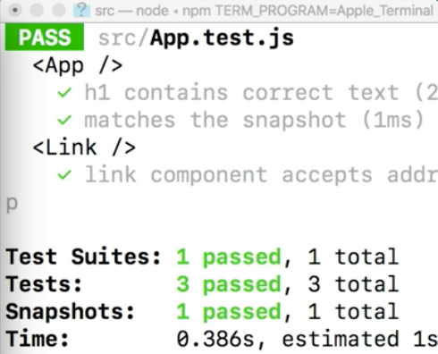

Instructor: 00:00 To begin writing test for component in node-props, let's create a new component. Export class `Link`, extends components, our `render` method, and we'll return an `a` tag with this.props.address. Click and close the a-tag. Perfect.

#### App.js
```javascript
class App extends Component {
  render() {
    return(
      <div className="App">
        <header className="App-header">
          
          <h1 className="App-title">Welcome to React</h1>
        </header>
        <p className="App-intro">Hello World</p>
      </div>
    );
  }
}

export class Link extends Component {
  render() {
    return <a href={this.props.address}>Click</a>
  }
}
```

00:18 Now we have a simple component called `Link` that returns an `a` tag with an href that will receive its value by a prop named `address`. Inside of our test, let's make a new `describe` block.

00:31 We'll do describe, and then our `Link` component. For our first it, it will be `Link` component, accepts `address` prop. Inside of this block, we'll do const `wrapper` equals `shallow` our `Link` component, within `address` prop. That goes to `www.google.com`.

#### App.test.js
``` javascript
describe('<Link />', () => {
  it('link component accepts address prop', () => {
    const wrapper = shallow(<Link address='www.google.com' />)
  })
```

00:49 Let's make sure that we import this `Link` component from our app file. We'll do `expect(wrapper.instance().props.address)` is `www.google.com`.

```javascript
import App, {Link} from './App'

describe('<Link />', () => {
  it('link component accepts address prop', () => {
    const wrapper = shallow(<Link address='www.google.com' />)
    expect(wrapper.instance().props.address).toBe('www.google.com')
  })
```

01:01 When it comes to testing component props with Enzyme, it's important to understand which prop or the component we're trying to test. What do we mean by this is, are we trying to test the actual instance of the component? This address prop value right here (`<Link address='www.google.com' />`), or are we trying to test the href value on the return a-tag (`<a href={this.props.address}>Click</a>`)?

01:22 For our first test here, we are testing the actual instance of the `Link` address prop. We can see that this is passing our test.



01:31 Next we'll do a-tag node renders href correctly. This block will do a new const `wrapper` equals `shallow` our `Link` component address. It is `www.google.com`.

01:43 We'll expect that our `wrapper.props().href` is `www.google.com`. 

``` javascript
it('a tag node renders href correctly', () => {
    const wrapper = shallow(<Link address='www.google.com' />)
    expect(wrapper.props().href).toBe('www.google.com')
  })
```

Perfect. This test passes. With this test, we are making sure that our href is using the correct prop value, contrary to our first test where we used the instance, now we're just using the `props` method on the wrapper itself.

02:05 This will return all the `props` of the components return node. In our case, we're looking at the `a` tag. It's treating the `href` like a prop. Our two tests are testing the same prop essentially, but in different ways.

02:21 What if our component had a conditional return value depending on the prop that's passed? What if we did `this.props.hide` as a ternary returning `null`?

#### App.js
``` javascript
export class Link extends Component {
  render() {
    return this.props.hide ? null : <a href={this.props.address}>Click</a>
  }
}
```

02:31 Let's write a new test for this. We'll do it returns null with true height prop. Into this block, we'll do const `wrapper` equals `shallow` our `Link` component with the `hide` of `false`. Going to expect `wrapper.find` our a length to be one.

#### App.test.js
```javascript
it('returns null with true hide prop', () => {
  const wrapper = shallow(<Link hide={false} />)
  expect(wrapper.find('a').length).toBe(1)
})
```

02:51 This test does pass, which means that this `false` value that we're passing on the `hide` prop is actually returning our a-tag. Let's test if our `null` was being returned correctly.

03:02 If we do `wrapper.setProps` with an object where `hide` is `true` now, we can expect that our `wrapper.get(0)` is null. It looks like our test still passes.

```javascript
it('returns null with true hide prop', () => {
  const wrapper = shallow(<Link hide={false} />)
  expect(wrapper.find('a').length).toBe(1)
  wrapper.setProps({ hide: true })
  expect(wrapper.get(0)).toBeNull()
})
```

03:15 Now, `setProps` is a method that takes an object and passes it through as new props to our component. This causes a re-render of our component. It's useful when wanting to test how components behave over time with changing props.

03:31 This method will call, `componentWillReceiveProps` lifecycle method on the component. Our `get` method simply returns the node at the given index of the current wrapper.

03:42 To wrap it all up, we're using the `toBeNull` method from Jest to make sure that this node that we are returning is actually null.