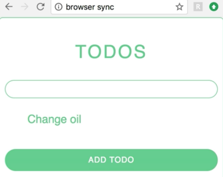

Instructor: 00:00 I've got a simple `TodoList` here. I'm able to click into this input box, write out todos, and then, when I click on the `Add Todo` button, it'll add it to the list.

00:08 Then, in order to delete them, we simply just need to click on them. We're using Redux to fire off the adding, removing, and keeping the current lists of our todos.



00:18 Inside of our `TodoList` component, we've got state here. That's going to keep track of our current input. Then we've also got three methods.

#### TodoList.js
```javascript
export class TodoList extends Component {
  state = { input: ''}

  handleClick = i => () => {
    this.props.removeTodo(i)
  }

  handleChange = e => {
    this.setState({ input: e.currentTarget.value})
  }
}
```

00:26 The `handleClick` method attaches to our `li` todos and fires the `removeTodo` Action creator with the index to remove. The `handleChange` lives on the `input` to update our input state.

00:38 The `handleSubmit` lives on the `addTodo` button, which calls the `addTodo` Action creator. This function sends off the current `input` state, and then clears the input.

#### store.js
``` javascript
export const addTodo = todo => ({
  type: 'ADD_TODO',
  todo
})

export const removeTodo = id => ({
  type: 'REMOVE_TODO',
  id
})
```

00:51 I've organized all of the Redux concepts into a `store.js` file. This is where our addTodo/removeTodo Action creators live. Then our reducer modifies the `state` according to our action creators.

```javascript
const handleNewTodo = (state, action) => ({
  todos: [...state.todos, action.todo]
})

const handleRemoveTodo = (state, action) => ({
  todos: [
    ...state.todos.slice(0, action.id),
    ...state.todos.slice(action.id + 1)
  ]
})

const currentList = (state = initialState, action) => {
  const handlers = {
    REMOVE_TODO: handleRemoveTodo,
    ADD_TODO: handleNewTodo
  }
}
```

01:04 Then, finally, we export our store out. 

```javascript
const rootReducer = combineReducers({
  currentList
})

export const store = createStore(rootReducer)
```

We use the `Provider` and pass our `store` down through it. We've also got a `TodoList.test.js` file here where we can begin running our tests.

#### TodoList.test.js
```javascript
import React from 'react'
import { TodoList } from './TodoList'
import { shallow, configure } from 'enzyme'
import Adapter from 'enzyme-adapter-react-16'
import toJson from 'enzyme-to-json'

configure({ adapter: new Adapter() })
```

01:17 When it comes to testing Redux components, as you can imagine, the biggest headache comes from trying to replicate a Redux store by mocking out its functionality. This ties our components to a lot of implementation detail when we really just want to test that our component renders and fires our prop actions.

```javascript
import { TodoList } from './TodoList'
```

01:34 Instead of importing some library, we can import our component directly. This is bringing only our component into this file and not the connected higher order component that we're exporting here at the bottom by default.

#### TodoList.js
```javascript
const mapStateToProps = ({ currentList: {todos} }) => ({ todos })

const bindActionsToDispatch = dispatch => ({
  addTodo: todo => dispatch(addTodo(todo)),
  removeTodo: id => dispatch(removeTodo(id))
})

const TodoListContainer = connect(mapStateToProps, bindActionsToDispatch)(
  TodoList
)

export default TodoListContainer
```

01:47 With this in mind, we can write out our game plan. Let's first test that it calls our `addTodo` Action when our button is clicked, it calls our `removeTodo` with an li click, and matches a snapshot.

01:57 We'll write out a `describe` block for our `TodoList`. Then, inside of this -- our first test -- it calls `addTodo` Redux action creator with button click. Now we need to make a props object with our `addTodo` and our `TodoList`.

02:13 Then we'll shallow render our `TodoList`, spreading out our props. We'll find our input, and then `simulate` a `change` and pass through our mocked out event object with the value of buy groceries.

02:29 Then we'll find our `.todo--button` class and `simulate` a `click`. We can expect that our `props` at `addTodo` is called with an object of text `Buy Groceries`.

#### TodoList.test.js
``` javascript
describe('<TodoList />', () => {
  it('calls addTodo Redux action creator with button click', () => {
    const props = {
      addTodo: jest.fn(),
      todos: []
    }
    const wrapper = shallow(<TodoList {...props} />)
    wrapper.find('input').simulate('change', {currentTarget: {value: 'Buy Groceries'}})
    wrapper.find('.todo--button').simulate('click')

    expect(props.addTodo).toHaveBeenCalledWith({text: 'Buy Groceries'})
  })
})
```

02:42 We created this `props` object with `addTodo` as a Jest mock function and a `todos` property with an empty array. This replicates our Redux store data.

02:52 After finding both our input for adding `input` state and clicking of the `addTodo` button, we can assert that our `addTodo` Action creator is called with the right parameter.

03:03 This test does pass. We can confirm that by messing with the text here, saving it, and reopening a terminal. We can see that everything is working correctly. I'll add that back.

03:15 Now, for our next test, let's test that our `removeTodoAction` creator is called correctly. We'll say it calls `removeTodo` Action creator on `li` click. We'll make a new props object with `removeTodo`, `jest.fn`, todos as an array of two todos.

03:31 We'll say `Buy groceries` is one and `Change oil` as our second. We'll `wrapper` `shallow` render our component, spreading out our new `props`.

03:42 We'll find our `li`s, grab the first one, then `simulate` a `click`. Then expect that `props.removeTodo` to be called with zero.

```javascript
it('calls removeTodo Redux action creator on li click', () => {
  const props = {
    removeTodo: jest.fn(),
    todos: [{text: 'Buy groceries'}, {text: 'Change oil'}]
  }
  const wrapper = shallow(<TodoList {...props} />)
  wrapper.find('li').at(0).simulate('click')

  expect(props.removeTodo).toHaveBeenCalledWith(0)
})
```

03:53 Similar to our last test, we're creating this props object. We're mocking out our `removeTodoAction` with Jest's mocking function.

03:59 We've got two todos here. When we find our lis, we want to just delete the first one on the list. That'll be the `Buy groceries` todo, and then we expect that our `removeTodoAction` is called with the right index which, in this case, is zero.

04:17 We can double-check our terminal and see that our second new test also passes. We can make it fail by changing the zero to a one and changing it back.

04:28 Perfect. We can finish up by creating a snapshot of this component. We'll say `it matches snapshot`, then we'll do const `props` as an object. `todos` is an empty array. Const `wrapper` equals `shallow` our `TodoList`, spreading our `props`.

04:45 Then we'll expect that our `toJson` wrapper matches a snapshot.

```javascript
it('matches snapshot', () => {
  const props = {
    todos: []
  }
  const wrapper = shallow(<TodoList {...props} />)
  expect(toJson(wrapper)).toMatchSnapshot()
})
```

 Perfect, now we have a snapshot that's been written to our test suite.